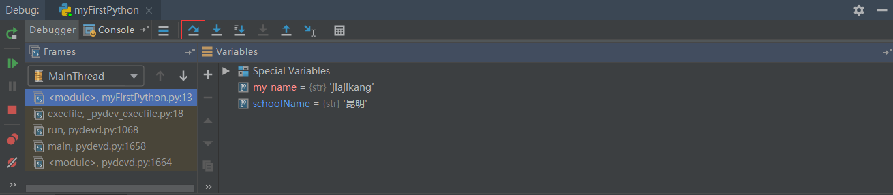
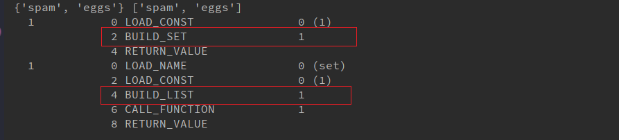

# Pycharm的基础设置

==考虑使用xmind==

[file]--[Setting]/[Defaut Settings]

**修改代码文字格式**

[Editor]--[Font]

- Font：修改字体
- Size：修改字号
- Line Spacing：修改行间距

**修改解释器**

[Project:项目名称]--[Project Interpreter]--[设置图标]--[Add]--浏览到目标解释器--[OK]--[OK]

 

**项目管理**

[File]--[Open]--浏览选择目标项目根目录--[ok]--选择打开项目方式

打开项目的方式三种：

 

1、This Window

覆盖当前项目，从而打开目标项目

2、New Window

在新窗口打开，则打开两次Pycharm,每个pycharm负责一个项目

3、Attach

一个窗口下打开多个项目，也就是多个项目重叠（本人比较喜欢这种，一眼尽收眼底）

**项目关闭**： [File]-[Close Project]/[Close Project in current window]

---

# 1、Python基础语法

## 1.1 注释

```
第一种(快捷键：ctrl+/)：  #     
第二种：
        """
        """
```

## 1.2 变量

**定义变量**

```
变量名 = 值
```

> 变量名自定义，要满足==标识符==命名规则


**标识符**

标识符命名规则是 Python中定义各种名字的时候的统一规范，具体如下

- 由数字、字母、下划线组成
- 不能数字开头
    不能使用内置关键字
- 严格区分大小写

   

**命名习惯：**

- 见名知义。
- 大驼峰：即每个单词首字母都大写，例如：`MyName`
- 小驼峰：第二个（含）以后的单词首字母大写，例如：`myName`
- 下划线：例如：`my_name`

---

**使用变量：**

```python
my_name = "jiajikang"
```

## 1.3 认识bug&Debug工具

所谓bug，就是程序中的错误。如果程序有错误，需要程序员排查问题，纠正错误。

Debug工具是PyCharm IDE中集成的用来调试程序的工具，在这里程序员可以查看程序的执行细节和
流程或者调解bug。

**Debug工具使用步骤：**

1. 打断点
2. Debug调试

---

### 1.3.1 打断点

**断点位置：**目标要调试的代码的第一行代码即可，即第一个断点。

**打断点的方法：** 单击目标代码的行号右侧空白位置

### 1.3.2 Debug调试

第一步：Debug运行

 

第二步：

 

 

## 1.4 数据类型

​	在 Python里为了应对不同的业务需求，也把数据分为不同的类型（xmind制作，可了解这个思维导图软件奥，用习惯了，你会比爱你老婆还喜欢这个，哈哈哈）。

 

> <font color=red>说明</font>：使用`type()`函数实现查看数据具体的类型


## ==1.5 变量章节总结==

- 定义变量的值 

    ```
    变量名 = 值
    ```

- 标识符

    由数字、字母、下划线组成

    不能数字开头

    不能使用内置关键字

    严格区分大小写

- 数据类型

    整型：int

    浮点型：float

    字符串：str

    布尔型：bool

    元组：tuple

    集合：set

    字典：dict

## 1.6 输出

- 格式化输出

    格式化符号

    f-字符串

- print的结束符


```python
print('hell')
age = 18
print(age)
```

### 1.6.1 格式化输出


 

**技巧：**

- %06d，表示输出的整数显示位数，不足以0补全，超出当前位数则原样输出
- %.2f，表示小数点后显示的小数位数。


### 1.6.2 输出_格式化基础

所谓的格式化输出即按照一定的格式输出内容。

**格式化符号**

```python
# 格式化符号输出数据
age = 18
name = "jiajikang"
weight = 120.3
stu_id = 1
print('%d岁' % age)
print('%s' % name)
print('%.2f' % weight)# 小数点后面保存2位
```


### 1.6.3 输出_格式化高级使用

```python
print('%d' % stu_id)
# 例如学号001
print('%03d' % stu_id) # %06d，表示输出的整数显示位数，不足以0补全，超出当前位数则原样输出

print('名字%s, 今年年龄%d' %(name,age) )
print('名字%s, 明年年龄%d' %(name,age+1) )
print('名字%s,年龄%d,体重%f,学号%d' % (name,age,weight,stu_id))
```

 ### 1.6.4 输出_拓展格式化字符串

```python
name = 'tom'
age = 13
weight = 12.3

print('名字%s，年龄%s， 体重%s' % (name,age,weight)) # 都可以使用%s

```

### 1.6.5 输出_f-格式化字符串

格式化字符串除了%s，还可以写成：`f{表达式}`

```python
age = 23
name = 'tom'
print('名字%s，年龄%s， 体重%s' % (name,age,weight)) # 都可以使用%s

# 语法：f{表达式}
print(f'名字是{name}, 年龄{age}') # 比%s更高效一点
```

### 1.6.6 输出_转义字符

- `\n`：换行
- `\t`：制表符，一个tab键（4个空格）距离

```python
print('hell \n python') # 换行
print('\tabcd') # 四个制表符
```

### 1.6.7 输出_print结束符

```python
print('输出的内容',end='\n')
print('hello',end='\t')
print('word')
print('hello',end='...')
```

> 在 Python中， print()，默认自带end="\n"这个换行结束符，所以导致每两个print直接会换行展示，用户可以按需求更改结束符。

### ==1.6.8 输出_总结==

- 格式化符号

    %s：格式化输出字符串

    %d：格式化输出整数

    %f：格式化输出浮点数

- f-字符串

    f'{表达式}'

- 转义字符

    \n：换行

    \t：制表符

- print结束符

    ```python
    print('内容',end="")
    ```


## 1.7 输入

在 Python中，程序接收用户输入的数据的功能即是输入。

**目标：**

- 输入功能的特点
- 输入input的特点

**输入语法：**

```python
input('提示信息')
```

**输入的特点：**

- 当程序执行到`input` ，等待用户输入，输入完成之后才继续向下执行。
- 在python中，`input`接收用户输入后，一般存储到变量，方便使用。
- 在python中，`input`会把接收到的任意输入的数据当做**字符串**处理。

**输入功能的实现：**

```python
password=input('请输入您的密码：')
print(f'您输入的密码是{password}')
print(type(password)) # str
```

## 1.8 转换数据类型

- 数据类型转换的必要性
- 数据类型转换常用方法

**转换数据类型的作用：**

问：input()接收用户输入的数据都是字符串类型，如果用户输入1，想得到整型该如何操作

答：转换数据类型即可，即将字符串类型转换成整型

**转换数据类型的函数：**

   

```python
num = input('请输入数字：')
print（num）
print(type(num)) # str
print(type(int(num))) # int

num1 = 1
str1 = '10'
print(type(float(num1))) # float
print(float(num1)) # 1.0

print(float(str1)) # 10.0

#数据转换成字符串
print(type(str(num1)))

# 3、tuple()将一个序列转换成元组
list1 = [10,20,30]
print(type(tuple(list1))) # 

#将一个序列转换成列表
t1 = (100,200,300)
print(list(t1)) # [100,200,300]

# 计算在字符串中有效python表达式，并返回一个对象
str2 = '1'
str3 = '1.1'
str4 = '(100,200,300)'
str5 = '[100,200,300]'
print(type(eval(str2))) # int
print(type(eval(str3))) # float
print(type(eval(str4))) # tuple
print(type(eval(str5))) # list

```

##1.9 转换类型总结

- 转换数据类型常用的函数

- [ ] int()
- [ ] float()
- [ ] list()
- [ ] tuple()
- [ ] eval() 

## 1.10 pychrm交互式开发

```
左下角：python Console
关闭交互式开发环境：1、右侧“-”；2、file-close project
```

  


# 2、运算符

**运算符的分类：**

●  算数运算符

● 赋值运算符

● 复合赋值运算符

● 比较运算符

● 逻辑运算符

---

##2.1 **算术运算符**

```python
+
-
*
/
// # 整除
%  # 取余
** # 指数
() # 小括号
```

> 混合运算优先级顺序：`（）`高于`**`高于`*` `/` `//` `%` 高于 `+` `-`


---

##2.2 **赋值运算符**

- 单个变量赋值

```python
num = 1
print(num)
```

- 多个变量赋值

```python
num1, float1, str1 = 10,0.5, 'hello world'
print(num1)
print(float1)
print(str1)
```

- 多变量赋相同值

```python
a = b = 10
print(a)
print(b)
```

## 2.3 复合赋值运算符

```python
+=
-=
*=
/=
//= # 整除赋值运算符  c//=a -> c =c//a
%=  # 取余赋值运算符  c%=a  -> c = c%a 
**= # 幂赋值运算符    c**=a -> c = c**a
```

```python
a = 100
a += 1
# 输出101 a = a+1 ，最终a = 100+1
print(a) # 101

b = 10
b -= 1 # b = b-1
print(b) # 9

#注意： 先算复合运算符右边的表达式；算复合赋值运算
c = 10
# c +=3 -- c=c+3
c += 1+2 # c= c+1+2
print(c) # 13

d = 10
d*=1+2
print(d) # 30

```

## 2.4 比较运算符

比较运算符也叫关系运算符，通常用来判断。

 


## 2.5 逻辑运算符

 

```python
a = 1
b = 2
c = 3
# 与
print((a<b) and (b<c)) # True
print((a>b) and (b<c)) # False
# 或
print((a>b) or (b<c)) # True
# 非：取反
print(not False) # True
print(not (a>b)) # True
```

**拓展：数字逻辑运算符**

```python
a = 0
b = 1
c = 2

# and运算符，只要有一个值为0，则结果为0，否则结果为最好一个非0数字
print(a and b) # 0
print(b and a) # 0
print(a and c) # 0
print(c and a) # 0
print(b and c) # 2
print(c and b) # 1

#or运算符，只有所有值为0结果才为0，否则结果为第一个非0数字
print(a or b) # 1
print(a or c) # 2
print(b or c) # 1
```

##  2.6 运算符总结

- 算符运算的优先级

    混合运算优先级顺序： `（）`高于`**`高于`*` `/` `//` `%` 高于 `+` `-`

- 赋值运算符

    =

- 复合运算符

    +=

    -=

    优先级

    ​       1、先算复合赋值运算符右测的表达式

    ​       2、再算复合赋值运算的算数运算

    ​       3、最后算赋值运算

- 比较运算符

    判断相等：==

    大于等于：>=

    小于等于：<=

    不等于：!=

- 逻辑运算符

    与：and

    或：or

    非：not

# 3、条件语句

假设一个场景：

- 同学们这个年龄去过网吧吗？
- 去网吧进门想要上网必须做的一件事是做什么？（考虑重点）
- 为什么要把身份证给工作人员？
- 是不是就是为了判断是否成年？
- 是不是如果成年可以上网？如果不成年则不允许上网？

其实这里所谓的判断就是条件语句，即条件成立执行某些代码，条件不成立则不执行这些代码。

##3 .1 语法

```python
if 条件:
   条件成立执行的代码1
   条件成立执行的代码2
   ...
```

**快速体验：**

```python
if True:
    print("条件成立执行的代码1")
#注意：在这个下方的没有加缩进的代码，不属于if语句块，即和条件成立与否无关
print("这个代码成立嘛？")
```

##3.2 实例

需求分析：如果用户年龄大于等于18岁即成年，输出已经成年，可以上网"。

```python
age = 20
if age >= 18:
    print("可以上网")
 print("系统关闭")   
```

**进阶版：**新增需求：用户可以输出自己的年龄，然后系统进行判断是否成年，成年则输出您的年龄是用户输入
的年龄'，已经成年，可以上网"。

```python
#1、用户输入
#2、保存用户输入的年龄
#3、if
age = input("请输入年龄：")
age = int(age)
if age >= 18:
    print(f'您输入的年龄是{age},已经成年，可以上网')

```


---

**if...else...**

```python
#1、用户输入
#2、保存用户输入的年龄
#3、if
age = input("请输入年龄：")
age = int(age)
if age >= 18:
    print(f'您输入的年龄是{age},已经成年，可以上网')
else:
    print(f'您输入的年龄是{age},未成年，不可以上网')
```

> 注意：如果某些条件成立执行了相关的代码，那么其他的情况的代码解释器根本不会执行。

## 3.3 多重判断

>思考：中国合法工作年龄为18-60岁，即如果年龄小于18的情况为童工，不合法；如果年龄在18
>-60岁之间为合法工龄；大于60岁为法定退休年龄。

```python
if 条件1：
    条件1成立执行的代码
elif 条件2：
    条件成立执行的代码
...
else:
    以上条件都不成立执行的代码

```

> 多重判断也可以和else配合使用。一般else放到整个if语句的最后，表示以条件都不成立的时候
> 执行的代码。

```python
"""
1、用户输入自己的年龄
2、做判断
3、输出提示信息：您输入的年龄：，合法与否
"""
age= input('请您输入年龄：')
age = int(age)
if age<18:
    print(f'您输入的年龄是{age},童工')
elif (age>=18) and (age<=60):
    print(f'您输入的年龄是{age},合法')
elif age>60:
    print(f'您输入的年龄是{age},退休年龄')

```


----

**if嵌套：**

```
if 条件1：
    条件1成立执行的代码
    if 条件2：
        条件2成立执行的代码
```

> 条件2的if也是出于条件1的缩进关系内部

**实例：**

```python
"""
1、准备将来要做判断的数据：钱和空座位
2、判断是否有钱：上车 和 不能坐上车
3、上车了：判断是否能坐下：有空座位 和 无空座位
"""
money = 1
seat = 1
if money == 1:
    print('土豪，请上车')
    #判断能否坐车
    if seat ==1:
        print('有空座，坐下了')
    else:
        print('没有空座，站着吧你')
else:
    print('土鳖，跑着去')
```

**if嵌套执行流程**

 


## 3.4 综合应用

需求分析：

- 参与游戏的角色

    玩家

    ​        手动出拳

    电脑

    ​        随机出拳

- 判断输赢

    玩家获胜

    平局

    电脑获胜

```python
"""
1、出拳
      玩家：手动输入
      电脑：1.固定 ：剪刀；2. 随机
      
2、判断输赢
   玩家获胜
   平局
   电脑获胜

"""
import random
player = int(input("请出拳：0--石头；1--剪刀；2--布"))
#电脑
#computer = 1
computer = random.randint(0,2)
print(computer)

# 2、判断输赢
if ((playter==0) and (computer==1) and (playter==1) and (computer==2) and (playter==2) and (computer==0)):
    print('玩家赢')
elif player == computer:
    print('平局')
else:
    print('电脑赢')

```

**随机数做法：**

```
import 模块名
random.randint(开始,结束)
```

```python
import random
num = random.ranint(0,2)
print(num) # 一个随机整数0,1,2

```

# <font color=red>4、三目运算符</font>

```python
条件成立执行的表达式 if 条件 else 条件不成立执行的表达式
```

```python
a = 1
b = 2
c = a if a>b else b
print(c) # 2

# 需求：有两个变量，比较大小，变量1 大于 变量2 执行 变量1 - 变量2； 否则 变量2 - 变量1
aa = 10
bb = 6
c = aa-bb if aa>bb else bb--aa
print(c) # 4

```

# 5、循环语法

**目标：**

- 了解循环
- while语法【重点】
- while应用
- break和continue和
-  while循环嵌套【重点】
-  while循环嵌套应用【难点】
- for循环

---

## 5.1  循环的分类

在python中，循环分为 `while` 和 `for` 两种，最终实现效果相同。

###5.1.2 while语法

```
while 条件：
    条件成立重复执行的代码1
    条件成立重复执行的代码1
    ...
```

**快速体验：**需求：复现重复执行100次 `print('媳妇，我错了')`（输出更简洁一些，我们这里设置5次）。

```python
i = 1
while i<=5:
    print('媳妇我错了')
    i += 1
print('任务结束')
```

**计数器习惯书写**

```python
i = 0
while i<5:
    print('媳妇我错了')
    i += 1
print('任务结束')
```

**解释器如何执行：**

```python
# 采用Debug每步每步执行
i = 0
while i<5:
    print('媳妇我错了')
    i += 1
print('原谅你了')
```


---


**while应用一:**

```python
"""
分析：1-100的累加和，即1+2+3+4+即前两个数字的相加结果+下一个数字（前一个数字+1）
"""
i = 0
sum = 0
while i<100:
    sum +=i
    i += 1

print(f'sum={sum}')

```

**while应用二:**

```python
"""
分析：1-100的偶数和，即2+4+6+8得到偶数的方法如下：
偶数即是和2取余结果为0的数字，可以加入条件语句判断是否为偶数，为偶数则累加
初始值为0/2，计数器每次累加2

"""
```

```python
# 方法一：条件判断和2取余数则累加
i = 1
result = 0
while i <= 100:
    if i % 2 == 0:
        result += i
    i += 1
print('result=%d' % result)
```

```python
# 方法二：计数器控制增量2
i = 2
result = 0
while i<=100:
    result += i
    i += 2
print(result) 
```

### 5.1.2 while循环嵌套

```python
while 条件:
    while 条件：
        print('媳妇我错了')
    print('刷晚饭的碗')
```

```
while 条件1：
    条件1成立的执行的代码
    ...
    while 条件2：
    条件2成立执行的代码

```

**快速体现：**

```python
j = 0
while j<3:
    i =0
    while i<3:
        print('媳妇我错了')
        i+=1
    print('刷碗')    
```

###5.1.3 break和continue

break和continue是循环中满足一定条件退出循环的两种不同方式。

**break**：当某些条件成立，退出当前循环

```python
i = 1
while i <= 5:
    if i==4:
        print(f'吃饱了不吃了')
        break
    print(f'吃了第{i}个苹果')
    i += 1
```

**continue**：当某些条件成立时候，退出当前循环，继而执行下一次循环

```python
i = 1
while i<=5:
    if == 3:
        print('有虫子,这个苹果不说了')
        # 如果使用continue，在continue之前一定要修改计数器，否则进入死循环
        i += 1
        continue
    print(f'吃了第{i}个苹果')
    i += 1
```


### 5.1.4 while循环嵌套应用

**应用一：**

```python
j = 0
while j<5:
    # 一行星星开始
    i = 0
    while i<5:
        print('*'，end='')
        i += 1
    # 一行星星结束    
    print() # 默认换行
    j+=1
```

**应用二：**

```python
# 三角形：每行星星的个数和行号数相等
j = 0
while j<5:
    # 一行星星开始
    i = 0
    # i表示每行里面星星的个数，这个数字要和行号相等所以i要和j联动
    while i<=j: 
        print('*'，end='')
        i += 1
    # 一行星星结束    
    print() # 默认换行
    j+=1
```

**应用三：**

```python
#重复打印9行乘法表达式
"""
1、打印一个乘法表达是：x * x = x*x
2、一行打印多个表达式--一行表达式的个数和行数相等 -- 循环：一个表达式，不换行

"""
j = 1
while j<=9:
    #一行的表达式开始
    i = 1
    while i<=j:
        print(f'{i} * {j} = {i*j}',end='\t')
        i += 1
    #一行表达时的结束
    print()
    j += 1

```

### 5.1.5 for循环

```python
for 临时变量 in 序列：
    重复执行的代码1
    重复执行的代码2
    ......
```

```python
str1 = 'jiajikang'
for i in str1:
    print(i)
```

####1、**break退出for循环**

```python
str1 = 'itheima'
for i in str1:
    if i == 'e':
        break
    print(i) # i t h
```

#### 2、continu退出for循环

```python
str1 = ‘itheima’
for i in str1:
    if i == 'e':
        continue
    print(i) # i t h i m a 
```

## 5.2 while...else

循环可以和else配合使用，else下方缩进的代码指的是当循环正常结束之后要执行的代码。

**while...else**

需求：女朋友生气了，要惩罚：连续说5遍“媳妇儿，我错了”，如果道歉正常完毕女朋友就原谅我了，这
个程序怎么写？

```python
i = 1
while i <= 5:
    print('媳妇我错了')
    i += 1
print('媳妇原谅我了')
```

**while...else语法**

```python
while 条件：
    条件成立重复执行的代码
else：
    循环正常结束之后要执行的代码
```

```python
i = 1
while i <= 5:
    print('媳妇我错了')
    i += 1
else:
    print('原谅我了')

```

###5.2.1 while...else之break和continue

**break:**

```python
i = 1
while i<5:
    if i==3:
        print('这边说的不真诚')
        break
    print('媳妇我错了')
    i += 1
else:
    print('媳妇原谅我了')
```

>  所谓else指的是循环正常结束之后要执行的代码，即如果是 break终止循环的情况，else下方缩进的代码将不执行。


**continue:**

```python
i = 1
while i<5:
    if i==3:
        i +=1
        print('这边说的不真诚')
        continue
    print('媳妇我错了')
    i += 1
else:
    print('媳妇原谅我了')
```

>因为 continue是退出当前一次循环，继续下一次循环，所以该循环在 continue控制下是可以正常结束的，当循环结束后，则执行了else缩进的代码。

## 5.3 for...else

```python
for 临时变量 i 序列：
    重复执行的代码
    ...
else:
    循环正常结束之后要执行的代码
```

```python
str1 = 'itheima'
for i in str1:
    print(i)
else:
    print("循环正常结束之后，执行的代码")
```

### 5.3.1 for...else之break和continue

**break：**

```python
str1 = 'itheima'
for i in str1:
    if i == 'e':
        break
        #continue
    print(i)
else:
    print('循环正常结束执行的else代码')
```

**continue：**

```python
str1 = 'itheima'
for i in str1:
    if i == 'e':
        #break
        continue
    print(i)
else:
    print('循环正常结束执行的else代码')
```

# 6、字符串

**目标：**

- 认识字符串
- 下标
- 切片
- 常用操作方法

## 6.1 认识字符串

字符串是 Python中最常用的数据类型。我们一般使用引号来创建字符串。创建字符串很简单，只要为变量分配一个值即可。

```python
a = 'hello' \ 
     'world'
b = 'abcdefg'
print(type(a)) # str
print(type(b)) # str

# 三引号
e = '''i am tom'''
print(type(e)) # str
f = """i am tom"""
print(type(f)) # str

# 转义字符问题
# I'm Tom
c = " I'm Tom "
print(c) #  I'm Tom
print(type(c)) # str

# d = ' I'm Tom '
d = ' I\'m Tom '
print(d) #  I'm Tom
print(type(d)) # str

```

## 6.2  字符串输出

```python
print('hello wolrd')

name = 'Tom'
print(f'我的名字是%s' % name)
print(f'我们的名字是{name}')

```

## 6.3 字符串输入

在python中，使用 `input()` 接收用户输入

```python
name = input('请输入名字：')
print(f'您输入的名字是{name}')
print(type(name)) # str

password = input('请输入您的密码：')
print(f'您输入的密码是{password}')
print(type(password)) # str
# 总结：无论是字符串还是数字都是str类型
```


## 6.4 下标

==下标==又叫==索引==，就是编号。比如火车座位号，座位号的作用：按照编号快速找到对应的座位。同理，下标的作用就是通过下标快速找到对应的数据。

```python
str1 = 'abcdefg'
print(str1)

# 想得到数据a字符，得到数据b字符 -- 使用字符串中某个特定的数据
# 这些字符数据从0开始顺序分配一个编号 -- 使用这个编号精确找到某个字符数据-- 下标或者索引或索引值
print(str1[0]) # a
print(str1[1]) # b

```

## 6.5 切片

### 6.5.1 切片简介

```python
str1 = 'abcdefg'
print(str1) # 获取整个

# 下标得到的是下标为某个数字的数据
print(str1[2]) # c
# 得到abc这三个数据该怎么办？
```

切片是指对操作的对象截取其中一部分的操作。**字符串、列表、元组**都支持切片操作。

---

**语法：**

```
序列[开始位置下标 ：结束位置下标 ：步长]
```

> 注意

1、不包含结束位置下标对应的数据，正负整数均可.

2、步长是选取间隔，正负整数均可，默认步长为1.

### 6.5.2 切片体验

```python
name = 'abcdefg'
print(name[2:5:1]) # cde
print(name[2:5]) # cde
print(name[:5]) # abcde  -- 如果不写开始，默认从0开始选取
print(name[2:]) # cdefg  -- 如果不写结束，表示选取到最后
print(name[:]) # abcdefg -- 如果不写开始和结束，表示选取所有

# 负数测试
print(name[::-1])  #gfedcba 如果步长为负数，表示倒序选取
print(anme[-4:-1]) # def 下标-1表示最后一个数据，依次向前类推

#终极测试
print(name[-4:-1:1]) # def
print(name[-4:-1:-1]) # 不能选取数据，从-4开始到-1结束，选取方向为从在到右，但是-1步长，从右向左选取
# ***** 如果选取方向(下标开始到结束的方向) 和 步长的方向冲突，则无法选取数据
print(name[-1:-4:-1]) # 要方向一致，才能选取数据
```

##6.6 字符串常用方法

字符串的常用操作方法有**查找、修改和判断**三大类。

### 6.6.1 查找find()和index()

所谓字符串查找方法即是查找子串在字符串中的位置或出现的次数。

- find()：检测某个子串是否包含在这个字符串中，如果在返回这个子串开始的位置下标，否则则返回-1。

**1、语法**

```
字符串序列.find(子串，开始位置下标，结束位置下标)
```

> 注意：开始和解书位置下标可以省略，表示在整个字符串序列中查找。

**2、快速体验**

```python
mystr = "hello world and itcast and iteima and python"

print(mystr.find('and')) # 12
print(mystr.find('and', 15, 30)) # 23
print(mystr.find('ands')) # -1
```


----


- index()：检测某个子串是否包含在这个字符串中，如果在返回这个子串开始的位置下标，否则则报异常

**1、语法**

```
字符串序列.index(子串，开始位置下标，结束位置下标)
```

> 注意：开始和结束位置下标可以省略，表示在整个字符串徐柳中查找。

**2、快速体验**

```python
mystr = "hello world and itcast and iteima and python"

print(mystr.index('and')) # 12
print(mystr.index('and', 15, 30)) # 23
print(mystr.index('ands')) # 如果index查找子串不存在，会报错
```


---


- count（）

**1、语法**

```
字符串序列.count(子串，开始位置下标，结束位置下标)
```

**2、快速体验**

```python
mystr = "hello world and itcast and iteima and python"

print(mystr.count('and',15,30)) # 1
print(mystr.count('and')) #  3
print(mystr.count('ands')) #  3
```


---

- rfind()：和find()功能相同，但查找方向从==右侧==开始
- rindex()：和index()功能相同，但查找方向为==右侧==开始
- count()：返回某个子串在字符串中出现的次数

```python
mystr = "hello world and itcast and iteima and python"
print(mystr.rfind('and')) # 1
```

### 6.6.2 修改

所谓修改字符串，指的就是通过函数的形式修改字符串中的数据。

- replace()： 替换

**1、语法**

```
字符串序列.replace(旧字符串，新子串，替换次数)
```

> 注意：替换次数如果查出子串出现的数据，则替换次数为该子串出现的次数

**2、快速体验**

```python
mystr = "hello world and itcast and iteima and python"
print(mystr.replace('and', 'he')) # hello world he itcast he iteima he python

print(mystr.replace('and', 'he', 10)) # 替换次数如果超出字串出现的次数，表示替换所有这个字串
print(mystr)

#**** 调用了replace函数后，发现原有字符串的数据并没有做到修改，修改后的数据是replace函数的返回值
#--- 说明 字符串是不可变数据类型
#数据是否可以改变划分为 可变类型 和  不可变类型
```

> 注意：数据按照是否能直接修改分为可变类型和不可变类型两种。字符串类型的数据修改的时候
>
> 不能改变原有字符串，属于不能直接修改数据的类型即是不可变类型。


---


- split()：按照指定字符分割字符串  ---  分割， 返回一个列表， 丢失分割字符

**1、语法**

```
字符串序列.split(分割字符，num)
```

> 注意：num表示的是分割字符出现的次数，即将来返回数据个数为num+1个。

**2、快速体验**

```python
mystr = "hello world and itcast and iteima and python"

list1 = mystr.split('and')
# ['hello world ', ' itcast ', ' iteima ', ' python']
print(list1)
```


---


- join()： 用一个字符或子串合并字符串，即是将多个字符串合并为一个新的字符串

**1、语法**

```python
字符或者子串.join(多字符串组成的序列)
```

**2、快速体验**

```python
list1 = ['chuan', 'zhi', 'bo', 'ke']
t1 = ('aa','b','cc','ddd')
#chuan...zhi...bo...ke
#<class 'str'>
new_list1 = '...'.join(list1)
print(new_list1)

```

### 6.6.3 修改之大小写转换

- capitalize()： 将字符串第一个字符转换成大写

```python
mystr = "hello world and itcast and iteima and python"
# Hello world and itcast and iteima and python
print(mystr.capitalize())

```

> 注意：capitalize()函数转换后，字符串第一个字符大写，其他的字符全是小写


---

- title()：将字符串每个单词首字母转换成大写。

```python
mystr = "hello world and itcast and iteima and python"
# Hello World And Itcast And Iteima And Python
print(mystr.title())
```


---

- lower()：将字符串中大写转换成小写

```python
mystr = "hello World and itcast and iteima and python"

print(mystr.lower())

```

  

---


- upper()：将字符串中小写转换成大写

```python
mystr = "hello World and itcast and iteima and python"

print(mystr.upper())
```


----


### 6.6.4 修改之删除空白字符

- lstrip()：删除字符串左侧空白字符
- rstrip()：删除字符串右侧空白字符
- strip()：删除字符串两侧空白字符（这里要注意和split函数注意区分）

```python
mystr = "     hello World and itcast and iteima and python     "
new_str = mystr.lstrip()
print(new_str)
```


### 6.6.5 修改之字符串对齐

- ljust()：返回一个原字符串左对齐，并使用指定字符（默认空格）填充至对应长度的新字符串。

1、语法

```
字符串序列.ljust(长度，填充字符)
```

2、快速检测

```python
mystr = 'hello'
print(mystr.ljust(10,'.')) # hello.....

```

- rjust()：返回一个原字符串右对齐并使用指定字符（默认空格）填充至对应长度的新字符串，语法和ljust()相同
- center()：返回一个原字符串居中对齐并使用指定字符（默认空）填充至对应长度的新字符串，语法和ljust()相同。


### 6.6.6 判断开头或结尾

所谓判断即是判断真假，返回的结果是布尔型数据类型：True或 False

- startswith()： 检查字符串是否是以指定子串开头，是则返回True，否则返回 False。如果设置开始和结束位置下标，则在指定范围内检查。

1、语法

```
字符串序列.startswitch(字串，开始位置下标，结束位置下标)
```

2、快速体验

```python
mystr = "hello World and itcast and iteima and python"
print(mysrt.startswith('hello')) # True

```

- endswith（）：与startswitch函数类似

```python
# endswitch()
print(mystr.endswitch('pythons')) # False
```


### 6.6.7 判断

- isalpha()：如果字符串至少有一个字符并且所有字符都是字母则返回True，否则返回False

```python
mystr1 = 'hello'
mystr2 = 'hello1234'

print(mystr1.isalpha()) # True

print(mystr2.isalpha()) # False

```

- isdigit()：如果字符串只包含数字则返回True否则返回False

```python
mystr1 = 'aaa23232'
mystr2 = '12121'
print(mystr1.isdigit()) # False
print(mystr2.isdigit()) # True
```

- isalnum：如果字符串至少有一个字符并且所有字符都是字母或者数字则返回True，否则返回Flase

```python
mystr1 = 'aaa2332'
mystr2 = '33434-'

print(mystr1.isalnum()) # True
print(mystr1.isalnum()) # False 
```

- isspace()：都是空白时，返回True

```python
mystr1 = ‘1 2 3 4’
print(mystr1.isspace()) # False 
```

# 7、列表

目标

- 列表的应用场景
- 列表的格式
- 列表的常用操作
- 列表的循环遍历
- 列表的嵌套使用

## 7.1 列表简介

**列表的应用场景**

思考：有一个人的姓名（TOM）怎么书写存储程序？

答：变量。

思考：如果一个班级100位学生，每个人的姓名都要存储，应该如何书写程序？声明100个变量吗？

答：列表即可，列表一次性可以存储多个数据。

**列表的格式**

```
[数据1，数据2，数据3，数据4.......]
```

列表可以一次性存储多个数据，且可以为不同数据类型。

##7.2 **列表的常用操作**

列表的作用是一次性存储多个数据，程序员可以对这些数据进行的操作有：**增、删、改、查。**

### 7.2.1 查找

#### 7.2.1.1 下标

```python
name_list = ['tome', 'lily', 'rose']

print(name_list[0]) # tome
print(name_list[1]) # lily
print(name_list[2]) # rose
```


#### 7.2.1.2 函数

- index()：返回指定数据所在位置的下标

1、语法

```
列表序列.index(数据，开始位置下标，结束位置下标)
```

2、快速体验

```python
name_list = ['tome', 'lily', 'rose']
print(name_list.index('lily',0,2)) # 1
```

> 注意：如果查找的数据不存在则报错


---


- count()：统计指定数据在当前列表中出现的次数。

```python
name_list = ['Tom', 'lily', 'rose']
print(name_list.count('lily')) # 1
```


---


- len()：访问列表长度，即列表中数据的个数

```python
name_list = ['Tom', 'lily', 'rose']
print(len(name_list)) # 3
```

### 7.2.2 查找数据之判断是否存在

- in：判断指定数据在某个列表序列，如果在返回True，否则返回Flase

```python
name_list = ['Tom', 'lily', 'rose']
print('lily' in name_list) # True

print('Lily' in name_list) # False
```

- not in：判断指定数据不在某个列表序列，如果不在返回True，否则返回 False

```python
name_list = ['Tom', 'lily', 'rose']
print('lily' not in name_list) # Flase

print('Lily' not in name_list) # True
```


**体验案例：**需求：查找用户输入的名字是否已经存在

```python
name_list = ['Tom', 'Lily', 'Rose']
name = input("请输入您要搜索的名字：")
if name in name_list:
    print(f'您输入的名字是{name},名字已经存在')
else:
    print(f'您输入的名字是{name},名字不存在')
```

### 7.2.3 列表添加数据

作用：增加知道数据到列表中

#### 7.2.3.1 列表添加数据之append

- append()：列表结尾追加数据

**1、语法**

```
列表序列.append(数据)
```

**2、快速体验**

```python
name_list = ['Tom', 'Lily', 'Rose']
name_list.append('JJK')
print(name_list) # ['Tom', 'Lily', 'Rose', 'JJK']
```

>列表追加数据的时候，直接在原列表里面追加了指定数据，即修改了原列表，故列表为可变类型数据。

**注意点：**如果 append（）追加的数据是一个序列，则追加整个序列到列表

```python
name_list = ['Tom', 'Lily', 'Rose']
name_list.append(['jjk','jiajikang'])
print(name_list) # ['Tom', 'Lily', 'Rose', ['jjk', 'jiajikang']]
```


#### 7.2.3.2 列表添加数据之extend

- extend（）：列表结尾追加数据，如果数据是一个序列，则将这个序列的数据逐一添加到列表。

1、语法

```
列表序列.extend(数据)
```

2、快速体验

**单个数据**

```python
name_list = ['Tom', 'Lily', 'Rose']
name_list.extend('jiajikang')
print(name_list) # ['Tom', 'Lily', 'Rose', 'j', 'i', 'a', 'j', 'i', 'k', 'a', 'n', 'g']
```

**序列数据**

```python
name_list = ['Tom', 'Lily', 'Rose']
name_list.extend(['jiajikang', 'jiajikang'])
print(name_list)  # ['Tom', 'Lily', 'Rose', 'jiajikang', 'jiajikang']
```

####7.2.3.3 列表添加数据之insert

- insert()：指定位置新增数据

**1、语法**

```
列表序列.insert(位置下标，数据)
```

**2、快速体验**

```python
name_list = ['Tom', 'Lily', 'Rose']
name_list.insert(1,"jiajiknag")
print(name_list)  # ['Tom', 'jiajiknag', 'Lily', 'Rose']
```


### 7.2.4 列表删除数据

- del 

1、语法

```
del 目标
```

2、快速体验

**删除列表**

```python
name_list = ['Tom', 'Lily', 'Rose']
def name_list
print(name_list) # 会报错

```

**删除指定数据**

```python
#del可以删除指定下标的数据
name_list = ['Tom', 'Lily', 'Rose']
del name_list[0]
print(name_list)
```


---


- pop()：删除指定下标的数据（默认为最后一个），并且返回该数据

1、语法

```
列表序列.pop(下标)
```

2、快速体验

```python
name_list = ['Tom', 'Lily', 'Rose']
del_name = name_list.pop(1)
print(del_name) # Lily
print(name_list) # ['Tom', 'Rose']
```


---


- remove()：移除列表中某个数据的第一个匹配项

1、语法

```
列表序列.remove(数据)
```

2、快速体验

```python
name_list = ['Tom', 'Lily', 'Rose']
name_list.remove('Rose')
print(name_list) # ['Tom', 'Lily']
```


---


- clear()：清空列表

```python
name_list = ['Tom', 'Lily', 'Rose']
name_list.clear()
print(name_list) # []
```


### 7.2.5 列表修改数据

- **修改指定下标数据**

```python
name_list = ['Tom', 'Lily', 'Rose']
name_list[0] = 'jiajiknag'
print(name_list) # ['jiajiknag', 'Lily', 'Rose']
```

- **逆置：reverse()**

```python
num_list = [1,2,3,4,5,6]
num_list.reverse()
print(num_list) # [6, 5, 4, 3, 2, 1]
```

- **排序**

1、语法

```python
列表序列.sort(key=None,reverse=False)
```

> 注意：reverese表示排序规则，reverse=True降序，reverse=False升序（默认）

2、快速体验

```python
list1 = [1,2,3,4,5,6,34,55,2,756,8]
list1.sort()
print(list1) # [1, 2, 2, 3, 4, 5, 6, 8, 34, 55, 756]
```


###7.2.6 列表复制数据

函数：copy()

```python
name_list1 = ['Tom', 'Lily', 'Rose']
name_list2 = name_list1.copy()
print(name_list2) # ['Tom', 'Lily', 'Rose']
```


###7.2.7 列表的循环遍历

#### 7.2.7.1 列表的循环之while

需求：依次打印列表中的各个数据

- 代码

```python
name_list1 = ['Tom', 'Lily', 'Rose']
i = 0
while i< len(name_list1):
    print(name_list1[i])
    i += 1
"""
Tom
Lily
Rose

"""
```


#### 7.2.7.2 列表的循环之for

- 代码

```python
name_list1 = ['Tom', 'Lily', 'Rose']
for i in name_list1:
    print(i)
"""
Tom
Lily
Rose

"""    
```

##7.3 列表嵌套

所谓列表嵌套指的就是一个列表里面包含了其他的子列表。

应用场景：要存储班级一、二、三三个班级学生姓名，且每个班级的学生姓名在一个列表。

```python
name_list = [['小明', '小红', '小绿'], ['Tom', 'Lily', 'Rose'], ['张三', '李四', '王五']]
```

思考：如何查找数据“李四”

```python
# 列表嵌套的时候的数据查找
# 第一步：按下标查找到李四所在的列表
print(name_list[2])
# 第二步：从李四所在的列表里面，再按下标找到数据李四
print(name_list[2][1]) # 整体，局部观察
```


---

**总和应用**

需求：有三个办公室，8位老师，8位老师随机分配到3个办公室

```python
"""
需求：有三个办公室，8位老师，8位老师随机分配到3个办公室
步骤：
    1、准备数据
       8位老师 -- 列表
       3个办公室 -- 列表嵌套
    2、分配老师到办公室
       随机分配
       就是吧老师的名字写入到办公室列表 -- 办公室列表追加老师名字数据
    3、验证是否分配成功
       打印办公室详细信息：每个办公室的人数和对应的老师名字

"""
import random
#1、准备数据
teachers = ['A', 'B', 'C', 'D', 'E', 'F', 'G', 'H']
offices = [[], [], []]

#2、分配老师到办公室 -- 取到每个老师放到办公室列表 -- 变量老师列表数据
for name in teachers:
    # 列表追加数据 -- append  extend  insert
    #xx[0] -- 不能指定是具体某个下标 -- 随机
    num = random.randint(0,2)
    offices[num].append(name)
#print(num)

#print(offices)
# 为了更贴近生活，把各个办公室子列表加一个办公室编号 1,2,3
i = 1
#3、验证是否分配成功
for office in offices:
    # 打印办公室人数 -- 子列表数据的个数 len()
    print(f'办公室{i}的人数是{len(office)},老师分别是：')
    # 打印老师的名字
    # print -- 每个子列表里面的名字个数不一定-- 遍历 -- 子列表
    for name in office:
        print(name)
```


##  7.2 列表推导式

```python
x = 'ABC'
dumny = [ord(x) for x in x]
```

# 8、元组

**目标**

- 元组的应用场景
- 定义元组
- 元组常见操作

## 8.1 元组的应用场景

思考：如果想要存储多个数据，但是这些数据是不能修改的数据，怎么做？

答：列表？列表可以一次性存储多个数据，但是列表中的数据允许更改。

```
num_list = [10,20,30]
num_list[0] = 100
```

==一个元组可以存储多个数据，元组内的数据是不能修改的。==

## 8.2 定义元组

元组特点：定义元组使用==小括号==，且==逗号==隔开各个数据，数据可以是不同的数据类型。

```python
t1 = (10,20,30) # 多个数据元组
t2 = (10,) # 单个数据元组
```

> 注意：如果定义的元组只有一个数据，那么这个数据后面也要==添加逗号==，否则数据类型为唯一的
> 这个数据的数据类型

```python
t2 = (10,)
print(type(t2)) # tuple

t3 = (20)
print(type(t3)) # int

t4 = ('hello')
print(type(t4)) # str
```

## 8.3 元组的常见操作

### 8.3.1 元组的常见操作之查找

元组数据不支持修改，只支持查找，具体如下：

- **按下标查找数据**

```python
tuple1 = ('aa', 'bb', 'cc', 'dd')
print(tuple1[0]) # aa
```

- **index()：**查找某个数据，如果数据存在返回对应的下标，否则报错，语法和列表、字符串的index方法相同。

```python
tuple1 = ('aa', 'bb', 'cc', 'dd')
print(tuple1.index('aa')) # 0
```

- **count()：**统计某个数据在当前元组出现的次数

```python
tuple1 = ('aa', 'bb', 'cc', 'dd', 'bb')
print(tuple1.count('bb')) # 2
```

- **len()：**统计元组中数据的个数

```python
tuple1 = ('aa', 'bb', 'cc', 'dd', 'bb')
print(len(tuple1)) # 5
```

### 8.3.2 元组的常见操作之修改

注意：元组内的直接数据如果修改则立即报错

```python
tuple1 = ('aa', 'bb', 'cc', 'dd', 'bb')
tuple1[0] = 'aaa'
```

但是如果元组里面有列表，修改列表里面的数据则是支持的，故自觉很重要。

```python
tuple2 =  (10,20, ['aa', 'bb', 'cc'], 50, 30)
print(tuple2[2]) # 访问到列表

tuple2[2][0] = 'aaaaaa'
print(tuple2)
"""
['aa', 'bb', 'cc']
(10, 20, ['aaaaaa', 'bb', 'cc'], 50, 30)
"""
```

# 9、字典

 **目标**

- 字典的应用场景
- 创建字典的语法
- 字典常见操作
- 字典的循环遍历

## 9.1 字典的应用场景

思考1：如果有多个数据，例如：Tom，男，20，如何快速存储？

答：列表

```
list1 = ['tom','男'，20]
```

思考2：如何查找到数据Tom'？

答：查找到下标为0的数据即可。

```
list1[0]
```

思考3：如果将来数据顺序发生变化，如下所示，还能用list1[0]访问到数据'Tom吗？

```
list1 = ['男','tom',20]
```

答：不能，数据Tom'此时下标为2

思考4：数据顺序发生变化，每个数据的下标也会随之变化，如何保证数据顺序变化前后能使用同一的
标准查找数据呢？

答：字典，字典里面的数据是以==键值对==形式出现，字典数据和数据顺序没有关系，即字典不支持下标，
后期无论数据如何变化，只需要按照对应的键的名字查找数据即可。

## 9.2 创建字典的语法

**字典特点：**

- 符号为大括号
- 数据为键值对形式出现
- 各个键值对之间用逗号隔开

```python
#有数据字典
dict1 = {'name' : 'jiajiknag', 'age':20, 'gender':'男'}
print(dict1)
#空字典
dict2 = {}
dict3 = dict() #函数创建
```

## 9.3 字典常用操作

### 9.3.1 增

**写法：**字典序列[key] = 值

**注意：**如果key存在则修改这个key对应的值；如果key不存在则新增此键值对。

```python
dict1 = {'name' : 'jiajiknag', 'age':20, 'gender':'男'}

dict1['name'] = 'jjk'
print(dict1)

dict1['id'] = 110
print(dict1) # {'name': 'jjk', 'age': 20, 'gender': '男', 'id': 110}
```

**注意：**字典为可变类型


### 9.3.2 删

- del()/del：删除字典或删除字典中指定键值对

```python
dict1 = {'name' : 'jiajiknag', 'age':20, 'gender':'男'}
#del(dict1) 
del dict1['gender']
print(dict1) # {'name': 'jiajiknag', 'age': 20}


```

- clear()：清空字典

```python
dict1 = {'name' : 'jiajiknag', 'age':20, 'gender':'男'}
dict1.clear()
print(dict1) # {}
```


### 9.3.3 改

**写法：**字典序列[key] = 值

**注意：**如果key存在则修改这个key对应的值；如果key不存在则新增此键值对。

```python
dict1 = {'name' : 'jiajiknag', 'age':20, 'gender':'男'}
dict1['name'] = 'JJK'
print(dict1) # 

dict1['ID'] = 1111
print(dict1)
```

### 9.3.4 查

#### 9.3.4.1 key值查找

```python
dict1 = {'name' : 'jiajikang', 'age':20, 'gender':'男'}
print(dict1['name']) # jiajikang
print(dict1['ID']) # 报错
```


#### 9.3.4.2 get()

- 语法

```
字典序列.get(key, 默认值)
```

- 注意：如果当前查找的key不存在则返回第二个参数（默认值），如果省略第二个参数，则返回
    None.

- 快速体验

```python
dict1 = {'name' : 'jiajikang', 'age':20, 'gender':'男'}
print(dict1.get('name')) # jiajikang
print(dict1.get('id',110)) # 110
print(dict1.get('id')) #None
```

#### 9.3.4.3 keys()

查找字典中所有的key，返回可迭代对象

```python
dict1 = {'name' : 'jiajikang', 'age':20, 'gender':'男'}
print(dict1.keys()) # dict_keys(['name', 'age', 'gender'])
```

#### 9.3.4.4 values()

查找字典中所有的value，返回可迭代对象

```python
dict1 = {'name' : 'jiajikang', 'age':20, 'gender':'男'}
print(dict1.values())# dict_values(['jiajikang', 20, '男'])
```

#### 9.3.4.5 items()

查找字典中所有的键值对，返回可迭代对象，里面的数据是元组，元组数据1是字典的key，元组数据2是字典key对应的value。

```python
dict1 = {'name' : 'jiajikang', 'age':20, 'gender':'男'}
print(dict1.items()) # dict_items([('name', 'jiajikang'), ('age', 20), ('gender', '男')])
```

## 9.5 创建字典

```python
# dict函数(构造器)中的每一组参数就是字典中的一组键值对
person = dict(name='王大锤', age=55, weight=60, home='中同仁路8号')
print(person)    # {'name': '王大锤', 'age': 55, 'weight': 60, 'home': '中同仁路8号'}

# 可以通过Python内置函数zip压缩两个序列并创建字典
items1 = dict(zip('ABCDE', '12345'))
print(items1)    # {'A': '1', 'B': '2', 'C': '3', 'D': '4', 'E': '5'}
items2 = dict(zip('ABCDE', range(1, 10)))
print(items2)    # {'A': 1, 'B': 2, 'C': 3, 'D': 4, 'E': 5}

# 用字典生成式语法创建字典
items3 = {x: x ** 3 for x in range(1, 6)}
print(items3)     # {1: 1, 2: 8, 3: 27, 4: 64, 5: 125}
```


## 9.4 字典的循环遍历

### 9.4.1  字典的循环遍历之key

```python
dict1 = {'name' : 'jiajikang', 'age':20, 'gender':'男'}
for key in dict1.keys():
    print(key) #
"""
name
age
gender

"""
```


### 9.4.2  字典的循环遍历之value

```python
dict1 = {'name' : 'jiajikang', 'age':20, 'gender':'男'}
for value in dict1.values():
    print(value)
"""
jiajikang
20
男
"""
```

### 9.4.3  字典的循环遍历之元素

```python
dict1 = {'name' : 'jiajikang', 'age':20, 'gender':'男'}
for item in dict1.items():
    print(item)
    
"""
('name', 'jiajikang')
('age', 20)
('gender', '男')
"""
```

### 9.4.4 遍历字典的键值对

```python
dict1 = {'name' : 'jiajikang', 'age':20, 'gender':'男'}
for key, value in dict1.items():
    print(f'{key} = {value}')
    
"""
name = jiajikang
age = 20
gender = 男

"""
```

# 10、集合

创建集合使用 `{}` 或者 `set()`，但是如果要创建空集合只能使用 `set()`，因为 `{}` 用来创建空字典。

```python
s1 = {10,20,30,40,50}
print(s1)

s2 = set('abcddfdf')
print(type(s2)) # set
print(s2)

s3 = set()
print(type(s3)) # set

s4 = {}
print(type(s4)) # dict
```

## 10.1 集合常见操作

### 10.1.1 增加

- **add()**

```python
s1 = {10,20}
s1.add(100)
# 集合有去重功能，如果追加的数据是集合已有的数据，则什么事情都不做
s1.add(10)
print(s1)  # {100, 10, 20}
```

因为集合有去重功能，所以，当向集合内追加的数据是当前集合已有数据的话，则不进行任何操作。

- **update()，追加的数据是序列**

```python
s1 = {10,20}
s1.update([100,200])
s1.update('abc')
```


### 10.1.2 删除

- remove()，删除集合中指定数据，如果数据不存在则报错

```python
s1 = {10,20}
s1.remove(10)
print(s1) # 20

s1.remove(10) # 报错
print(s1)
```

- discard()，删除集合中指定数据，如果数据不存在也不会报错

```python
s1 = {10,20}
s1.discard(10)
print(s1) # {20}


s1.discard(10)
print(s1) # {20}
```

- pop()，随机删除集合中的某个数据，并返回这个数据

```python
s1 = {10,20,30,40,50}

del_num = s1.pop()
print(del_num)
print(s1)
```


###10.1.3 查找

- in：判断数据在集合序列
- not in：判断数据不在集合序列

```python
s1 = {10,20,30,40,50}
print(10 in s1) #True
print(10 not in s1) # False
```

# 11、公共操作

**目标：**

- 运算符
- 公共方法
- 容器类型转换

## 11.1 运算符

 


### 11.1.1 +

```python
str1 = 'aa'
str2 = 'bb'
#列表
list1 = [1,2]
list2 = [10,20]
# 元组
t1 = (1,2)
t2 = (10,20)
dict1 = {'name':'python'}
dict2 = {'age':30}

# +:合并
str3 = str1 + str2
print(str3)

print(list1+list2)
print(t1+t2)

# 字典不支持+操作
```

### 11.1.2 *

```python
str1 = 'a'
list1 = ['hello']
t1 = ('word',)

# *:复制
print(str1*5)
#打印10个-
print('-'*10)

print(list1*5)
print(t1*5)

"""
aaaaa
----------
['hello', 'hello', 'hello', 'hello', 'hello']
('word', 'word', 'word', 'word', 'word')

"""
```

### 11.2.3 in and not in

```python
str1 = 'aa'
str2 = 'bb'
#列表
list1 = [1,2]
list2 = [10,20]
# 元组
t1 = (1,2)
t2 = (10,20)
dict1 = {'name':'python'}
dict2 = {'age':30}

print('a' in str1) # True
print('a' not in str1)

print(10 in list2)
print(10 not in list2)

print(10 not in t1)
print(10 in t2)

print('name' in dict2)
print('name' in dict1)
```


# 12、公共方法

 

## 12.1 len()

```python
# 1、字符串
str1 = 'abdfdf'
print(len(str1))

# 2、列表
list1 = [10,20,30,40,50]

# 3、元组
t1 = (10,20,30,40,50)

# 4、集合
s1 = {10,20,30,40,50}

# 5、字典
dict1 = {'name':'jiajikang', 'age':2}

print(len(list1))
print(len(str1))
print(len(t1)) # 5
print(len(s1)) # 5
print(len(dict1)) # 2
```

## 12.2 del或者del()

```python
# 1、字符串
str1 = 'abdfdf'
# 2、列表
list1 = [10,20,30,40,50]
# 3、元组
t1 = (10,20,30,40,50)
# 4、集合
s1 = {10,20,30,40,50}
# 5、字典
dict1 = {'name':'jiajikang', 'age':2}
# del 目标 或者del(目标)
#del str1
#print(str1)

# del(list1)
# print(list1)

del(list1[0])
print(list1)

del s1
print(s1)

del dict1
print(dict1)

del dict1['name']
print(dict1)
```


## 12.3 max()和min()

```python
# 1、字符串
str1 = 'abdfdf'
# 2、列表
list1 = [10,20,30,40,50]
print(max(str1))
print(max(list1))

print(min(str1))
print(min(list1))
```

## 12.4 range(start,end,step)

```python
for i in range(1,10,1):
    print(i) # 1-9
# print(range(1,10,1)) # 返回的可迭代的对象
for i in range(1,10,2):
    print(i) # 1 3 5 7 9
    
for i in range(10):
    print(i) # 1-9
# 1、如果不写开始，默认从0开始
# 2、如果不写步长，默认为1
```

注意：range()生成的序列不包含end数字。

## 12.5 enumerate()

- 语法

```python
enumerate(可遍历对象，start=0)
```

注意：start参数用来设置遍历数据的下标的起始值，默认为0

- 快速体验

```python
list1 = ['a', 'b', 'c', 'd', 'e']
for i in enumerate(list1):
    print(i)
for index, char in enumerate(list1,start=1):
    print(f'下标是{index},对应的字符是{char}')
    
"""
(0, 'a')
(1, 'b')
(2, 'c')
(3, 'd')
(4, 'e')
"""

"""
下标是1,对应的字符是a
下标是2,对应的字符是b
下标是3,对应的字符是c
下标是4,对应的字符是d
下标是5,对应的字符是e

"""
```

说明：enumerate 返回的结果是元组，元组第一个数据是原迭代对象的数据对应的下标，元组第二个数据是元迭代对象的数据。

# 13、容器类型的转换

## 13.1 tuple()

作用：将某个序列转换成元组

```python
list1 = [10,20,30,40,50]
s2 = {100,200,300,400,50}

print(tuple(list1))
print(tuple(s1))
```

## 13.2 list()

作用：将某个序列转换成列表

```python
t1 = ('a', 'b', 'c', 'd', 'e')
s2 = {100,200,300,400,50}

print(list(t1))
print(list(s1))
```

## 13.3 set()

作用：将某个序列转换成集合

```python
list1 = [10,20,30,40,50]
t1 = ('a', 'b', 'c', 'd', 'e')
print(set(list1))
print(set(t1))
```


# 14、==推导式==

**目标：**

- 列表推导式
- 字典推导式
- 集合推导式

## 14.1 列表推导式

**作用：**用一个表达式创建一个有规律的列表或控制一个有规律列表。

列表推导式又叫列表生成式。

------

**快速体验：**

**while实现**

需求：创建一个0-10的列表

```python
#1、准备一个空列表
list1 = []
#2、书写循环，一次追加数字到空列表list1中
i = 0
while i<10:
    list1.append(i)
    i += 1
print(list1)
```

**for循环实现**

```python
list1 = []
for i in  range(10):
    list1.append(i)
print(list1)
```

**列表推导式实现**

```python
list1 = [i for i in range(10)]
print(list1)
```

------

**带if的列表推导式**

需求：创建0-10的偶数列表

- 方法一：range()步长实现

```python
list1 = [i for i in range(0,10,2)]
print(list1)
```

- 方法二：if实现

```python
list1 = []
for i in range(10):
    if i%2 ==0:
        list1.append(i
list1 = [i for i in range(10) if i % 2 ==0]
print(list1)
```

------

**多个for循环实现列表推导式**

```python
# 需求：[(1, 0), (1, 1), (1, 2), (2, 0), (2, 1), (2, 2)]
list1 = []
for i in range(1,3):
    for j in range(3):
        # 列表里面追加元组，循环前面准备一个空列表，然后这里追加元组数据到列表
        list1.append((i,j))
print(list1)
list1 = [(i,j) for i in range(1,3) for j in range(3)]
# 多for的列表推导式等同于for循环嵌套
```

## 14.2 字典推导式

思考：如果有如下两个列表：

```python
list1 = ['name', 'age', 'gender']
list2 = ['Tom', 23, 'man']
```

如何快速合并成一个字典？

**答：**字典推导式

字典推导式作用：快速合并列表为字典或提取字典中目标数据。

------

**快速体验**

1、创建一个字典：字典key是1-5数字，value是这个数字的2次方。

```python
dict1 = {i : i**2 for i in range(1,5)}
print(dict1)
"""
{1: 1, 2: 4, 3: 9, 4: 16}
"""
```

2、将两个列表合并成一个字典

```python
list1 = ['name', 'age', 'gender']
list2 = ['Tom', 23, 'man']

dict1 = {list1[i]:list2[i] for i in range(len(list1))}
print(dict1)

"""
{'name': 'Tom', 'age': 23, 'gender': 'man'}
"""
# 总结：
# 如果两个列表数据个数相同，len统计任何一个列表的长度都可以
# 如果两个列表数据个数不同，len统计数据多的列表数据个数会报错；len统计数据少的列表数据个数不会报错
```

3、提取字典中目标数据

```python
counts = {'MBP':268, 'hp':235, 'DELL':343, 'Lenovo':123,'acer':99}
# 需求：提取上述电脑数量大于200的字典数据
count1 = {key:value for key,value in counts.items() if value>=200}
print(count1)

# {'MBP': 268, 'hp': 235, 'DELL': 343}
```

## 14.3 集合推导式

需求：创建一个集合，数据为下标列表的2次方

```python
list1 = [1,1,2]
```

代码如下：

```
list1 = [1,1,2]
set1 = {i**2 for i in list1}
print(set1)
#{1, 4}
```

**注意：**集合有数据去重功能

------

**总结**

```python
#列表推导式
[xx for xx in range()]
# 字典推导式
{xx1:xx2 for ... in ...} # 注意字典是键值对存在
# 集合推导式
{xx for xx in ...}
```

# 15、函数一

**目标：**

- 函数的作用
- 函数的使用步骤
- 函数的参数作用
- 函数的返回值作用
- 函数的说明文档
- 函数嵌套

## 15.1 函数的作用

需求：用户到ATM机取钱：

1. 输入密码后显示"选择功能"界面
2. 查询余额后显示"选择功能"界面
3. 取2000钱后显示"选择功能"界面

特点：显示选择功能”界面需要重复输出给用户，怎么实现？

函数就是将一段具有==独立功能的代码块==整合到一个整体并命名，在需要的位置==调用这个名称==即可完成对
应的需求。

函数在开发过程中，可以更高效的实现==代码重用==。


## 15.2 函数的使用步骤

### 15.2.1 定义函数

```python
def 函数名称(参数):
    代码1
    代码2
    ...
```

### 15.2.2 调用函数

```python
函数名(参数)
```

> 注意：

1、不同的需求，参数可有可无

2、在python中，函数必须==先定义后调用==

### 15.2.3 快速体验

需求：复现ATM取钱功能

1、搭建整体框架（复现需求）

```python
print('密码正确登录成功')
# 显示“选择功能”界面
print('查询余额完毕')

# 显示“选择功能”界面
print('取了2000大洋')
# 显示“选择功能”界面
```

2、确定“选择功能”界面内容

```python
print('余额查询')
print('存款')
print('取款')
```

3、封装“选择功能”

注意：一定是先定义函数，后调用函数

```python
# 封装ATM机功能选择---定义函数
def select_func():
    print('---请选择功能---')
    print('查询余额')
    print('存款')
    print('取款')
    print()
    print('---请选择功能---')
```

4、调用函数

在需要显示“选择功能”函数的位置调用函数

```python
select_func()
```

## 15.3 函数的注意事项

```python
1、先定义函数
2、后调用函数
3、函数的执行流程***
   当调用函数的时候，解释器回到定义函数的地方执行下方缩进的代码，当这些代码执行完，回到调用函数的地方继续向下执行；
   定义函数的时候，函数体内部缩进的代码并没有执行
```

## 15.4 函数的参数作用

思考：完成需求如下：一个函数完成两个数1和2的加法运算，如何书写程序？

```python
def add_num1():
    result = 1+2
    print(result)
# 调用函数
add_num1()
```

**思考：**上述add_num1函数只能完成数字和2的加法运算，如果想要这个函数变得更灵活，可以计算任
何用户指定的两个数字的和，如何书写程序？

**分析：**用户要在调用函数的时候指定具体数字，那么在定义函数的时候就需要接收用户指定的数字。函
数调用时候指定的数字和定义函数时候接收的数字即是函数的参数。

```python
#定义函数时同时定了接收用户数据的参数num1，num2 被称为形参
def add_num2(num1,num2):
    result = num1 + num2
    print(result)
# 调用函数时传入了真实的数据10和20，真实数据为实参    
add_num2(10,20) # 30
```

## 15.5 函数返回值

例如：我们去超市购物，比如买烟，给钱之后，是不是售货员会返回给我们烟这个商品，在函数中，如
果需要返回结果给用户需要使用函数返回值。

```python
def buy():
    return '烟'
# 使用变量保存函数返回值
goods = buy()
print(goods)
# reutrn返回结果给函数调用的位置
# return作用：
# 1、负责函数返回值
# 2、退出当前函数，导致return下方的所有代码（函数体内部）不执行
```

**应用**

需求：制作一个计算器，计算任意两个字数之和。

```python
def sum_num(a,b):
    return a+b
#用result变量保存函数返回值
result = sum_num(10,20)
print(result)
```

## 15.6 ==函数的说明文档==

思考：定义一个函数后，程序员如何书写程序能够快速提示这个函数的作用？

答：注释
思考：如果代码多，我们是不是需要在很多代码中找到这个函数定义的位置才能看到注释？如果想更方
便的查看函数的作用怎么办？

答：函数的说明文档

注意：函数的说明文档也叫函数的文档说明。

### 15.6.1 语法

- 定义函数的说明文档

```python
def 函数名(参数):
    """说明文档的位置"""
    代码
    ....
```

- 查看函数的说明文档

```python
help(函数名)
```

### 15.6.2 快速体验

```python
def sum_num(a,b):
    """求和函数"""
    return a+b

help(sum_num)

# 函数说明文档的高级使用
def sum_num1(a, b):
    """
    求和函数sum_num1
    :param a: 参数1
    :param b: 参数2
    :return:  返回值
    """
    return a+b
help(sum_num1)
```

## 15.7 函数的嵌套调用

所谓函数嵌套调用指的是一个函数里面又调用了另外一个函数。

```python
def testB():
    print('-------testb start------')
    print('这里是testb函数执行的代码')
    print('--------testb end-------')

def testA():
    print('------testa start--------')
    testB()
    print('------testa end----------')
testA()
```

### 15.7.1 函数嵌套调用之应用一

**1、打印一条横线**

```python
def print_line():
    print('-'*20)
```

**2、打印多条横线**

```python
def print_line():
    print('-'*20)
    
def print_lines(num):
    i = 0
    while i<=num:
        print_line()
        i += 1
print_lines(5) 
```


### 15.7.2 函数嵌套调用之应用二

1、求三个函数之和

```python
def sum_num(a,b,c):
    return a+b+c
result = sum_num(1,2,3)
print(result)

```

2、求三个数的平均值

```python
def sum_num(a,b,c):
    return a+b+c
def average_num(a,b,c):
    sumResult = sum_num(a,b,c)
    return sumResult /3
averageResult = average_num(1,2,3)
print(averageResult) # 2.0
```

# 16、函数二

**目标：**

- 变量作用域
- 多函数程序执行流程
- 函数的返回值
- 函数的参数
- 拆包和交换两个变量的值
- 引用
- 可变和不可变类型

## 16.1 变量作用域

变量作用域指的是变量生效的范围，主要分为两类：==局部变量和全局变量==。

- **局部变量**

所谓局部变量是定义在函数体内部的变量，即只在函数体内部生效。

```python
def testA():
    a = 100
    print(a)
testA() # 100
print(a) # 报错
```

变量a是定义在 testA函数内部的变量，在函数外部访问则立即报错。

局部变量的作用：在函数体内部，临时保存数据，即当函数调用完成后，则销毁局部变量。

- **全局变量**

所谓全局变量，指的是在函数体内、外都能生效的变量。

思考：如果有一个数据，在函数A和函数B中都要使用，该怎么办？

答：将这个数据存储在一个全局变量里面。

```python
# 定义全局变量
a = 100
def testA():
    print(a) # 访问全局变量
    
def testB():
    print(a) # 访问全局变量 
testA()
testB()
```

思考：testB函数需求需改变量a的值为200，如何修改程序？

```python
# 定义全局变量
a = 100
def testA():
    print(a) # 访问全局变量
    
def testB():
    a = 200
    print(a) # 访问全局变量 
testA()
testB()
print(f'全局变量a={a}') # 100
```

思考：在 testB函数内部的a=200中的变量a是在修改全局变量a吗？

答：不是。观察上述代码发现，11行得到a的数据是100，仍然是定义全局变量a时候的值，而没有返回testB函数内部的200。综上：testB函数内部的a=200是定义了一个局部变量。

```python
# 定义全局变量
a = 100
def testA():
    print(a)  # 访问全局变量

def testB():
    # a =200 # 如果直接修改a=200,此时的a是全局还是局部a? ---局部
    # 因为在全局变量（b函数调用后）打印a得到的不是200而是100
    # 想要全局变量a 值是200
    global a # 声明全局变量
    a = 200
    print(a)  # 访问全局变量

testA()
testB()
print(a) # 200
```

## 16.2 多函数程序执行流程

一般在实际开发过程中，一个程序往往由多个函数（后面知识中会讲解类）组成，并且多个函数共享某
些数据，如下所示：

- 共用全局变量

```python
#1、定义全局吧今后
glo_num = 0

def test1():
    global glo_num
    # 修改全局变量
    glo_num = 100

def test2():
    #调用test1函数中修改后的全局变量
    print(glo_num)
#2、调用test1函数，执行函数内部代码：声明和修改全局变量
test1()
#3、调用test2函数，执行函数内部代码：打印
test2() # 100
```

## 16.3 返回值作为参数传递

- 返回值作为参数传递

```python
def test1():
    return 50

def test2(num):
    print(num)
#1、保存函数test1的返回值
result = test1()

#2、将函数返回值所在变量作为参数传递到test2函数
test2(result) # 50
```

## 16.4 函数的返回值

思考：如果一个函数如些两个 return（如下所示），程序如何执行？

```python
def return_num():
    return 1
    return 2
result = return_num()
print(result)#1
```

答：只执行了第一个 return，原因是因为 return可以退出当前函数，导致 return下方的代码不执行。

思考：如果一个函数要有多个返回值，该如何书写代码？

```python
def return_num():
    return 1,2
    return （10,20）
    return [100,200]
    return {'name':'python','age':30}

result = return_num()
print(result)#(1,2)是一个元组

```

注意：

1. `return a,b` 写法，返回多个数据的时候，默认是元组类型。
2. return后面可以连接列表、元组或字典，以返回多个值。

## 16.5 函数的参数

### 16.5.1 位置参数

**位置参数：**调用函数时根据函数定义的参数位置来传递参数。

```python
def users_info(name,age,gender):
    print(f'您的名字是{name},年龄是{age},性别是{gender}')
users_info('jjk',20,'男')
```

**注意：**传递和定义参数的顺序及个数必须一致

### 16.5.2 关键字参数

函数调用，通过“键=值“形式加以指定。可以让函数更加清晰、容易使用，同时也清除了参数的顺序需求。

```python
def users_info(name,age,gender):
    print(f'您的名字是{name},年龄是{age},性别是{gender}')
user_info('Rose',age=20,gender='女')
user_info('小敏',gender='男',age=20)
```

**注意：**函数调用时，如果有位置参数时，位置参数必须在关键字参数的前面但关键字参数之间不存在
先后顺序。

### 16.5.3 缺省参数

缺省参数也叫默认参数，用于定义函数，为参数提供默认值，调用函数时可不传该默认参数的值（注意：所有位置参数必须出现在默认参数前包括函数定义和调用）。

```python
def users_info(name,age,gender='男'):
    print(f'您的名字是{name},年龄是{age},性别是{gender}')
    
user_info('Rose',age=20)
user_info('小敏',age=20,gender='男')
```

注意：函数调用时，如果为缺省参数传值则修改默认参数值；否则使用这个默认值。

### 16.5.4 ==不定长参数==

不定长参数也叫可变参数。用于不确定调用的时候会传递多少个参数（不传参也可以）的场景。此时，
用包裹（packing）位置参数，或者包裹关键字参数，来进行参数传递，会显得非常方便。

- **包裹位置传递**

```python
def user_info(*args):
    print(args)

#('tom',)
user_info('tom')
#('tom',18)
user_info('tom',18)
```

==注意==：传进的所有参数都会被args变量收集，它会根据传进参数的位置合并为一个元组（tuple）
args是元组类型，这就是包裹位置传递。

- **包裹关键字传递**

```python
def user_info(**kwargs): # key word args
    print(kwargs)
    
# {'name': 'jjk', 'age': 18, 'id': 110}
user_info(name='jjk',age=18,id=110)
```

综上：无论是包裹位置传递还是包裹关键字传递，都是一个==组包==的过程。

## 16.6 拆包和交换变量值

### 16.6.1 拆包

- 拆包：元组

```python
def return_num():
    return 100,200 # 默认返回一个元组

num1,num2 = return_num()
print(num1) # 100
print(num2) # 200
```

- 拆包：字典

```python
dicts = {'name':'tom', 'age':18}
a, b =dict1
# 对字典进行拆包，取出来的是字典的key
print(a) # name
print(b) # age
print(dict1[a]) # tom
print(dict1[b]) # 18
```

### 16.6.2 交换变量值

需求：有变量 `a=10` 和 `b=20` ，交换两个变量的值。

- 方法一

借助第三变量存储数据

```python
# 1、定义中间变量
c = 0
# 2、将a的数据存储到c
c = a
# 3、将b的数据20复制到a，此时a=20
a = b
# 4、将之前c的数据10赋值到b，此时b = 10
b = c
print(a) # 20
print(b) # 10
```

- 方法二

```python
a, b = 1,2
a, b = b,a
print(a) # 2
print(b) # 1
```

### 16.6.3 引用

#### 16.6.3.1 **了解引用**

在python中，值是靠引用传递来的。

我们可以用 `id` 来判断两个变量是否为同一个值的引用。我们可以将id值理解为那块内存的地址标识。

```python
# 1、int类型
a = 1
b = a
print(b) # 1
print(id(a)) # 1617604832
print(id(b)) # 1617604832

a = 2
print(b) # 1、说明int类型为不可变类型
```

#### 16.6.3.2 可变类型

```python
#2、列表
aa = [10,20]
bb = aa

print(id(aa)) # 1470481080200
print(id(bb)) # 1470481080200

aa.append(30)
print(bb) # [10, 20, 30]  列表为可变类型

print(id(aa)) # 2125878697864
print(id(bb))  #2125878697864
```

#### 16.6.3.3 引用当做实参

```python
def test1(a):
    print(a) # 100
    print(id(a)) # 1617608000

    a += a

    print(a) # 200
    print(id(a)) # s

# int:计算前后id值不同
b = 100
test1(b)

#列表：计算前后id值不同
c = [11,12]
test1(c)

"""
[11, 12]
2728354815880
[11, 12, 11, 12]
2728354815880
"""
```

#### 16.6.3.4 可变和不可变类型

所谓可变类型与不可变类型是指：数据能够直接进行修改，如果能直接修改那么就是可变，否则是不可变。

- 可变类型

    列表

    字典

    集合

- 不可变类型

    整型

    浮点型

    字符串

    元组

## 16.7 函数关键字参数

# 17、函数加强

**目标**

- 应用：学员管理系统
- 递归
- lambda表达式
- 高阶函数

## 17.1 应用：学员管理系统

**1.1 吸引简介**

需求：进入系统显示功能界面，功能如下：

- 添加学员
- 删除学员
- 修改学员信息
- 查询学员信息

系统共6个功能，用户根据自己需求选取

## 17.2 步骤分析

1、显示功能界面

2、用户输入功能序号

3、根据用户输入的功能序号，执行不能的功能（函数）

​     3.1 定义函数

​     3.2 调用函数

## 17.3 需求实现

### 17.3.1 显示功能界面

定义函数 `print_info` ，负责显示系统功能。

```python
# 定义功能界面函数
def info_print():
    print('请选择功能-------')
    print('1、添加学员')
    print('2、删除学员')
    print('3、修改学员')
    print('4、查询学员')
    print('5、显示所有学员')
    print('6、退出系统')
    print('-' * 20)

# 系统功能需要循环使用，直到用户输入6，退出系统
while True:
    # 1、显示功能界面
    info_print()
    # 2、用户输入功能序号
    user_num = int(input('请输入功能序号：'))
    # 3、按照用户输入的功能序号，执行不同的界面
    # 如果用户输入1、执行添加...... ----多重判断
    if user_num == 1:
        print('添加')
    elif user_num == 2:
        print('删除')
    elif user_num == 3:
        print('修改')
    elif user_num == 4:
        print('查询')
    elif user_num == 5:
        print('显示所有')
    elif user_num == 6:
        print('退出系统')
        break
    else:
        print('输入的功能序号有误')
```

### 17.3.2 定义不同功能的函数

所有功能函数都是操作学员信息，所有存储所有学员信息应该是一个==全局变量==，数据类型为==列表==。

```
info = []
```

#### 17.3.2.1 添加学员

- 需求分析

    1、接收用户输入学员信息，并保存

    2、判断是否添加学员信息

    ​      2.1 如果学员姓名已经存在，则报错提示

    ​      2.2 如果学员姓名不存在，则准备空字典，将用户输入的数据追加的字典，再列表追加字典数据

    3、对应的if条件成立的位置调用该函数

- 代码实现

```python
# 等待存储所有学员的信息
info = []
# 添加学员信息的函数
def add_info():
    """添加学员函数"""
    # 添加用户输入学员信息
    # 1 用户书臣：学号、姓名、手机号

    new_id = input('请输入学号：')
    new_name = input('请输入姓名：')
    new_tel = input('请输入手机号：')

    # 声明info是全局变量
    global info
    #2 判断是否添加这个学员：如果学员姓名一斤存在报错提示：如果不存在则添加数据
    # 2.1 不允许姓名重复：判断用户输入的姓名和 列表里面字典的name对应的值 相等 提示
    for i in info:
        if new_name == i['name']:
            print('此用户已经存在')
            return # 此时，退出当前函数，后面添加信息的代码不执行

    # 2.2 如果输入的姓名不存在，添加数据：准备空字典，字典新增数据，列表追加字典
    info_dict = {}

    # 字典新增数据
    info_dict['id'] = new_id
    info_dict['name'] = new_name
    info_dict['tel'] = new_tel
    print(info_dict) # 打印一下

    # 列表追加字典
    info.append(info_dict)
    print(info)
```

#### 17.3.2.2 删除学员

- 需求分析

按用户输入的姓名进行删除

1、用户输入目标学员姓名

2、检查这个学员是否存在

​      2.1 如果存在，则列表删除这个数据

​      2.2 如果不存在，则提示“该用户不存在”

3、对应的if条件成立的位置调用该函数

- 代码实现

```python
# 删除学员信息的函数
def del_info():
    """删除学员信息"""
    # 1、用户输入目标学员姓名
    del_name = input('请输入要删除的学员姓名：')

    global info
    # 2、检查这个学员是否存在
    for i in info:
        if del_name == i['name']:
            info.remove(i)
            break
    else:
        print('该学员不存在')
    print(info)
```

#### 17.3.2.3 修改学员

- 需求分析

1、用户输入目标学员姓名

2、检查这个学员是否存在

​      2.1 如果存在，则修改这个学员的信息，例如手机号

​      2.2 如果不存在，则报错

3、对应的if条件成立的位置调用该函数

```python
# 修改学员信息的函数
def modify_info():
    """修改函数"""
    # 1、用户输入目标学员姓名
    modify_name = input('请输入要修改学员的姓名：')
    global info
    # 2、检查这个学员是否存在
    #    2.1 如果存在，则修改这个学员的信息，例如手机号
    #    2.2 如果不存在，则报错
    for i in info:
        if modify_name== i['name']:
            # 将tel这个key修改值，并终止此循环
            i['tel'] = input('请输入新的手机号：')
            break
    else: # 循环都没执行，自然不存在
        print('学员不存在')
    print(info)
```

#### 17.3.2.4  查询学员信息

- 需求分析

1、用户输入目标学员名称

2、检查学员是否存在

      2.1 如果存在，则显示这个学员的信息 

​      2.2 如果不存在，则报错

3、对应的if条件成立的位置调用该函数

- 代码实现

```python
def search_info():
    """查询学员信息"""
    # 1、用户输入目标学员名称
    search_name = input('请输入要查找的学员姓名：')
    global  info
    # 2、检查学员是否存在
    #    2.1 如果存在，则显示这个学员的信息
    #    2.2 如果不存在，则报错
    for i in info:
        if search_name == i['name']:
            print('查到找学习信息如下：--------')
            print(f"该学员的学号为{i['id']},姓名是{i['name']}, 手机号是{i['tel']}")
            break
    else:
        print('不存在')
    # 3、对应的if条件成立的位置调用该函数
```

#### 17.3.2.5  显示所有成员信息

- 需求分析

打印所以学员信息

- 代码实现

```python
# 显示所有学员信息
def print_all():
    """显示所有学员信息"""
    #1、打印提示字
    print('学号\t姓名\t手机号')
    #2、打印所有学员的数据
    for i in info:
        print(f"{i['id']}\t {i['name']}\t {i['tel']}")
```


#### 17.3.2.6 退出系统功能

在用户输入序号6的时候要退出系统，代码如下：

```python
elif user_num == 6:
    exit_fla = input('确定要退出系统 yes or no:')
    if exit_fla == 'yes':
        break
```

# 18、递归

## 18.1 递归的应用场景

**递归是一种编程思想，应用场景：**

1. 在我们日常开发中，如果要遍历一个文件夹下面所有的文件，通常会使用递归来实现；
2. 在后续的算法学习中，很多算法都离不开递归，例如：快速排序。

## 18.2 递归的特点

- 函数内部自己调用自己
- 必须有出口

## 18.3 应用：3以内数字累加和

虽然方法很多（sun(range(4)),while等实现），但是您能想到递归的方法嘛？？？滋滋

```python
#3+2+1
def sum_numbers(num):
    # 1、如果是1，直返返回1 -- 出口
    if num ==1:
        return  1
    # 2、如果不是1， 重复执行累加并返回结果
    return num + sum_numbers(num-1)
sum_result = sum_numbers(3)
print(sum_result)
```

 

# 19、lambda表达式

## 19.1 lambda的应用场景

如果一个函数有一个返回值，并且只有一句代码，可以使用lambda简化

## 19.2 lambda语法

```python
lambda 参数列表 ： 表达式
```

**注意：**

1.  lambda表达式的参数可有可无，函数的参数在 lambda表达式中完全适用。
2.  lambda表达式能接收任何数量的参数但只能返回一个表达式的值。

**快速入门：**

```python
#需求：函数 返回值100
def fn1():
    return 200
result = fn1()
print(result)
# lambda 匿名函数
# lambda 参数列表 ：表达式
fn2 = lambda : 100
print(fn2) # lambda内存地址
#100返回值 调用函数
print(fn2())
```

**注意：**直接打印 lambda表达式，输出的是此 lambda的内存地址

## 19.3 实例

### 19.3.1 计算a+b

```python
def add(a,b):
    return a+b
result = add(1,2)
print(result)
```

不难发现代码太多了。

### 19.3.2 lambda实现

```python
fn1 = lambda a,b : a+b
print(fn1(1,2))
```

## 19.4 lambda参数

### 19.4.1 无参数

```python
fn1 = lambda : 100
print(fn1()) # 100
```

### 19.4.2 一个参数

```python
fn1 = lambda a:a
print(fn1('hello word'))
```

### 19.4.3 默认参数

```python
fn1 = lambda a,b,c=100:a+b+c
print(fn1(10,20)) # 100
```

### 19.4.4 可变参数：*args

参数个数不定，根据程序员输入界定

```python
fn1 = lambda *args: args
print(fn1(10,20,30))
```

**注意：**这里可变参数传入到lambda之后，返回值为==元组==

### 19.4.5 可变参数：**kwargs

```python
fn1 = lambda **kwargs :kwargs
print(fn1(name='python',arg=20))
```

**注意：**这里可变参数传入到lambda之后，返回值为==字典==

## 19.5 lambda应用

### 19.5.1 带判断的lambda

```python
fn1 = lambda a, b: a if a>b else b
print(fn1(1,2))
```

### 19.5.2 列表数据按字典key的值排序

```python
students = [
    {'name':'jjk', 'age':20},
    {'name':'ROSE', 'age':18},
    {'name':'Jack', 'age':23}
]

#按name值升序排列
students.sort(key=lambda x:x['name'])
print(students)

#按name值升序排列
students.sort(key=lambda x : x['name'],reverse=True)
print(students)

# 按age值升序排序
students.sort(key=lambda x : x['age'])
print(students)
```


# 20、高阶函数

==把函数作为参数传入==，这样的函数称为高阶函数，高阶函数是函数式编程的体现。函数式编程就是指这种高度抽象的编程范式。

## 20.1 ==体验高阶函数==

在python中，`abs()` 函数可以完成对数字求绝对值计算

```python
abs(-10) # 10
```

`round()` 函数可以完成对数字的四舍五入计算

```python
round(1.2) # 1
round(1.9) # 2
```

需求：任意两个数字，按照指定要求整理数字后再进行求和计算。

- **方法1**

```python
def add_num(a,b):
    return abs(a) + abs(b)
result = add_num(-1,2)
print(result) # 3
```

- **方法2**：f是第三个参数，用来接收将来传入的函数

```python
def sum_num(a,b,f):
    return f(a) +f(b)
result = sum_num(-1,2,abs)
print(result) #3

result2 = sum_num(1.1,1.3,round)
print(result2)
```

注意：两种方法对比之后，发现，方法2的代码会更加简洁，函数灵活性更高。

函数式编程大量使用函数，减少了代码的重复，因此程序比较短，开发速度较快。

## 20.2 内置高阶函数

### 20.2.1 map()

`map(func,lst)` ，将传入的函数变量func作用到st变量的每个元素中，并将结果组成新的列表（Python2）/ 迭代器（Python3）返回。

需求：计算 `1ist1` 序列中各个数字的2次方。

```python
list1 = [1,2,3,4,5]
def func(x):
    return x**2

result = map(func,list1)

print(result) # <map object at 0x0000024DA11BC438>
print(list(result)) # [1, 4, 9, 16, 25]
"""
1、准备列表
2、准备2次方计算的函数
3、调用map
"""
```

### 20.2.2 reduce()

`reduce(func,lst)`，其中func必须有两个参数。每次func计算的结果继续和序列的下一个元素做累计计算。

注意：`reduce()` 传入的参数func必须接收**2个参数。**

需求：计算 `list1` 序列中各个数字的累加和

```python
import functools
list1 = [1,2,3,4,5]
def func(a,b):
    return  a+b

result = functools.reduce(func,list1)
print(result) # 15
```

### 20.2.3 filter()

`filter(func,lst)` 函数用于过滤序列，过滤掉不符合条件的元素，返回一个filter对象。如果要转换为列表，可以使用 `list()` 来转换。

```python
list1 = [1,2,3,4,5,6,7,8,9,10]
def func(x):
    return x %2 ==0 # 求偶数

result = filter(func,list1)
print(result) # <filter object at 0x000002015D4AC438>
print(list(result)) # [2, 4, 6, 8, 10]
```

## 20.3 总结

- 递归

    函数内部自己调用自己

    必须有出口

- lambda

    语法

    ```python
    lambda 参数列表 ： 表达式
    ```

    lambda的参数形式

    无参数

    ```python
    lambda : 表达式
    ```

    一个参数

    ```python
    lambda 参数：表达式
    ```

    默认参数

    ```python
    lambda key= value:表达式
    ```

    不定长位置参数

    ```python
    lambda *args : 表达式
    ```

    不定长关键字参数

    ```python
    lambda **kwargs:表达式
    ```

- 高阶函数

    作用：把函数作为参数传入，简化代码

    内置高阶函数：map()，reduce()，filter()

# 21、文件

**目标**

- 文件操作的作用

- 文件的基本操作

    打开

    读取

    关闭

- 文件备份

- 文件和文件夹的操作

## 21.1 文件操作的作用

**思考：**什么是文件？文件操作包含什么？

**答：**打开、关闭、读、写、复制

**思考：**文件操作的的作用是什么？

**答：**读取内容、写入内容、备份内

**总结：**文件操作的作用就是把一些内容数据）存储存放起来，可以让程序下一次执行的时候直接使
用，而不必重新制作一份，省时省力。

---

## 21.2 文件的基本操作

### 21.2.1 文件操作步骤

1、打开文件

2、读写等操作

3、关闭文件

注意：可以只打开和关闭文件，不进行任何读写操作。

```python
f = open('test.txt','w')
f.write('aaa')
f.close()
```


----

**1、打开**

在python，使用open函数，可以打开一个已经存在的文件，或者创建一个新文件，语法如下：

```python
open(name,mode)
```

name：是要打开的目标文件名的字符串（可以包含文件所在的具体路径）。

mode：设置打开文件的模式（访问模式：只读、写入、追加等。

**2、打开文件模式之读访问模式**

 

```python
# r 如果文件不存在，就会报错;r只是读
f = open('test.txt','r')
f.close()

# w 如果文件不存在，新建文件;w会覆盖式写入
f = open('test.txt','w')
f.write('aa')
f.close()

# a 追加，如果文件不存在，新建文件；会以追加的方式写入文件。
f = open('text.txt','a')
f.write('bbbb')
f.close()

# 访问模式参数是否可以省略   如果省略表示访问默认为r，
f = open('test.txt')
f.close()
```

### 21.2.2 读

- read()

```
文件对象.read(num)
```

num表示要从文件中读取的数据的长度（单位是字节），如果没有传入num，那么就表示读取文
件中所有的数据。

```python
f = open('test.txt')
#content = f.read()
content = f.read(2)
print(content)

f.close()
```

1、文件内容如果换行，底层有\n,会有字节占位，导致read书写参数读取出来的眼睛看到的个数和参数值不匹配。

2、read()不写参数读取所有内容。

----

- readlines()

readlines可以按照行的方式把整个文件中的内容进行一次性读取，并且返回的是一个列表，其中每一行
的数据为一个元素。

```python
f = open('test.txt','r')
content = f.readlines()
print(content) # ['aaa\n', 'bbb\n', 'ccc']

f.close() 
```

---

- readline()

readline()一次读取一行内容

```python
f = open('test.txt','r')
content = f.readline()
print(f'第一行：{content}')

content = f.readline()
print(f'第二行：{content}')

f.close()
"""
第一行：aaa
第二行：bbb
"""
```

### 21.2.3 访问模式的特点

```python
# 1、r+ 和 w+ a+区别
# 2、文件指针对数据读取的影响

# r+：r没有该文件则会报错，文件指针在开头，所以能读取出来数据
f = open('test.txt', 'r+')
# w+：没有该文件会新建该文件，w特点：文件指针在开头，用新内容覆盖原内容
f = open('test.txt', 'w+')

#a+：没有该文件会新建该文件；文件指针在结尾，无法读取数据（文件指针后面没有数据）
f = open('test.txt', 'a+')

con  =f.read()
print(con)
f.close()
```

### 21.2.4 seek()

**作用：**用来移动文件指针

**语法如下：**

```python
文件对象.seek(偏移量，起始位置)
```

> 起始位置：
>
> - 0：文件开头
> - 1：当前位置
> - 2：文件结尾


```python
"""
语法：文件对象.seek(偏移量，起始位置) 0开头1当前2结尾
目标：
    1. r改变文件指针位置：改变读取数据开始位置或把文件指针放结尾（无法读取数据）
    2. a改变文件指针位置，做到可以读取出来数据
"""
f = open('test.txt','r+')
# 1、改变读取数据起始位置
# f.seek(2,0)
# 1、把文件指针放结尾（无法读取数据）
# f.seek(0,2)

f = open('test.txt','a+')
#2. a改变文件指针位置，做到可以读取出来数据
f.seek(0,0)


con = f.read()
print(con)
f.close()

```

## 21.3 文件备份

###21.3.1 实现

需求：用户输入当前目录下任意文件名，程序完成对该文件的备份功能（备份文件名为xx[备份]后缀，例
如：test[备份].txt）。

**步骤**

1. 接收用户输入的文件名
2. 规划备份文件名
3. 备份文件写入数据

**代码实现**

1、接收用户输入目标文件名

```python
old_name = input('请输入您要备份的文件名：')
```

2、规划备份文件名

​      2.1 提取目标文件后缀

​      2.2 组织备份的文件名，xx[备份]后缀

```python
# 2. 规划备份文件名
# 2.1 提取目标文件后缀
# == 找到名字中的点 -- 名字和后缀分离--最右侧的点才是后缀的点 -- 字符串查找某个子串rfind
index = old_name.rfind('.') # .
print(index)

# 2.2 组织备份的文件名，xx[备份]后缀   就文件名+[备份]+后缀
# 原名字就是字符串中的一部分子串 -- 切片[开始：结束：步长]
# print(old_name[:index])
# print(old_name[index:])
new_name = old_name[:index] + '[备份]' + old_name[index:]
print(new_name)

```

3、备份文件写入数据

3.1 打开源文件和备份文件

3.2 将源文件数据写入备份文件

3.3 关闭文件

```python
# 3. 备份文件写入数据
# 3.1 打开文件
old_f = open(old_name,'rb')
new_f = open(new_name,'wb')

# 3.2 将原文件数据写入备份文件
# 如果不确定文件大仙，循环读取写入，当读取出来的数据没有了终止循环
while True:
    con = old_f.read(1024)
    if len(con) ==0:
        break
    new_f.write(con)

# 3.3 关闭文件
old_f.close()
new_f.close()
```

### 21.3.2 思考

如果用户输入.txt，这是一个无效文件，程序如何更改才能限制只有有效的文件名才能备份？

答：添加条件判断即可。

```python
old_name = input('请输入您要备份的文件名：')
index = old_name.rfind('.')

if index>0:
    postfix = old_name[index:]
new_name = old_name[:index] + '[备份]' +postfix

old_f = open(old_name, 'rb')
new_f = open(new_name, 'wb')

while True:
    con = old_f.read(1023)
    if len(con) == 0:
        break
    new_f.write(con)
 # 3.3 关闭文件
old_f.close()
new_f.close()   
```

# 22、文件函数操作

在 Python中文件和文件夹的操作要借助os模块里面的相关功能，具体步骤如下：

1、导入os模块

```
import os
```

2、使用os模块相关功能

```
os.函数名()
```

##  22.1 文件操作

### 22.1.1 文件重命名

```python
# os.rename(目标文件名，新文件名)
import os
# 1、rename():重命名
os.rename('test.txt', 'text.txt')
```

### 22.1.2 删除文件

```python
# 2、renove():删除文件
os.remove('test[备份].txt')
```

## 22.2 文件夹操作

### 22.2.1 创建文件夹

```python
os.mkdir(文件夹名字)
import os
os.mkdir('aa')
```

### 22.2.2 删除文件夹

```python
os,rmdir(文件夹名字)
import os
os.rmdir('aa')
```

### 22.2.3 获取当前目录

```python 
os.getcwd()
import os
print(os.getcwd()) # F:\Pycharm\Pycharm_workstation\python系统学习
```

### 22.2.4 改变默认目录

```python
os.chdir(目录)
import os
# 需求：在aa里面创建bb文件夹：1、切换到aa。 2创建bb
os.mkdir('aa')
os.chdir('aa')
os.mkdir('bb')

```

### 22.2.5 获取目录列表

```python
os.listdir(目录)
import os
# listdir():获取某个文件夹下所有文件，返回一个列表
print(os.listdir()) #
print(os.listdir('aa'))# 获取aa文件夹下。。。。
```

 ## 22.3 应用案例

需求：批量修改文件名，既可添加指定字符串，又能删除指定字符串。

- 步骤

    1、设置添加删除字符串的的标识

    2、获取指定目录的所有文件

    3、将原有文件名添加/删除指定字符串，构造新名字

    4、os. rename（）重命名

- 代码

```python
import os
# 1、找到所有文件，获取指定文件夹的目录列表 -- listdir()
file_list = os.listdir()
print(file_list)

# 2、构造名字
for i in file_list:
    # new_name = 'python_'+原文件i
    new_name = 'python_' + i
    # 3、重命名
    os.rename(new_name)
```

```python
# 1、将指定文件夹所有文件重命名 python xxx
# 2、删除python_ 重命名：

import os
# 构造条件的数据
flag = 1

# 1、找到所有文件，获取指定文件夹的目录列表 -- listdir()
file_list = os.listdir()
print(file_list)

# 2、构造名字
for i in file_list:
    if flag ==1:
        # new_name = 'python_'+原文件i
        new_name = 'python_' + i
    #
    elif flag ==2:
        # 删除前缀
        num = len('python_')
        new_name = i[num:]
    #  3、重命名
    os.rename(new_name)
```

## 22.4 总结

- **文件操作步骤**

    打开

    ```
    文件对象= open(目标文件，访问模式)
    ```

    操作：读

    ```
    文件对象.read()
    文件对象.readlines()
    文件对象.readline()
    ```

    操作：写

    ```
    文件对象.write()
    ```

    操作：seek()

    关闭

    ```
    文件对象.close()
    ```

- **主要访问模式**

    w：写，文件不存在则新建该文件

    r：读，文件不存在则报错

    a：追加

- **文件和文件夹操作**

    重命名：os.rename()

    获取当前目录：os.getcwd()

    获取目录列表：os.listdir()

# 23、面向对象基础

**目标**

- 理解面向对象
- 类和对象
- 添加和获取对象属性
- 魔法方法

---

## 23.1 理解面向对象

面向对象是一种抽象化的编程思想，很多编程语言中都有的一种思想。

例如：洗衣服

思考：几种途径可以完成洗衣服？

答：手洗和机洗

手洗：找盆-放水-加洗衣粉-浸泡-搓洗-拧水-倒水-漂洗N次-拧干-晾晒。

机洗：打开洗衣机-放衣服-加洗衣粉-按下开始按钮-晾晒。

思考：对比两种洗衣服途径，发现了什么？

答：机洗更简单

思考：机洗，只需要找到一台洗衣机，加入简单操作就可以完成洗衣服的工作，而不需要关心洗衣机内
部发生了什么事情。

总结：<font color=red>面向对象就是将编程当成是一个事物，对外界来说，事物是直接使用的，不用去管他内部的情况。而编程就是设置事物能够做什么事。</font>

---

## 23.2 类和对象

思考：洗衣机洗衣服描述过程中，洗衣机其实就是一个事物，即对象，洗衣机对象哪来的呢？

答：洗衣机是由工厂工人制作出来。

思考：工厂工人怎么制作出的洗衣机？

答：工人根据设计师设计的功能图纸制作洗衣机。

总结：图纸→洗衣机→洗衣服。

在面向对象编程过程中，有两个重要组成部分：==类和对象==。

==类和对象的关系：用类去创建一个对象。==

## 23.3 理解类和对象

### 23.3.1 类

类是对一系列具有相同==特征==和==行为==的事物的统称，是一个==抽象的概念==，不是真实存在的事物。

- 特征即是属性
- 行为即是方法

类比如是制造洗衣机时要用到的图纸，也就是说==类是用来创建对象==。

### 23.3.2 对象

对象是类创建出来的真实存在的事物，例如：洗衣机。

==注意==：开发中，先有类，再有对象。

## 23.4 面向对象实现方法

### 23.4.1 定义类

- 语法

```python
class 类名():
    代码
    .....
```

注意：类名要满足标识符命名规则，同时遵循==大驼峰命名习惯==

- 体验

```python
class Washer():
    def wash(self):
        print("我会洗衣服")
```

- 拓展：经典类

```python
class 类名：
    代码
    ....
```

### 23.4.2 创建对象

对象又名实例

- 语法

```
对象名 = 类名()
```

- 体验

```python
haier1 = Washer() # 创建对象
print(haier1) # <__main__.Washer object at 0x00000194F1331160>
# 使用wash功能 -- 实例方法/对象方法 -- 对象名.wash()
haier1.wash()
```

### 23.4.3 ==self==

==self指的是调用该函数的对象==

```python
# 1、定义类
class Washer():
    def wash(self):
        print('我会洗衣服')
        print(self) # <__main__.Washer object at 0x0000021B3A5EE160>

# 2、创建对象
haier1 = Washer()
print(haier1)  # <__main__.Washer object at 0x000002BB8EA31160>

haier1.wash()
# 由于打印对象和打印self得到的内存地址相同，所以self 指的是调用该函数的对象
```

### 23.4.4 一个类创建多个对象

```python
# 1、一个类可以创建多个对象
# 2、多个对象都调用函数的时候，self地址是否相同 ---不相同

# 1、定义类
class Washer():
    def wash(self):
        print('我会洗衣服')
        print(self) # <__main__.Washer object at 0x0000021B3A5EE160>

# 2、创建对象
haier1 = Washer()
haier1.wash()

haier2 = Washer()
haier2.wash() #
```

### 23.4.5==扩展经典类和新式类==

- **拓展1：**经典类或旧式类

不由任意内置类型派生出的类，称之为经典类。

```python
class 类名：
    ....
```

- **拓展2：**新式类

```python
class 类名(object):
    代码
    ....
```

Python面向对象的继承指的是多个类之间的所属关系，即子类默认继承父类的所有属性的方法，具体如

## 23.5 添加和获取对象属性

属性即是特征，比如：洗衣机的宽度、高度、重量

对象属性既可以在类外面添加和获取，也能在类里面添加和获取。

---

### 23.5.1 类外面添加对象属性

- 语法

```
对象名.属性名 = 值
```

- 体验

```python
haier1.width =500
haier1.height = 500
```


### 23.5.2 类外面获取对象属性

- 语法

```
对象名.属性名
```

- 体验

```python
print(f'haier1洗衣机的宽度是{haier1.width}')
print(f'haier1洗衣机的高度是{haier1.height}')
```

### 23.5.3  类里面获取对象属性

- 语法

```python
self.属性名
```

- 体验

```python
# 1、定义类
class Washer():
    def wash(self):
        print('我会洗衣服')
    # 获取对象属性
    def print_info(self): 
        """self.属性名"""
        #print(self.width)
        # 在类里面定义一个实例方法
        print(f'洗衣机的宽度是{self.width}')
        print(f'洗衣机的高度是{self.heigth}')

haier1 = Washer()

# 添加属性
haier1.width = 400
haier1.heigth = 500

# 对象调用方法
haier1.print_info()
```


## 23.6 ==魔法方法==

在python中，`__xx__()` 的函数叫做魔法方法，指的是具有特殊功能的函数。

### 23.6.1 `__init__()`

#### 23.6.1.1 体验 `__init__()`

思考：洗衣机的宽度高度是与生俱来的属性，可不可以在先产过程中就赋予这些属性呢？

答：理应如此。

`__init__()` ==方法的作用：初始化对象==

```python
class Washer():
     # 定义__init__，添加实例属性(通常是创建类时候，与生俱来的属性)
     def __init__(self):
         # 添加实例属性
         self.width = 400
         self.height = 500
     def print_info(self):
         # 类里面调用实例属性
         print(f'洗衣机的宽度是{self.width},高度是{self.height}')

haier1 = Washer() # 创建对象
haier1.print_info() # 调用实例对象
```

> 注意：====
>
> - `__init__()` 方法，在创建一个对象时默认被调用，不需要手动调用
> - `__init__(self)` 中的self参数，不需要开发者传递， python解释器会自动把当前的对象引
>     用传递过去。


#### 23.6.1.2 带参数的 `__init__()`

思考：一个类可以创建多个对象，如何对不同的对象设置不同的初始化属性那？

答：传参数。

---

```python
# 定义类：带参数的__init__：宽度和高度；实例方法：调用实例属性
class Washer():
    def __init__(self,width,height):
        self.width = width
        self.height = height

    def print_info(self):
        print(f'洗衣机的宽度是{self.width}')
        print(f'洗衣机的高度是{self.height}')

# 创建对象，创建多个对象且属性值不同；调用实例方法
haier1 = Washer(10,20) # 创建对象
haier1.print_info() # 实例化对象

haier2 = Washer(10,30) # 创建对象
haier2.print_info() # 实例化对象

```

### 23.6.2 `__str__()` 

当使用==print输出对象的时候==，默认打印对象的==内存地址==。如果类定义了 `__str__()` 方法，那么就会打印从这个方法中return的数据。

```python
class Washer():
    def __init__(self,width, height):
        self.width = width
        self.height = height

    def __str__(self):
        return '这是海尔洗衣机说明书'

haier1 = Washer(10,20)
print(haier1) # 这是海尔洗衣机说明书
```

### 23.6.3 `__len()__`

在List一节中，我们要求List列表中有多少个元素时，直接用len(L)即可获得列表元素个数。那现在我想求类中实例的个数，用len()函数没有效果，那怎么办呢？这就需要我们今天即将介绍的__len__()特殊方法来解决了。

```python
class Fib(object):
    def __init__(self, num):
        a = 0
        b = 1
        L  = []
        for n in range(num):#range()用来生成自然数的序列，序列从0开始，用list显示具体内容
            L.append(a)
            c = b
            b = a+b
            a = c
        self.numbers = L
    def __str__(self):
        return str(self.numbers)  #str()将数据转变成字符串类型，在这我们也可得出，list是一个字符串类型

    def __len__(self):
        return len(self.numbers)

print(Fib(10))
print(len(Fib(10)))
```

`__len__()`在一个自定义的类：如果自定义的类表现的像一个list，要获取多少个元素，就要用`len()`函数。但是要想让`len()`能够正常发挥，在自定义类中必须提供一个特殊魔法，那就是`__len__()`，由它返回元素的个数。再例如：

```python
class Student(object):
    def __init__(self,*args):
        self.names = args
    def __len__(self):
        return len(self.names)

student = Student('jjk','hx')
print(len(student)) # 2
```

### 24.6.4  `__repr__()`

如果我们在打印对象的时候不希望看到对象的地址而是看到我们自定义的信息，可以通过在类中放置`__repr__`魔术方法来做到，该方法返回的字符串就是用`print`函数打印对象的时候会显示的内容。

```python
class Student:
    """学生"""

    def __init__(self, name, age):
        """初始化方法"""
        self.name = name
        self.age = age

    def study(self, course_name):
        """学习"""
        print(f'{self.name}正在学习{course_name}.')

    def play(self):
        """玩耍"""
        print(f'{self.name}正在玩游戏.')

    def __repr__(self):
        return f'{self.name}:{self.age}'

stu1 = Student('骆昊', 40)
print(stu1)        # 骆昊: 40
students = [stu1, Student('王小锤', 16), Student('王大锤', 25)]
print(students)    # [骆昊: 40, 王小锤: 16, 王大锤: 25]
```


### 24.6.1.7 `__getitem__()`

凡是在类中定义了这个__getitem__ 方法，那么它的实例对象（假定为p），可以像这样p[key] 取值，当实例对象做p[key] 运算时，会调用类中的方法__getitem__。__getitem __可以让对象实现迭代功能，这样可以不断的调用数据。

```python
class DataTest(object):
    def __init__(self,animal_list):
        self.animals_name = animal_list

    def __getitem__(self,index):
        return self.animals_name[index]

animals = DataTest(["dog","cat","fish"])
for animal in animals:
    print(animal)
```

**般如果想使用索引访问元素时，就可以在类中定义这个方法（__getitem__(self, key) ）。**

**一般这样用：**

```python
class DataBase:
    '''Python 3 中的类'''
 
    def __init__(self, id, address):
        '''初始化方法'''
        self.id = id
        self.address = address
        self.d = {self.id: 1,
                  self.address: "192.168.1.1",
                  }
 
    def __getitem__(self, key):
        # self.__dict__.get(key, "100")
        return self.d.get(key, "default")#返回指定键的值，如果键不在字典中返回默认值 None 或者设置的默认值
       
 
data = DataBase(1, "192.168.2.11")
print(data["hi"])
print(data[data.id])
```

还可以用在对象的迭代上：

```python
class STgetitem:

    def __init__(self, text):
        self.text = text

    def __getitem__(self, index):
        result = self.text[index].upper()
        return result


p = STgetitem("Python")
print(p[0])
print("------------------------")
for char in p:
    print(char)
    
或者-------------------------------------------------------
class Pe():
    def __init__(self):
        self.lis = [1,2,3]
    def __getitem__(self,itm):
        return self.lis[itm]
p = Pe()
for i in P:
    print(i)
```

### 23.6.3 `__del__()`

当删除对象时候，python解释器也会默认调用 `__del__()` 方法。

```python
class Washer():
    def __init__(self,width, height):
        self.width = width
        self.height = height

    def __del__(self):
        print(f'{self}对象已经被删除') # <__main__.Washer object at 0x0000020A40431198>对象已经被删除

haier1 = Washer(10,20)
del haier1 # 
```

### 24.6.1.4 `__slots__`

### 24.6.1.5 `__lt__`


## 23.7 综合应用

###23.7.1烤地瓜

#### 23.7.1.1 需求

**需求主线：**

1、被烤的时间和对应的地瓜状态

​      0-3分钟：生的

​      3-5分钟：半生不熟

​      5-8分钟：熟的

​      超过8分钟：烤糊了

2、添加的调料

​      用户可以按照自己的意愿添加调料

#### 23.7.1.2 步骤分析

需求涉及一个事物：地瓜，故案例涉及一个类：地瓜类

**定义类**

- 地瓜的属性

    被烤的时间

    地瓜的状态

    添加的调料

- 地瓜的方法

    被烤

    ​        用户根据意愿设定每次烤地瓜的时间

    ​        判断地瓜被烤的总时间是在哪个区间，修改地瓜状态

    添加调料

    ​        用户根据意愿设定添加的调料

    ​        将用户添加的调料存储

- 显示对象信息

----

#### 23.7.1.3 具体实现

- 地瓜属性

    定义地瓜初始化属性、后期根据程序推荐更新实例属性

```python
# 1、定义类：初始化属性、被烤和添加调料的方法、显示对象信息的str
class SweetPotato():
    def __init__(self):
        # 被烤的时间
        self.cook_time = 0
        # 地瓜的状态
        self.cook_static = '生的'
        # 调料列表
        self.condiments = []
# 2、创建对象并调用 对应的实例方法
```

- 定义烤地瓜方法

```python
# 1、定义类：初始化属性、被烤和添加调料的方法、显示对象信息的str
class SweetPotato():
    .....
    
    def cook(self,time):
        """烤地瓜的方法"""
        # 1、先计算地瓜整体烤过的时间
        # 2、用整体烤过的时间再判断地瓜的状态
        self.cook_time += time
        if 0<=self.cook_time<3:
            self.cook_static = '生的'
        elif 3<=self.cook_time <5:
            self.cook_static = '半生不熟'
        elif 5<=self.cook_time<8:
            self.cook_static = '熟了'
        elif self.cook_time>=8:
            self.cook_static = '烤糊了'
# 2、创建对象并调用 对应的实例方法
```

- 书写str魔法方法，用于输出对象状态

```python
class SweetPotato():
    ....
    
    def __str__(self):
        return f'这个地瓜的被烤过时间是{self.cook_time},状态是{self.cook_static}'
```

- 创建对象，测试实例属性和实例方法

```python
# 2、创建对象并调用 对应的实例方法
digua1 = SweetPotato() # 创建对象
print(digua1) # 打印对象--打印的是魔法方法str

digua1.cook(2)
print(digua1)
"""
这个地瓜的被烤过时间是0,状态是生的
这个地瓜的被烤过时间是2,状态是生的
这个地瓜的被烤过时间是4,状态是半生不熟

"""
```

- 定义添加调料方法，并调用该实例方法

```python
# 1、定义类：初始化属性、被烤和添加调料的方法、显示对象信息的str
class SweetPotato():
    ...
    def add_condiments(self,condiment):
        """用户意愿的调料追加到调料列表中"""
        self.condiments.append(condiment)

    def __str__(self):
        return f'这个地瓜的被烤过时间是{self.cook_time},状态是{self.cook_static},调料有{self.condiments}'


# 2、创建对象并调用 对应的实例方法

digua1 = SweetPotato() # 创建对象
print(digua1) # 打印对象--打印的是魔法方法str

digua1.cook(2)
digua1.add_condiments('辣椒面')
print(digua1)

digua1.cook(2)
digua1.add_condiments('酱油')
print(digua1)

"""
这个地瓜的被烤过时间是0,状态是生的,调料有[]
这个地瓜的被烤过时间是2,状态是生的,调料有['辣椒面']
这个地瓜的被烤过时间是4,状态是半生不熟,调料有['辣椒面', '酱油']
"""
```


### 23.7.2 搬家具

将小于房子剩余面积的家具搬放到房子中

#### 23.7.2.1 步骤分析

需求涉及两个事物：房子 和 家具，故被案例涉及两个类：房子类 和 家具类

- 房子类

    实例属性

    ​        房子占地面积

    ​        房子地理位置

    ​       房子剩余面积

    ​       房子内家具列表

    实例方法

    ​       容纳家具

    显示房屋信息

- 家具类

    家具名称

    家具占地面积

    

#### 23.7.2.2 具体实现

**创建对象并调用相关方法**

- 家具类

```python
class Furniture():
    def __init__(self,name,area):
        # 家具名字
        self.name = name
        # 家具占地面积
        self.area = area
        

```


- 房子类

```python
# 房子类
class Home():

    def __init__(self,address,area):
        # 地理位置
        self.address = address
        # 房屋面积
        self.area = area
        # 剩余面积
        self.free_area = area
        # 家具列表
        self.furniture = []

    def __str__(self):
        return f'房子坐落于{self.address},占地面积{self.area},剩余面积{self.free_area},家具有{self.furniture}'
```


- 容纳家具

```python
    def add_furniture(self,item):
        """容纳家具"""
        # 如果家具占地面积<=房子剩余面积：可以搬入（家具列表添加家具名字，并且房子剩余面积更新）
        # 房屋剩余面积-该家具的占地面积
        # 否则：提示用户家具太大，剩余面积不足，无法容纳
        if item.area <= self.free_area:
            self.furniture.append(item.name)
            self.free_area -= item.area
        else:
            print('用户家具太大，剩余面积不足，无法容纳')
```

**所以源码：**

```python
# 家具类
class Furniture():
    def __init__(self,name,area):
        # 家具名字
        self.name = name
        # 家具占地面积
        self.area = area

# 房子类
class Home():

    def __init__(self,address,area):
        # 地理位置
        self.address = address
        # 房屋面积
        self.area = area
        # 剩余面积
        self.free_area = area
        # 家具列表
        self.furniture = []

    def __str__(self):
        return f'房子坐落于{self.address},占地面积{self.area},剩余面积{self.free_area},家具有{self.furniture}'

    def add_furniture(self,item):
        """容纳家具"""
        # 如果家具占地面积<=房子剩余面积：可以搬入（家具列表添加家具名字，并且房子剩余面积更新）
        # 房屋剩余面积-该家具的占地面积
        # 否则：提示用户家具太大，剩余面积不足，无法容纳
        if item.area <= self.free_area:
            self.furniture.append(item.name)
            self.free_area -= item.area
        else:
            print('用户家具太大，剩余面积不足，无法容纳')

# 双人床
bed = Furniture('双人床', 6)
sofa = Furniture('沙发',10)

# 房子1：北京，1000
jia1 = Home('北京',1000)
print(jia1)

jia1.add_furniture(bed)
print(jia1)

ball = Furniture('篮球场', 2000)
jia1.add_furniture(ball)
print(jia1)
```

# 24、==继承==

**目标**

- 继承的概念
- 单继承
- 多继承
- 子类重写父类的同名属性和方法
- 子类调用父类的同名属性和方法
- 多层继承
- super()
- 私有属性和私有方法


## 24.1 体验继承

- **拓展1：**经典类或旧式类

不由任意内置类型派生出的类，称之为经典类。

```python
class 类名：
    ....
```

- **拓展2：**新式类

```python
class 类名(object):
    代码
    ....
```

Python面向对象的继承指的是多个类之间的所属关系，即子类默认继承父类的所有属性的方法，具体如

```python
# 实例属性
# 实例方法
# 继承：子类默认继承父类的所有属性和方法
# 1、定义父类
class A(object):
    def __init__(self):
        self.num = 1

    def info_print(self):
        print(self.num)

# 2、定义子类，继承父类
class B(A):
    pass

# 3、创建对象，验证结论
result = B()
result.info_print() # 1
```

==在 Python中，所有类默认继承object类， object类是顶级类或基类；其他子类叫做派生类。==

## 24.2 单继承

> 故事主线：一个煎饼果子老师傅，在煎饼果子界摸爬滚打多年，研发了一套精湛的摊煎饼果子的技术。师父要把这套技术传授给他的唯一的最得意的徒弟。


分析：徒弟是不是要继承师父的所有技术？

```python
# 1、师傅类：属性和方法
class Master(object):
    def __init__(self):
        self.kongfu = '古法煎饼果子配方'

    def make_cake(self):
        print(f'运用{self.kongfu}制作煎饼果子')

# 2、徒弟类：继承师傅类
class Prentice(Master):
    pass

# 3、用徒弟类创建对象，调用实例属性和方法结论验证
daqiu = Prentice()
print(daqiu.kongfu)
daqiu.make_cake()

"""
古法煎饼果子配方
运用古法煎饼果子配方制作煎饼果子
"""
```

## 24.3 多继承

> 故事推进：daqiu是个爱学习的好孩子想学习更多的煎饼果子技术，于是，在百度搜索到jjk程序员，报班学习煎饼果子技术。

所谓多继承意思就是一个类同时继承了多个父类。

```python
# 1、师傅类：属性和方法
class Master(object):
    def __init__(self):
        self.kongfu = '古法煎饼果子配方'

    def make_cake(self):
        print(f'运用{self.kongfu}制作煎饼果子')

#为了验证我们的多继承，添加school父类
class School(object):
    def __init__(self):
        self.kongfu = 'jjk煎饼果子配方'

    def make_cake(self):
        print(f'运用{self.kongfu}制作煎饼果子')

# 2、徒弟类：继承师傅类 和 学校类
class Prentice(Master,School): # 想要继承谁，就把谁写在第一个位置
    pass

# 3、用徒弟类创建对象，调用实例属性和方法结论验证
daqiu = Prentice()

print(daqiu.kongfu)

daqiu.make_cake()
#结论：如果一个类继承多个父类，优先继承第一个父类的同名属性和方法

```

==注意：当一个类有多个父类的时候，默认使用第一个父类的同名属性和方法。==

## 24.4 子类重写父类同名方法和属性

> 故事：daqiu掌握了师父和培训的技术后，自己潜心钻研出自己的独门配方的一套全新的煎饼果子
> 技术。

```python
# 1、师傅类：属性和方法
class Master(object):
    def __init__(self):
        self.kongfu = '古法煎饼果子配方'

    def make_cake(self):
        print(f'运用{self.kongfu}制作煎饼果子')

#为了验证我们的多继承，添加school父类
class School(object):
    def __init__(self):
        self.kongfu = 'jjk煎饼果子配方'

    def make_cake(self):
        print(f'运用{self.kongfu}制作煎饼果子')

# 2、徒弟类：继承师傅类 和 学校类， 添加和父类同名的属性和方法
class Prentice(Master,School): # 想要继承谁，就把谁写在第一个位置
    def __init__(self):
        self.kongfu = '独创的煎饼果子技术'

    def make_cake(self):
        print(f'运用{self.kongfu}制作煎饼果子')

# 3、用徒弟类创建对象，调用实例属性和方法结论验证
daqiu = Prentice()

print(daqiu.kongfu)

daqiu.make_cake()

#结论：如果子类和父类拥有同名属性和方法，子类创建对象调用属性和方法的时候，调用到的是子类里面的同名属性和方法。

```

==子类和父类具有同名属性和方法，默认使用子类的同名属性和方法。==

## 24.5 拓展 `__mro__` 顺序

`__mro_` ：查看某个类的继承关系

```python
# 1、师傅类：属性和方法
class Master(object):
    def __init__(self):
        self.kongfu = '古法煎饼果子配方'

    def make_cake(self):
        print(f'运用{self.kongfu}制作煎饼果子')

#为了验证我们的多继承，添加school父类
class School(object):
    def __init__(self):
        self.kongfu = 'jjk煎饼果子配方'

    def make_cake(self):
        print(f'运用{self.kongfu}制作煎饼果子')

# 2、徒弟类：继承师傅类 和 学校类， 添加和父类同名的属性和方法
class Prentice(Master,School): # 想要继承谁，就把谁写在第一个位置
    def __init__(self):
        self.kongfu = '独创的煎饼果子技术'

    def make_cake(self):
        print(f'运用{self.kongfu}制作煎饼果子')

# 3、用徒弟类创建对象，调用实例属性和方法结论验证
daqiu = Prentice()

print(daqiu.kongfu)

daqiu.make_cake()
#结论：如果一个类继承多个父类，优先继承第一个父类的同名属性和方法

# (<class '__main__.Prentice'>, <class '__main__.Master'>, <class '__main__.School'>, <class 'object'>)
print(Prentice.__mro__) 
```

## 24.6 子类调用父类的同名方法和属性

> 故事：很多顾客都希望也能吃到古法和JJK的技术的煎饼果子。

```python
# 1、师傅类：属性和方法
class Master(object):
    def __init__(self):
        self.kongfu = '古法煎饼果子配方'

    def make_cake(self):
        print(f'运用{self.kongfu}制作煎饼果子')

class School(object):
    def __init__(self):
        self.kongfu = 'jjk煎饼果子配方'

    def make_cake(self):
        print(f'运用{self.kongfu}制作煎饼果子')

# 2、徒弟类：继承师傅类 和 学校类， 添加和父类同名的属性和方法
class Prentice(Master,School): 
    def __init__(self):
        self.kongfu = '独创的煎饼果子技术'

    def make_cake(self):
        # 加自己的初始化原因：如果不加这个自己的初始化，kongfu属性值是上一次调用的init内的kongfu属性值       
        # 如果是先调用了父类的属性和方法，父类属性会覆盖子类属性，故在调用属性前，先调用自己子类的初始化
        self.__init__()
        print(f'运用{self.kongfu}制作煎饼果子')

    # 子类调用父类的同名属性和方法：把父类的同名属性和方法再次封装
    # 调用父类方法，但是为了保证调用到的也是父类的属性，必须在调用方法前调用父类的初始化 
    def make_master_cake(self):
        # 父类类名.函数()
        # 再次调用初始化的原因：这里想要调用父类的同名方法和属性，属性在init初始化位置，所以需要再次调用init
        Master.__init__(self)
        Master.make_cake(self)

    def make_school_cake(self):
        School.__init__(self)
        School.make_cake(self)


# 3、用徒弟类创建对象，调用实例属性和方法结论验证
daqiu = Prentice()
daqiu.make_cake()

daqiu.make_master_cake()
daqiu.make_school_cake()
daqiu.make_cake()

"""
运用独创的煎饼果子技术制作煎饼果子
运用古法煎饼果子配方制作煎饼果子
运用jjk煎饼果子配方制作煎饼果子
运用独创的煎饼果子技术制作煎饼果子

"""
```

## 24.7 多层继承

> 故事：N年后， daqiu老了，想要把所有技术传承给自己的徒弟。

```python
# 1、师傅类：属性和方法
class Master(object):
    def __init__(self):
        self.kongfu = '古法煎饼果子配方'

    def make_cake(self):
        print(f'运用{self.kongfu}制作煎饼果子')

class School(object):
    def __init__(self):
        self.kongfu = 'jjk煎饼果子配方'

    def make_cake(self):
        print(f'运用{self.kongfu}制作煎饼果子')


# 2、徒弟类：继承师傅类 和 学校类， 添加和父类同名的属性和方法
class Prentice(Master,School): # 想要继承谁，就把谁写在第一个位置
    # 加自己的初始化原因：如果不加这个自己的初始化，kongfu属性值是上一次调用的init内的kongfu属性值
    def __init__(self):
        self.kongfu = '独创的煎饼果子技术'

    def make_cake(self):
        self.__init__()
        print(f'运用{self.kongfu}制作煎饼果子')

    # 子类调用父类的同名属性和方法：把父类的同名属性和方法再次f封装
    def make_master_cake(self):
        # 父类类名.函数()
        # 再次调用初始化的原因：这里想要调用父类的同名方法和属性，属性在init初始化位置，所以需要再次调用init
        Master.__init__(self)
        Master.make_cake(self)

    def make_school_cake(self):
        School.__init__(self)
        School.make_cake(self)
        

# 徒孙类
# 步骤：1、创建类Tusun，用这个类创建对象；2、用这个对象调用父类的属性或方法看能否成功。
class Tusun(Prentice):
    pass

xiaoqiu = Tusun()

xiaoqiu.make_cake()

xiaoqiu.make_master_cake()

xiaoqiu.make_school_cake()
```

## 24.8 super()调用父类方法

```python
# 1、师傅类：属性和方法
class Master(object):
    def __init__(self):
        self.kongfu = '古法煎饼果子配方'

    def make_cake(self):
        print(f'运用{self.kongfu}制作煎饼果子')

class School(Master):
    def __init__(self):
        self.kongfu = 'jjk煎饼果子配方'

    def make_cake(self):
        print(f'运用{self.kongfu}制作煎饼果子')

        # 2.1 super()带参数写法
        # super(School,self).__init__()
        # super(School,self).make_cake()

        # 2.2 无参数super
        super().__init__()
        super().make_cake() # master类

# 2、徒弟类：继承师傅类 和 学校类， 添加和父类同名的属性和方法
class Prentice(School): # 想要继承谁，就把谁写在第一个位置
    # 加自己的初始化原因：如果不加这个自己的初始化，kongfu属性值是上一次调用的init内的kongfu属性值
    def __init__(self):
        self.kongfu = '独创的煎饼果子技术'

    def make_cake(self):
        self.__init__()
        print(f'运用{self.kongfu}制作煎饼果子')

    # 子类调用父类的同名属性和方法：把父类的同名属性和方法再次f封装
    def make_master_cake(self):
        # 父类类名.函数()
        # 再次调用初始化的原因：这里想要调用父类的同名方法和属性，属性在init初始化位置，所以需要再次调用init
        Master.__init__(self)
        Master.make_cake(self)

    def make_school_cake(self):
        School.__init__(self)
        School.make_cake(self)

    # 需求：一次性调用父类School Master的方法
    def make_old_cake(self):
        # 方法一：如果定义的类名修改，这里也要修改，麻烦；代码量庞大，冗余
        # School.__init__(self)
        # School.make_cake(self)
        # Master.__init__(self)
        # Master.make_cake(self)

        # 方法二：super()
        # 方法2.1 super(当前类名，self).函数()
        # super(Prentice,self).__init__()
        # super(Prentice,self).make_cake() # 调用到了School类的方法

        # 方法2.2 无参数super
        super().__init__()
        super().make_cake() # School类

# 3、用徒弟类创建对象，调用实例属性和方法结论验证
daqiu = Prentice()
daqiu.make_old_cake()
```

注意：使用 super()可以自动查找父类。调用顺序遵循 `__mro__` 类属性的顺序。比较适合单继承使用。

----

## 24.9 私有权限

### 24.9.1 定义私有属性和方法

在 Python中，可以为实例属性和方法设置私有权限，即设置某个实例属性或实例方法不继承给子类。

> 故事：daqiu把技术传承给徒弟的同时，不想把自己的钱（200000个亿）继承给徒弟，这个时候就要为钱这个实例属性设置私有权限。

设置私有权限的方法：在属性名和方法名前面加上两个下划线__。

```python
# 1、师傅类：属性和方法
class Master(object):
    def __init__(self):
        self.kongfu = '古法煎饼果子配方'

    def make_cake(self):
        print(f'运用{self.kongfu}制作煎饼果子')

class School(object):
    def __init__(self):
        self.kongfu = 'jjk煎饼果子配方'

    def make_cake(self):
        print(f'运用{self.kongfu}制作煎饼果子')


# 2、徒弟类：继承师傅类 和 学校类， 添加和父类同名的属性和方法
class Prentice(School,Master): # 想要继承谁，就把谁写在第一个位置
    # 加自己的初始化原因：如果不加这个自己的初始化，kongfu属性值是上一次调用的init内的kongfu属性值
    def __init__(self):
        self.kongfu = '独创的煎饼果子技术'
        #self.money = 220000 # 
        self.__money = 220000 # 定义私有属性

    # 定义私有方法
    def __info_print(self):
        print('这是私有方法')


    def make_cake(self):
        self.__init__()
        print(f'运用{self.kongfu}制作煎饼果子')

    # 子类调用父类的同名属性和方法：把父类的同名属性和方法再次f封装
    def make_master_cake(self):
        # 父类类名.函数()
        # 再次调用初始化的原因：这里想要调用父类的同名方法和属性，属性在init初始化位置，所以需要再次调用init
        Master.__init__(self)
        Master.make_cake(self)

    def make_school_cake(self):
        School.__init__(self)
        School.make_cake(self)

class Tusun(Prentice):
    pass

# 3、用徒弟类创建对象，调用实例属性和方法结论验证
xiaoqiu = Tusun()
#print(xiaoqiu.money) # 220000
#xiaoqiu.__info_print() # 这是私有方法
```

### 24.9.2 获取和修改私有属性值

在 Python中，一般定义函数名 `get_xx`  用来获取私有属性，定义 `set_xx` 用来修改私有属性值。

```python
# 1、师傅类：属性和方法
class Master(object):
    def __init__(self):
        self.kongfu = '古法煎饼果子配方'

    def make_cake(self):
        print(f'运用{self.kongfu}制作煎饼果子')

class School(object):
    def __init__(self):
        self.kongfu = 'jjk煎饼果子配方'

    def make_cake(self):
        print(f'运用{self.kongfu}制作煎饼果子')


# 2、徒弟类：继承师傅类 和 学校类， 添加和父类同名的属性和方法
class Prentice(School,Master): # 想要继承谁，就把谁写在第一个位置
    # 加自己的初始化原因：如果不加这个自己的初始化，kongfu属性值是上一次调用的init内的kongfu属性值
    def __init__(self):
        self.kongfu = '独创的煎饼果子技术'
        #self.money = 220000 #
        self.__money = 220000 # 定义私有属性

    # 定义函数：获取私有属性值  get_xx
    def get_money(self):
        return self.__money
    # 定义函数：修改私有属性值 set_xx
    def set_money(self):
        self.__money = 500

    # 定义私有方法
    def __info_print(self):
        print('这是私有方法')


    def make_cake(self):
        self.__init__()
        print(f'运用{self.kongfu}制作煎饼果子')

    # 子类调用父类的同名属性和方法：把父类的同名属性和方法再次f封装
    def make_master_cake(self):
        # 父类类名.函数()
        # 再次调用初始化的原因：这里想要调用父类的同名方法和属性，属性在init初始化位置，所以需要再次调用init
        Master.__init__(self)
        Master.make_cake(self)

    def make_school_cake(self):
        School.__init__(self)
        School.make_cake(self)

class Tusun(Prentice):
    pass

# 3、用徒弟类创建对象，调用实例属性和方法结论验证
xiaoqiu = Tusun()
print(xiaoqiu.get_money())

xiaoqiu.set_money()
print(xiaoqiu.get_money())

"""
220000
500
"""
```

### 24.9.3 访问私有属性

```python
class Student:

    def __init__(self, name, age):
        self.__name = name
        self.__age = age

    def study(self, course_name):
        print(f'{self.__name}正在学习{course_name}.')


stu = Student('王大锤', 20)
stu.study('Python程序设计')
print(stu._Student__name, stu._Student__age)
```

# 25、面向对象-其他

**目标**

- 面向对象三大特性
- 类属性和实例属性
- 类方法和静态方法


## 25.1 面向对象三大特性

- 封装

    将属性和方法书写到类的里面的操作即为封装

    封装可以为属性和方法添加私有权限

- 继承

    子类默认继承父类的所有属性和方法

    子类可以重写父类属性和方法

- 多态

    传入不同的对象，产生不同的结果

---

## 25.2 多态

### 25.1.1 了解多态

多态指的是一类事物有多种形态，（一个抽象类有多个子类，因而多态的概念依赖于继承）。

- 定义：多态是一种使用对象的方式，子类重写父类方法，调用不同子类对象的相同父类方法，可以产生不同的执行结果

- 好处：调用灵活，有了多态，更容易编写出通用的代码，做出通用的编程，以适应需求的不断变
    化！

- 实现步骤：

    定义父类，并提供公共方法

    定义子类，并重写父类方法

    传递子类对象给调用者，可以看到不同子类执行效果不同


### 25.1.2 体验多态

```python
# 需求：警务人员和警犬一起工作，警犬分两种：追击敌人和追查毒品，携带不同的警犬，执行不同的工作

# 1、定义父类，提供公共方法：警犬  和   人
class Dog(object):
    """父类"""
    def work(self):
        pass


# 2、定义子类，子类重写父类方法：定义2个类表示不同的警犬
class ArmyDog(Dog):
    def work(self):
        print('追击敌人....')

class DruDog(Dog):
    def work(self):
        print('追查毒品....')

# 定义人类
class Person(object):
    def work_with_dog(self,dog):
        dog.work()

# 3、创建对象，调用不同的对象，传入不同的对象，执行不同的结果
ad = ArmyDog()
dd = DruDog()

daqiu = Person()
daqiu.work_with_dog(ad)
daqiu.work_with_dog(dd)
```

## 25.3 类属性和实例属性

### 25.3.1 类属性

#### 25.3.1.1 设置和访问类属性

- 类属性就是**类对象**所拥有的属性，它被**该类的所有实例对象所共有**。
- 类属性可以使用**类对象**或**实例对象**访问。

```python
# 1、定义类，定义类属性
class Doa(object):
    tooth = 20

# 2、创建对象
wangcai = Doa()
xiaohei = Doa()

# 3、访问类属性：类和对象
print(Doa.tooth) # 20
print(wangcai.tooth) #20
print(xiaohei.tooth) # 20
```

>  类属性的优点
>
> - 记录的某项数据始终保持一致时，则定义类属性。
> - **实例属性**要求**每个对象**为其**单独开辟一份内存空间**来记录数据，而**类属性**为全类所共有
>     ，**仅占用一份内存，更加节省内存空间。**

### 25.3.2 实例属性

**修改类属性**

类属性只能通过**类对象**修改，不能通过实例对象修改，如果通过实例对象修改类属性，表示的是创建了
一个实例属性。

```python
# 1、定义类，定义类属性
class Dog(object):
    tooth = 20

# 2、创建对象
wangcai = Dog()
xiaohei = Dog()

# 修改类属性
# 1、类 类.类属性 = 值
Dog.tooth = 1000
print(Dog.tooth) # 1000
print(wangcai.tooth) #1000
print(xiaohei.tooth) # 1000

# 2、测试通过对象修改类属性
wangcai.tooth = 200
print(Dog.tooth) # 20
print(wangcai.tooth) #200
print(xiaohei.tooth) # 20
```

### 25.3.2 动态属性

## 25.4 类方法和静态方法

#### 25.4.1 类方法的特点

需要用装饰器 `@classmethod` 来标识其为类方法，对于类方法，**第一个参数必须是类对象**，一般以
`cls` 作为第一个参数。

#### 25.4.2 类方法使用场景

- 当方法中**需要使用类对象**（如访问私有类属性等）时，定义类方法
- 类方法一般和类属性配合使用

```python
# 1、定义类：私有类属性，类方法获取私有类属性
class Dog(object):
    __tooth = 10

    # 定义类方法
    @classmethod
    def get_tooch(cls):
        return cls.__tooth

# 2、创建对象，调用类方法
wangcai = Dog()
result = wangcai.get_tooch()
print(result) # 10
```

#### 25.4.3 ==静态方法==

##### 25.4.3.1 静态方法的特点

- 需要通过装饰器 `@staticmethod` 来进行修饰，**静态方法既不需要传递类对象也不需要传递实例对象**
    **（形参没有 `self/cls` ）**。
- 静态方法也能够通过**实例对象**和**类对象**去访问。

##### 25.4.3.2 静态方法使用场景

- 当方法中**既不需要使用实例对象**（如实例对象，实例属性），**也不需要使用类对象**（如类属性、类方
    法、创建实例等）时，定义静态方法
- **取消不需要的参数传递**，有利于**减少不必要的内存占用和性能消耗**。

```python
# 1、定义类：定义静态方法
class Dog(object):
    @staticmethod
    def info_print():
        print('这是一个静态方法')
# 2、创建对象
wangcai = Dog()

# 3、调用静态方法：类 和 对象
wangcai.info_print()
Dog.info_print() # 静态方法也可以通过类来调用
```

# 26、异常

**目标**

- 了解异常
- 捕获异常
- 异常的else
- 异常 finally
- 异常的传递
- 自定义异常

## 26.1 了解异常

当检测到一个错误时，解释器就无法继续执行了，反而出现了一些错误的提示，这就是所谓的"异常"。
例如：以 `r` 方式打开一个不存在的文件。

## 26.2 异常的写法

### 26.2.1 语法

```python
try:
    可能发生错误的代码
except:
    如果发生异常执行的代码
```

### 26.2.1 快速体验

需求：尝试以 `r` 模式打开文件，如果文件不存在，则以 `w` 方式打开

```python
try:
    f = open('test.txt','r')
except:
    f = open('text.txt','w')
```

## 26.3 捕获指定异常

### 26.3.1 语法

```python
try:
    可能发生错误的代码
except 异常类型：
    如果捕获到该异常类型执行的代码

```

### 26.3.2 体验

```python
try:
    print(num)
except NameError:
    print('有错误')
```

> 注意：
>
> 1. 如果尝试执行的代码的异常类型和要捕获的异常类型不一致，则无法捕获异常。
> 2. 一般try下方只放一行尝试执行的代码。

### 26.3.3 捕获多个指定异常

当捕获多个异常时，可以把要捕获的异常类型的名字，放到 except后，并使用元组的方式进行书写。

```python
try:
    print(1/0)
except (NameError,ZeroDivisionError):
    print('有错误')
```

### 26.3.4 捕获异常描述信息

```python
try:
    print(num)
except (NameError,ZeroDivisionError) as result:
    print(result)
```

### 26.3.5 捕获所有异常

Exception是所有程序异常类的父类。

```python
try:
    print(num)
except Exception as result:
    print(result)
```

## 26.4 异常的else

else表示的是如果没有异常要执行的代码。

```python
try:
    print(1)
except Exception as result:
    print(result)
else:
    print('我是else，当没有异常的时候执行的代码')
   
"""
1
我是else，当没有异常的时候执行的代码

"""
```

## 26.5 异常的finally

finally表示的是无论是否异常都要执行的代码，例如关闭文件。

```python
try:
    f = open('text.txt', 'r')
except Exception as result:
    f = open('test.txt', 'w')
else:
    print('没有异常，真开心')
finally:
    f.close()
```

## 26.6 异常的传递

需求：

1、尝试只读方式打开test.txt文件，如果文件存在则读取文件内容，文件不存在则提示用户即可。

2、读取内容要求：尝试循环读取文件，读取过程中如果检测到用户意外终止程序，则except捕获异常并提示用户。

```python
# 需求1：尝试只读打开test.txt 文件存在读取内容，不存在提示用户
# 需求2：读取内容：循环读取，当无内容的时候退出循环，如果用户意外终止，提示用户已经被意外终止。
import time
try:
    f = open('test.txt')
    try:
        while True:
            content = f.readline()
            if len(content) ==0:
                break
            time.sleep(2)
            print(content)
    except:
        # 如果在读取文件的过程中，产生了异常，那么就会捕获到
        # 比如，按下了ctrl+c
        print('意外终止了读取数据')
    finally:
        f.close()
        print('关闭文件')
except:
    print('文件不存在')
```


## 26.7 自定义异常

在 Python中，抛出自定义异常的语法为 `raise` 异常类对象。

**需求：**密码长度不足，则报异常（用户输入密码，如果输入的长度不足3位，则报错，即抛出自定义异常，并捕获该异常）。

```python
# 1、自定义异常类：继承Exception，魔法方法有init和str(设置异常描述信息)
# 2、抛出异常: 尝试执行：用户输入密码，如果长度小于3，抛出异常
# 3、捕获异常

# 自定义异常类，继承Exception
class ShortInputError(Exception):
    def __init__(self,length, min_len):
        #用户输入的密码长度
        self.length = length
        #系统要求的最少长度
        self.min_len = min_len

    # 设置抛出异常的描述信息
    def __str__(self):
        return f'你输入的长度是{self.length},不能少于{self.min_len}个字符'

def main():
    try:
        con = input('请输入密码：')
        if len(con)<3:
            raise ShortInputError(len(con),3)
    except Exception as e:
        print(e)
    else:
        print('输入密码完成')

main()
```


## 26.8 异常总结

- 异常语法

```python
try:
    可能发生异常的代码
except:
    如果发出异常执行的代码
else:
    没有异常执行的代码
finally:
    无论是否异常都要执行的代码
```

- 捕获异常

```python
except 异常类型:
    代码
except 异常类型 as xx:
    代码
```

- 自定义异常

```python
# 1、自定义异常类
class 异常类类名(Exception):
    代码
    #设置抛出异常的描述信息
    def __str__(self):
        return ...
# 2、抛出异常
raise 异常类名()
# 捕获异常
except Exception
```

# 27、模块和包

**目标**

- 了解模块
- 导入模块
- 制作模块
- `__all__`
- 包的使用方法

---

## 27.1 模块

Python模块（Module），是一个 Python文件，以py结尾，包含了 Python对象定义和 Python语句。

**模块能定义函数，类和变量，模块里也能包含可执行的代码。**

### 27.1.1 导入模块

#### 27.1.1.1 导入模块的方式

- import 模块名
- from 模块名 import 功能名
- from 模块名 import *
- import 模块名as 别名
- from 模块名 import 功能名 as 别名

### 27.1.2 导入方式详解

#### 27.1.2.1 import

- 语法

```python
# 1、导入模块
import 模块名
import 模块名1，模块名2...

# 2、调用功能
模块名.功能名()
```

- 体验

```python
import math
print(math.sqrt(9)) # 3.0
```

#### 27.1.2.2 from...import...

- 语法

```
from 模块名 import 功能1，功能2，功能3...
```

- 体验

```python
from math import sqrt
print(sqrt(9))
```

#### 27.1.2.3 from..import *

- 语法

```python
from 模块名 import *
```

- 体验

```python
from math import *
print(sqrt(9))
```

#### 27.1.2.4 as定义别名

- 语法

```python
#模块定义别名
import 模块名 as 别名

# 功能定义别名
from 模块名 import 功能 as 别名
```

- 体验

```python
# 模块别名
import time as tt
tt.sleep(2)
print('hello')

# 功能别名
from time import sleep as sl
sl(2)
print('hello')
```

### 27.1.3 ==制作模块==

在 Python中，每个 Python文件都可以作为一个模块，模块的名字就是文件的名字。<font color=red>**也就是说自定义模块名必须要符合标识符命名规则。**</font>

#### 27.1.3.1 定义模块

新建一个python文件，命名为 `my_module1.py` ，并定义 `testA` 函数。

```python
def testA(a,b):
    print(a+b)
```

#### 27.1.3.2 测试模块

在实际开中，当一个开发人员编写完一个模块后，为了让模块能够在项目中达到想要的效果，这个开发
人员会自行在py文件中添加一些测试信息，例如，在 `my_module1.py` 文件中添加测试代码。

```python
def testA(a,b):
    print(a+b)
testA(1,1)
```

此时，无论是当前文件，还是其他已经导入了该模块的文件，在运行的时候都会自动执行 ` testA` 函数的调用。
解决办法如下：

```python
def testA(a,b):
    print(a+b)    
# 只在当前文件中调用该函数，其他导入的文件内不符合该条件，则不执行testA函数调用
#__name__是系统变量，是模块的标识符，值是：如果是自身模块值是__main__,否则是当前模块的名字
if __name__ == '__main__':
   testA(1,1)
```

#### 27.1.3.3 调用模块

```python
# 1、导入模块
import my_module1
# 2、调用功能
my_module1.testA(2,2)
```

### 27.1.4 模块定位顺序

当导入一个模块， Python解析器对模块位置的搜索顺序是：

1. 当前目录
2. 如果不在当前目录， Python则搜索在shell变量PYTHONPATH下的每个目录。
3. 如果都找不到， Python会察看默认路径。UNIX下，默认路径一般为/usr/local/lib/python/

模块搜索路径存储在system模型的sys.path变量中。变量里包含当前目录，PYTHONPATH和由安装过程决定的默认目录。

- **注意**

    自己的文件名不要和已有的模块名重复，否则导入模块功能无法使用（大概意思就是你本地文件同目录下，不要有和模块名重复的文件名）

    使用from 模块名 import 功能 的时候，如果功能名字重复，调用到的是最后定义或导入的功能。

---

**名字重复的严重性**

```python
问题：import 模块名  是否担心  功能名字重复的问题 ------不需要
import time
print(time)
time = 1
print(tim3) #1
# 问题：为什么变量也能覆盖模块？     -----在python语言中，数据是通过  引用  传递的。
```

### 27.1.5 `__all__` 列表

如果一个模块文件有 `__all__` 变量，当使用 `from xxx import *` 导入时，只能导入这个列表中的元素。

- my_module1模块代码

```python
__all__ = ['testA']

def testA():
    print('testA')

def testB():
    print('testB')
```

**说明**：本来我们能导入这个模块中的所有功能，奈何模块中有：`__all__`  ，导致只能导入`__all__` 列表中的内容。

- 导入模块的文件代码

```python
from my_module1 import *
testA()
# 因为testB函数没有添加到all函数，只有all列表里面的功能才能导入
# testB()  # NameError: name 'testB' is not defined
```

## 27.2 包

包将有联系的模块组织在一起，即放到同一个文件夹下，并且在这个文件夹创建一个名为 `__init__.py` 文件，那么这个文件夹就称之为包。

### 27.2.1 制作包

[new]—[python package]—输入包名—[ok]—新建功能模块(有联系的模块)

注意：新建包后，包内会自动创建 `__init__.py` 文件，这个文件控制这包的**导入行为**。

### 27.2.2 快速体验

1. 新建包 `mypackage`
2. 新建包内模块：`my_module1` 和 `my_module2`
3. 模块内代码加下

```python
# my_module1
print(1)

def info_print1():
    print('my_module1')
```

```python
# my_module2
print(2)

def info_print1():
    print('my_module2')
```

### 27.2.3 导入包

#### 27.2.3.1 方法一

- 语法

```python
import 包名.模块名

包名.模块名.目标
```

- 体验

```python
import my_package.my_module1

my_package._my_module1.info_print1()
```

#### 27.2.3.2 方法二

<font color=red>注意：</font>必须在 `__init__.py` 文件中添加 `__all__=[]` ，**控制允许导入的模块列表。**

- 语法

```python
from 包名 import *
模块名.目标
```

- 体验

```python
# __init__.py文件：
__all__ = ['my_module1']

# 测试文件
from my_package import *
my_module1.info_print1() 

"""
1
my_module1
"""
```

# 28、面向对象版学院管理系统

**目标**

- 了解面向对象开发过程中类内部功能的分析方法

- 了解常用系统功能

    添加

    删除

    修改

    查询

## 28.1 系统需求

使用面向对象编程思想完成学员管理系统的开发，具体如下：

- 系统要求：学员数据存储在文件中
- 系统功能：添加学员、删除学员、修改学员信息、查询学员信息、显示所有学员信息、保存学员信
    息及退出系统等功能。

## 28.2 准备程序文件

### 28.2.1 分析

- 角色分析

    学员

    管理系统

**工作中注意事项**

1. 为了方便维护代码，一般一个角色一个程序文件；
2. 项目要有主程序入口，习惯为main.py

---

### 28.2.2 创建程序文件

创建项目目录，例如：`StudentManageSystem`

**程序文件如下：**

- 程序入口文件：main.py
- 学员文件：student.py
- 管理系统文件：manageSystem.py

---

### 28.2.3 书写程序

#### 28.2.3.1 student.py

**需求：**

- 学员信息包含：姓名、性别、手机号；
- 添加 `__str__` 魔法方法，方便查看学员对象信息

**程序源码：**

```python
"""
 author:jjk
 datetime:2020/4/25
 coding:utf-8
 project name:Pycharm_workstation
 Program function:
 
"""
"""
需求：
- 学员信息包含：姓名、性别、手机号；
- 添加 __str__ 魔法方法，方便查看学员对象信息

"""

class Student(object):
    def __init__(self,name, gender,tel):
        # 学员信息包含：姓名、性别、手机号；
        self.name = name
        self.gender = gender
        self.tel = tel
    # 添加 __str__ 魔法方法，方便查看学员对象信息
    def __str__(self):
        return f'{self.name}, {self.gender}, {self.tel}'

# 测试代码
# aa = Student('aa','nv',121)
# print(aa)
```

#### 28.2.3.2 managerSystem.py

**需求：**

- 存储数据的位置：文件（student.data）

    加载文件数据

    修改数据后保存到文件

- 存储数据的形式：列表存储学员对象

- 系统功能

    添加学员

    删除学员

    修改学员

    查询学员信息

    显示所有学员信息

    保存学员信息

---

**定义类**：

```python
class StudentSystem(object):
    def __init__(self):
        # 存储数据所用的列表
        self.student_list = []
```

**管理系统框架：**

需求：系统功能循环使用，用户输入不同的功能序号执行不同的功能。

- 步骤

    定义程序入口函数

    ​        加载数据

    ​        显示功能菜单

    ​        用户输入功能序号

    ​        根据用户执行不同的功能序号执行不同的功能

    定义系统功能函数，添加、删除学员等

```python
# 一、程序入口函数，启动程序后执行的函数
    def run(self):
        # 1、加载学员信息
        while True:
            # 2、显示功能菜单
            # 3、用户输入功能序号
            menu_num = int(input('您输入的功能序号：'))

            # 4、根据用户输入的序号执行不同的功能
            if menu_num ==1:
                # 添加学员
                pass
            elif menu_num ==2:
                # 删除学员
                pass
            elif menu_num ==3:
                # 修改学员信息
                pass
            elif menu_num ==4:
                # 查询学员信息
                pass
            elif menu_num ==5:
                # 显示所有学员信息
                pass
            elif menu_num ==6:
                # 保存学员信息
                pass
            elif menu_num ==7:
                # 退出系统----退出循环
                break
```

更新

```python
"""
 author:jjk
 datetime:2020/4/25
 coding:utf-8
 project name:Pycharm_workstation
 Program function:
 
"""

class StudentSystem(object):
    def __init__(self):
        # 存储学员数据所用的列表
        self.student_list = []

    # 一、程序入口函数，启动程序后执行的函数

    def run(self):
        # 1、加载学员信息
        self.add_student()
        while True:
            # 2、显示功能菜单
            self.show_menu() # 类里面调用方法self
            # 3、用户输入功能序号
            menu_num = int(input('您输入的功能序号：'))

            # 4、根据用户输入的序号执行不同的功能
            if menu_num ==1:
                # 添加学员
                self.add_student()
            elif menu_num ==2:
                # 删除学员
                self.del_student()
            elif menu_num ==3:
                # 修改学员信息
                self.modify_student()
            elif menu_num ==4:
                # 查询学员信息
                self.search_student()
            elif menu_num ==5:
                # 显示所有学员信息
                self.show_menu()
            elif menu_num ==6:
                # 保存学员信息
                self.save_student()
            elif menu_num ==7:
                # 退出系统----退出循环
                break


    # 二、系统功能函数
    # 2.1 显示功能菜单 -- 打印序号的功能对应关系 ---静态
    @staticmethod
    def show_menu():
        print('请选择如下功能：')
        print('1:添加学员')
        print('2:删除学员')
        print('3:修改学员信息')
        print('4:查询学员信息')
        print('5:显示学员信息')
        print('6:保存学员信息')
        print('7:退出系统')

    # 2.2 添加学员
    def add_student(self):
        """添加学员"""
        print('添加学员')
    # 2.3 删除学员
    def del_student(self):
        print('删除学员')
    # 2.4 修改学员信息
    def modify_student(self):
        print('修改学员信息')
    # 2.5 查询学员信息
    def search_student(self):
        print('查询学员信息')
    # 2.6 显示所有学员信息
    def show_student(self):
        print('显示所有')
    # 2.7 保存学员信息
    def save_student(self):
        print('保存学员信息')

    # 2.8 加载学员信息
    def load_student(self):
        print('加载学员信息')
```

#### 28.2.3.3 main.py

```python
"""
 author:jjk
 datetime:2020/4/25
 coding:utf-8
 project name:Pycharm_workstation
 Program function:
 
"""

# 1、导入managerSystem模块
from managerSystem import *
# 2、启动学员管理系统
# 保证是当前文件运行才启动管理系统  if --创建对象并调用run方法
if __name__ == '__main__':
    student_manager = StudentSystem()
    student_manager.run()
```

#### 28.2.3.4 定义系统功能函数

**添加功能**

- 需求：用户输入学员姓名、性别、手机号，将学员添加到系统。

- 步骤

    用户输入姓名、性别、手机号

    创建该学员对象

    将该学员对象添加到列表

- 代码

```python
# 2.2 添加学员
def add_student(self):
    """添加学员"""
    #1、用户输入姓名、性别、手机号
    name = input('请输入您的姓名：')
    gender = input('请输入您的性别：')
    tel = input('请输入您的手机号：')

    #2、创建学员对象  --类？ 类在student文件中，先导入student模块，再创建对象
    student = Student(name,gender,tel)
    #3、将该对象添加到学员列表
    self.student_list.append(student)
    print(self.student_list)
    print(student)
```

----

**删除学员**

- 需求：用户输入目标学员姓名，如果学员存在则删除该学员。

- 步骤

    用户输入目标学员姓名

    遍历学员数据列表，如果用户输入的学员姓名存在则删除，否则则提示该学员不存在。

- 代码

```python
    # 2.3 删除学员
    def del_student(self):
        #1、用户输入目标学员姓名
        del_name = input('请输入需要删除的学员：')
        #2、遍历学员数据列表，如果用户输入的学员姓名存在则删除，否则则提示该学员不存在。
        for i in self.student_list:
            if del_name == i.name:
                # 删除该学员对象
                self.student_list.remove(i)
                break
        else:
            # 循环正常结束执行的代码：循环结束都没有删除任何一个对象，所以说明用户输入的目标学员不存在
            print('查无此人')
        print(self.student_list)
```

**修改学员信息**

- 需求：用户输入目标学员姓名，如果学员存在则修改该学员信息。

- 步骤

    用户输入目标学员姓名；

    遍历学员数据列表，如果用户输入的学员姓名存在则修改学员的姓名、性别、手机号数据，
    否则则提示该学员不存在。

- 代码

```python
# 2.4 修改学员信息
def modify_student(self):
    # 用户输入目标学员姓名；
    modify_name = input('请输入要修改的学员姓名：')

    #遍历学员数据列表，如果用户输入的学员姓名存在则修改学员的姓名、性别、手机号数据，否则则提示该学员不存在。
    for i in self.student_list:
        if modify_name == i.name:
            i.name = input('请输入您的姓名：')
            i.gender = input('请输入您的性别：')
            i.tel = input('请输入您的手机号：')
            print(f'修改学员信息成功， 姓名：{i.name}, 性别：{i.gender},手机号：{i.tel}')
            break
            else:
```

**查询学员信息功能**

- 需求：用户输入目标学员姓名，如果学员存在则打印该学员信息

- 步骤

    用户输入目标学员姓名

    遍历学员数据列表，如果用户输入的学员姓名存在则打印学员信息，否则提示该学员不存在。

- 代码

```python
# 2.5 查询学员信息
    def search_student(self):
        print('查询学员信息')
        # 1、用户输入目标学员姓名
        search_name = input('请输入要查询的学员姓名：')
        # 2、遍历学员数据列表，如果用户输入的学员姓名存在则打印学员信息，否则提示该学员不存在。
        for i in self.student_list:
            if i.name == search_name:
                print(f'姓名：{i.name}, 性别：{i.gender}, 手机号：{i.tel}')
                break
        else:
            print('查无此人')
```

**显示所有学员信息**

- 打印所有学员信息

- 步骤

    遍历学员数据列表，打印所有学员信息

- 代码

```python
    # 2.6 显示所有学员信息
    def show_student(self):
        print('姓名\t性别\t手机号')
        for i in self.student_list:
            print(f'{i.name}\t{i.gender}\t{i.tel}')
```

**保存学员信息**

- 需求：将修改后的学员数据保存到存储数据的文件。

- 步骤

    打开文件

    文件写入数据

    关闭文件

思考

1. 文件写入的数据是学员对象的内存地址吗？
2. 文件内数据要求的数据类型是什么？

- 拓展 `__dict__`：**收集类对象或者实例对象的属性和方法以及对应的值**

```python
#1、定义类
#2、创建对象
#3、调用__dict__
class A(object):
    a = 0 # 类属性
    def __init__(self):
        self.b = 1 # 实例属性

aa = A()
# {'__module__': '__main__', 'a': 0, '__init__': <function A.__init__ at 0x000001C220638C80>, '__dict__': <attribute '__dict__' of 'A' objects>, '__weakref__': <attribute '__weakref__' of 'A' objects>, '__doc__': None}....
print(A.__dict__)  
print(aa.__dict__) # {'b': 1}
```

==保存学员数据==

```python
    # 2.7 保存学员信息
    def save_student(self):
        # 1、打开文件
        f = open('student.data', 'w')
        # 2、文件写入数据
        # 2.1 [学员数据] 转换成 [字典]
        new_list = [i.__dict__  for i in self.student_list] # [{'name': 'jbji', 'gender': 'dfdf', 'tel': 'dfdf'}]
        # 2.2 文件写入  字符串数据
        f.write(str(new_list))
        # 3、关闭文件
        f.close()
```

==**加载学员数据**==

- 需求：每次进入系统后，修改的数据是文件里面的数据

- 步骤

    尝试以 `"r"` 模式打开学员数据文件，如果文件不存在则以 `"w"` 模式打开文件

    如果文件存在则读取数据并存储数据

    ​       读取数据

    ​       转换数据类型为列表并转换列表内的字典为对象

    ​        存储学员数据到学员列表

    关闭文件

- 代码

```python
# 2.8 加载学员信息
def load_student(self):
    """加载学员数据"""
    # 1、打开文件：尝试以 "r" 模式打开学员数据文件，如果文件不存在则以 "w" 模式打开文件
    try:
        f = open('student.data', 'r')
        except:
            f = open('student.data', 'w')
            else:
                # 如果文件存在则读取数据并存储数据
                # 读取数据：文件读取的数据是字符串，还原成列表类型： [{}] 转换 [学员对象]
                data = f.read() # 字符串
                new_list = eval(data) # 还原成原本的列表形式
                self.student_list = [Student(i['name'], i['gender'], i['tel']) for i in new_list]

                # 3、关闭文件
                finally:
                    f.close()
```

# 29、自定义实用函数及方法

## 1. 合并两个字典

```python
def Merge(dict1, dict2): 
    res = {**dict1, **dict2} 
    return res 
      
# 两个字典
dict1 = {"name": "Joy", "age": 25}
dict2 = {"name": "Joy", "city": "New York"}
dict3 = Merge(dict1, dict2) 
print(dict3)
```

## 2. 链式比较

python有链式比较的机制，在一行里支持多种运算符比较。相当于拆分多个逻辑表达式，再进行逻辑与操作。

```python
a=5
print(2<a<8)
print(1==a<3)
```

## 3. 重复打印字符串

将一个字符串重复打印多次，一般使用循环实现，但有更简易的方式可以实现。

```python
a=5
string = "huangxi"
print(string*a)
```

## 4. 检查文件是否存在

我们知道Python有专门处理系统交互的模块-os，它可以处理文件的各种增删改查操作。

那如何检查一个文件是否存在呢？os模块可以轻松实现。

```python
from os import path
def check_for_file():
    print("Does file exist:",path.exists("hx.csv"))
if __name__ == "__main__":
    check_for_file()
```

## 5. 查看列表最后一个元素

在使用列表的时候，有时会需要取最后一个元素，有下面几种方式可以实现。

```python
my_list = ['banana', 'apple', 'orange', 'pineapple']
last_element1 = my_list[-1] # 索引方法
last_element2 = my_list.pop() # pop方法
```

## 6.列表推导式

列表推导式是for循环的简易形式，可以在一行代码里创建一个新列表，同时能通过if语句进行判断筛选。

```python
def get_vowels(string):
    return [vowels for vowels in string if vowels in "huangxi"]
print("Vowels are:",get_vowels('This is some random strings'))
```

## 7.计算代码的执行时间

python中time模块提供了时间处理相关的各种函数方法，我们可以使用它来计算代码执行的时间。

```python
import time

start_time = time.time()

total = 0
for i in range(10):
  total += i
print("Sum:", total)

end_time = time.time()
time_taken = end_time - start_time
print("Time: ", time_taken)
```

## 8.查找出现次数最多的元素

使用max方法找出列表中出现次数最多的元素

```python
def most_frequent(list):
    return max(set(list),key=list.count)
mylist = [1,2,3,4,5,1,1,1]
print("出现次数最多的元素是:", most_frequent(mylist))
```

## 9. 将两个列表转换为字典

有两个列表，将列表A里的元素作为键，将列表B里的对应元素作为值，组成一个字典。

```python
def list_to_dictionary(keys,values):
    return dict(zip(keys,values))
list1 = [1,2,3]
list2 = ['one','two','three']
print(list_to_dictionary(list1,list2))
```

## 10. 异常处理

Python提供了try...except...finally的方式来处理代码异常，当然还有其他组合的方式。

```python
a,b = 1,0
try:
    print(a/b)
except ZeroDivisionError:
    print("Can not divide by zero")
finally:
    print("Executing finally block")
```

## 11. 反转字符串

使用切片操作对字符串进行反转，这是比较直接有效的方式。这也可以用来检测回文数。

```python
str = 'jiajikang'
print('反转后的字符串是：',str[::-1])
```

## 12. 字符串列表组成单个字符串

使用join方法将字符串列表组成单个字符串。

```python
lists = ['huangxi','jiajikang']
combined_string = " ".join(list)
print(combined_string)
```

## 13. 返回字典缺失键的默认值

字典中的get方法用于返回指定键的值，如果键不在字典中返回默认值 None 或者设置的默认值。

```python
dicts = {1:"one", 2:"two", 3:"three"}
print(dicts.get(3,"jjk"))
```

## 14. 交换两个变量的值

```python
a,b =5,6
a,b = b,a
-------
def swap(a,b):
    return b,a
```

## 15. 正则表达式

正则表达式用来匹配处理字符串，python中的re模块提供了全部的正则功能。

```python
import re
text = "the rain in spain"
result = re.search("rain",text)
```

## 16. 筛选值

python中的filter方法可以用来进行值的筛选。

```python
my_list = [0,1,2,3,6,7,9,11]
result = filter(lambda x: x % 2!=0, my_list)
print(list(result))
```

```python
filter(function,iterable)
# 其中function为函数，iterable为序列
# 序列中的每个元素作为参数传递给函数进行判断，返回True或者False，最后将返回True的元素放到新列表中。
def is_odd(n):
    return n%2 ==1
lst1 = filter(is_odd,[1,2,3,4,5,6,7,8,9])
```

## 17.  统计字频

判断字符串每个元素出现的次数，可以用collections模块中的Counter方法来实现，非常简洁。

```python
from collections import Counter
result = Counter('banana')
print(result) # 
```

## 18. 变量的内存占用

如何输出python中变量的内存占用大小，可以通过sys模块来实现。

```python
import sys
str1 = 20
lis = [1,2,3,4,5,6,7,8,9,10]
print(f'str1_size={sys.getsizeof(str1)},lis_size={sys.getsizeof(lis)}')
```

## 19.  链式函数调用

在一行代码这调用多个函数

```python
def add(a,b):
    return a+b
def subtrace(a,b):
    return a-b
a,b = 10,20
c = (add if b>a else subtrace)(a,b)
print(c)
```

 ## 20. 从列表中删除重复项

删除列表中重复项一般可以通过遍历来筛选去重，或者直接使用集合方法。

```python
list1 = [1,2,3,3,4,'John', 'Ana', 'Mark', 'John']
# 方法1
def remove_duplicate(list_value):
    return list(set(list_value))
print(remove_duplicate(list1))

# 方法2
result = []
[result.append(x) for x in list1 if x not in result]
print(result)
----------------------------------------------------扩展--------------------
not_repeat = []
in_repeat = []

result = [not_repeat.append(x) if x not in not_repeat else in_repeat.append(x) for x in end_datas]
print(len(in_repeat),len(not_repeat))
```

## 21 读取字符串保证特殊字符不发生任何变化

处理变量：repr(变量)

处理常量：r'常量'

```python
strs = "CoAP Resources:\n  /\n    ct: 0\n    title: General Info\n"
print(repr(strs))# 'CoAP Resources:\n  /\n    ct: 0\n    title: General Info\n'
```

## 22 判断字符串类型

```python
isinstance(字符串，类型) # True OR False
```

## 23 jupyter注释取消斜体

https://www.cnblogs.com/impromptu/p/14259153.html

> jupiter lab和jupyter notebook中注释默认是斜体，修改为普通字体的方法

- **jupyter notebook中注释取消斜体**

1. 在用户目录.jupyter文件夹下新建custom文件夹
2. 在custom 文件夹下新建custom.css文件，写入以下内容

```css
/* Code - comment */
span.cm-comment {
    font-style: normal !important;
}
```

- **jupyter lab注释取消斜**

1. 找到~/.local/share/jupyter/lab/themes文件夹，修改主题下的index.css文件
2. 在文件末尾写入以下内容
3. 保存后重新启动jupyter生效

```css
span.cm-comment {
  font-style:normal !important; color:#423f3a !important;
}
```

- 修改注释字体

```css
/*
Placeholder for custom user CSS
mainly to be overridden in profile/static/custom/custom.css
This will always be an empty file
*/
 
span.cm-comment {font-family:  Monaco !important; font-style:normal !important; color:#FFAE3C !important;}
```

## 24 判断文件内容是否为空

- 判断文件是否为空

  os.path.getsize() 返回文件的字节数，如果为 0，则代表空。

```python
import os
file = "/home/abc/a.txt"
if not os.path.getsize(file):
    os.remove(file)
```

- 判断文件/文件夹是否为空

  os.path.exisits()方法用于检验文件/文件夹是否存在

```python
import os
path = ""
file = ""
if not os.path.exisits(path):
    os.path.makedirs()
if not os.path.exisits(file):
    pass
```

先判断文件是否存在，如果存在则判断是否为空：

```python
# 文件是否存在，以及是否为空
file = "/home/abc/test_file.txt"
if os.path.exists(file):
    print(file, " is exists!")
    sz = os.path.getsize(file)
    if not sz:
        print(file, " is empty!")
    else:
        print(file, " is not empty, size is ", sz)
else:
    print(file, " is not exists!")
```

## 25 collections中的namedtuple

```python
from collections import namedtuple

websites = [
    ('Sohu', 'http://www.google.com/', u'张朝阳'),
    ('Sina', 'http://www.sina.com.cn/', u'王志东'),
    ('163', 'http://www.163.com/', u'丁磊')
]

Website = namedtuple('Website', ['name', 'url', 'founder'])

for website in websites:
    website = Website._make(website)
    print(website) # website.name/website.url,website.founder
"""
Website(name='Sohu', url='http://www.google.com/', founder='张朝阳')
Website(name='Sina', url='http://www.sina.com.cn/', founder='王志东')
Website(name='163', url='http://www.163.com/', founder='丁磊')
Website(name='Sohu', url='http://www.google.com/', founder='张朝阳')
Website(name='Sina', url='http://www.sina.com.cn/', founder='王志东')
Website(name='163', url='http://www.163.com/', founder='丁磊')
"""
```

Python中存储系列数据，比较常见的数据类型有list，除此之外，还有tuple数据类型。相比与list，tuple中的元素不可修改，在映射中可以当键使用。tuple元组的item只能通过index访问，collections模块的namedtuple子类不仅可以使用item的index访问item，还可以通过item的name进行访问。可以将namedtuple理解为c中的struct结构，其首先将各个item命名，然后对每个item赋予数据。

## 26 监控代码占用内存

```python
from memory_profiler import profile
@profile
def fun_try():
    test =[]
    for i in range(10000):
        test.append(i)
    for j in test:
        print(j)
```

## 27 字符串大小写函数

- title()：将每个单词的首字母改为大写。
- lower()：将整个字符串改为小写。
- upper()：将整个字符串改为大写。

## 28 函数参数类型指定

```python
# 限制了a的参数类型为list, 返回值类型为tuple
def tmp0(a:list) -> tuple:
	pass

# 复杂一点的写法
from typing import List, Tuple, Dict
# 限制了返回值类型为列表, 并且列表的元素是int类型或者str类型
def tmp1(a:float, s:str) -> List[int or str]:
	pass

# 限制了返回值为元组类型, 并且元组内的元素类型依次为元组,字典,字符串,布尔
def tmp2(a:bool, s:str) -> Tuple[Tuple, Dict, str, bool]:
    pass
```

## 29 python程序打包

PyInstaller可以把python程序打包成多个文件并放入一个文件夹中，也可以把程序只打包成一个可执行文件。通常我们比较倾向后者，因为拷贝起来更加方便，使用起来也更加简单。

### 1. 文件夹模式打包

现在在桌面新建一个文件夹名为jjk，文件夹中是bell.py文件。

方法：直接在cmd到jjk目录下，执行：`pyinstaller belle.py`文件。执行完毕后，会有生成文件————>而我们需要的可执行文件就在dist文件夹中。点击进入dist文件夹后，会发现有一个主程序文件夹 ，这个文件夹就是我们需要的了——>其中有可执行文件以及相关依赖。。

### 2. 单文件模式打包

所谓单文件模式打包就是打包后在dist文件夹中只有一个可执行文件，全部的依赖文件都已经被打包进去了。这样很方便，对不怎么懂编程或者电脑操作不是很熟练的客户来讲也比较友好。

命令：`pyinstaller -F belle.py`

### 3. build、dist、spec

build：一些日志文件以及工作文件

dist：已经打包好的文件

spec：文件中存储着打包时所用的命令以及要打包的相关文件，它的作用就是告诉PyInstaller如何来进行处理。

### 4. 如何发送给他人使用

- 若用文件夹模式打包，读者需要把打包好的整个文件夹发过去，而你的朋友或者客户只需要点击文件夹中的belle.exe可执行文件即可运行程序。
- 若用单文件模式打包，读者把dist文件夹下的belle.exe可执行文件发过去即可
- build文件夹和spec文件跟程序运行没有关系，读者可以删掉。

### 5. 黑框的调试作用以及如何去掉黑框

所谓黑框，其实就是命令行窗口。当我们成功打包并运行程序后，黑框中会显示程序输出内容。但是如果程序运行不成功，那黑框中就会显示报错信息，这个对我们非常重要。而有些时候我们程序显示的是一个GUI界面，所以不想要黑框，不然用户会觉得不友好。其中以下为bell.py文件中内容：

```python
import tkinter
win = tkinter.Tk()
win.iconbitmap('hx.ico') #设置窗口图标
win.mainloop()

import os
print('Hello World')
os.system('pause')    # 暂停程序，好看清输出内容
```

其中，hx.ico文件是一个将图片转化为ico格式的文件，我们将它放到项目路径下。

命令打包：`pyinstaller -F bell.py` 将主程序中的hx.ico文件复制到dick目录下，然后在运行bell.exe文件。

---

**如何去掉黑框：**

```python
pyinstaller -F -w belle.py
或者
pyinstaller -w -F belle.py
```

### 6. PyInstaller的其他一些基础命令

1. -h

   该命令可以显示PyInstaller的帮助信息，使用后读者可以看到所有PyInstaller命令的用法和解释：

2. -v

   使用该命令可以查看当前所使用的PyInstaller的版本：

3. -n

   使用该命令可以修改包含可执行文件的文件夹名称、可执行文件的名称以及spec文件的名称：

   ```
   pyinstaller -n=good belle.py
   或者带上引号
   pyinstaller -n="good" belle.py
   
   pyinstaller -n good belle.py
   ```

4. -y

   当打包完毕后，我们可能会想修改下源码然后再次重新打包，那么第二次重新打包时PyInstaller会询问是否要移除之前已经生成的文件。

   如果在第二次打包时加上-y命令的话(也就是不需要用户确认)，PyInstaller就会直接删除之前的文件(夹)然后打包生成新文件(夹)

   ```python
   pyinstaller -y belle.py
   ```

5. --distpath

   使用该命令可以指定dist文件夹中可执行文件(及依赖)的生成路径，比方说笔者让dist文件夹中的内容在桌面上生成：

   ```
   pyinstaller --distpath=路径 bell.py
   ```

6. --workpath

   该命令可以指定build文件夹中所有文件的生成路径，同理笔者也将其放到桌面上

   ```
   pyinstaller --workpath=路径 bell.py
   ```

7. --specpath

   该命令指定spec文件的生成路径，同样放到桌面上演示下：

   ```
   pyinstaller --specpath=路径 bell.py
   ```

8. --clean

   在打包前先清理PyInstaller中的缓存并清除临时文件(如果读者要重新打包的话，建议加上该命令)：

   ```
   pyinstaller --clean bell.py
   ```

   既然涉及到删除，PyInstaller肯定会询问用户是否确认执行，我们可以加上-y命令(详见-y命令讲解)：

   ```
   pyinstaller --clean -y bell.py
   ```

9. --hidden-import 

   打包结束后，在运行时我们常常会碰到以下错误：

   ```text
   ModuleNotFoundError: No module named xxx
   ```

   出现这种问题的原因无非就两种：

   - 没有安装相应的模块，那么pip install xxx安装下即可

   - 已经安装了，但PyInstaller在打包时没有找到，这时候读者可以使用该命令来解决(xxx即模块名称)：

     ```
     pyinstaller --hidden-import=xxx belle.py
     ```

     或者读者可以直接选择在源码中import相应的模块，当然我们还可以修改spec文件来解决

10. -w

    去掉黑框其实非常简单，我们只需要加上-w命令即可：

    ```
    pyinstaller -F -w bell.py
    ```

11. -i 

    -i：就是给程序添加图标的命令，我们需要在该命令后添加图标的路径，这个路径可以是相对路径，也可以是绝对路径

---

**总结：** 通常我们打包只有两种过程，第一种就是首次打包；第二种就是说重新打包

首次打包

```
pyinstaller -F bell.py
或者
pyinstaller -F --distpath=路径 bell.py
或者添加其他业务需求
```

重新打包

```
pyinstaller -F --clean -y bell.py
或者
pyinstaller -F --clean -y --distpath=路径 bell.py
或者添加其他业务需求
```

### 7. 使用批处理文件快速打包

```
pyinstaller --clean -y -F belle.py
```

我们在项目路径下新建一个记事本文件命名为 pack. txt，然后把上面的命令输进去

接着保存，然后把后缀名t直接修改为bat，现在双击运行bat文件即可打包（避免命名为 installer. bat，否则无法正常运行）

**注**：<font color=red>在 Linux和Mac上的批处理文件格式为sh，道理是一样的，笔者这里就不再详细介绍</font>

---

**如果让你的朋友或者客户自己来打包，那么他们的电脑上必须安装好 python环坏境以及程序所用到的第三方库**。许多人通常想到用以下命令：

```python
pip freeze > requirements.txt 
```

但是这样会包含环境的所有依赖包。比方说我现在把 belle. py修改如:

```
# 使用第三方库requests
import requests
# 请求python官网页面
r = requests.get('https://python.org')
# 打印页面源码
print(r.text)
```

然后在项目路径下使用 pip freeze> requirements. txt命令，生成的文件内容令人头疼（哪有需要这么多）,因此正确的做法是：使用**pipreqs**这个库来生成 requirements文件，首先需要进行下载：

```
pip install pipreqs
```

接着同样在项目路径下打开命令行窗口，输入以下命令即可：

```
pipreqs ./
或者：
pipreqs ./ --encoding=utf-8
```

此时requirements. txt文件的内容如下，正确显示出 belle. py脚本中用到的第三方库：只显示执行程序中用到的第三文件库。不过我们还得加上一条 pyinstaller的库以防对方电脑没有安装：requirements.txt中换行继续添加：

```
pyinstaller==3.4 # 或者查看自己具体的版本
```

之后我们就可以把包含**bat文件和requirements. txt**文件的项目文件夹发给对方，而他们可以**首先**运行以下命令来安装依赖文件：

```
pip install -r requirements.txt
```

接着，再双击运行bat文件打包就可以了。

### 8. 可执行文件运行会发生什么

1. 文件夹模式下如何运行

   若使用文件夹模式打包，我们最后会得到一个文件夹，其中包含可执行文件及其依赖。当双击可执行文件时， pyinstaller的启动装置（ bootloader）会开始运行，并创建—个临时的python环境。接着拷贝的 Python解释翳会在文件夹中寻找相应的模块和库文件。如果必要的件都存在，那么运行就会成功。

   启动装置其实是种二进制类型的可执行程序，它是打包文件运行时的核心。在运行 Python代码前，启动装置会首先运行并准备好相应的环境。

2. 单文件模式下如何运行

   启动装置同样是单文件模式下打包文件运行时的核心，但处理方式跟文件夹模式稍有不同。当我们双击可执行文件后，启动装置会先在系统存放临时文件的路径下生成一个临时文件夹（不同电脑路径或有不同）。该文件夹被命名为MELXXXXXX,XXX是一串随机数字。

**注**：如果不知道系统存放临时文件的路径，我们可以用`print(sys._MEIPASS)` 打印下。需打包后查看，否则会报错 Attribute error module 'sys has no attribute MEIPASS.

我们知道，在单文件模式下打包时， Pylnstaller会把所有依蔌都打包到可执行文件中，我们最后得到的只有一个文件。那么当我们运行该文件时，启动装置会把相关依赖全部解压出来，并将依赖的副本全部存放在临时文件夹MEⅨxxxxx中。这解压又拷贝的操作肯定需要花些时间，**这也就是为什么单文件模式下打包的程序运行时比文件夹模式下的要慢的原因了**。

----

**临时文件夹**：

我们其实可以改变临时文件夹的生成位置使用`-runtime-tmpdir`命令就行了。比方说笔者现在让临时文件夹在可执行文件的路径下生成：

```python
pyinstaller --clear -y -F -runtime-tmpdir=. bell.py
```

注：. 符号就代表当前路径，也就是可执行文件所在的路径

这样就算程序运行奔溃的话，我们也可以很快的把这个临时文件删除调，不必担心磁盘内存被占用了。

### 9. 打包资源文件

`--add-data和--add-binary`这两个命令。前者用来打包非二进制文件（比如图片），后者打包二进制文件。

```
pyinstaller --clear -y -F -runtime-tmpdir=. --add-data=icon.ico;. bell.py
```

`--add-data`命令后面跟的参数规则为 SRC;DEST。SRC代表要添加的资源路径，DEST代表资源文打包后的所处位置（相对于可执行文件）
<font color=red>在 Windows上，SRC和DEST用分号来分隔，而在Mac和 Linux上使用冒号注主意都是英文状态下</font>

> 注：如果你用的是Win10上的PowerShell，请在参数两边加上双引号，即- add-data="icon.ico;."（单引号双引号都行）

打包图片咨询

```
import tkinter
import sys
import os
 
 
def res_path(relative_path):
    """获取资源绝对路径"""
    try:
        base_path = sys._MEIPASS
    except Exception:
        base_path = os.path.abspath(".")
 
    return os.path.join(base_path, relative_path)
 
 
win = tkinter.Tk()
win.iconbitmap(res_path('./icon.ico'))    # 设置窗口图标
win.mainloop()
```

---

**添加可执行文件**

第一步：belle.py文件先打包

```
import os
 
print('la vie est belle')
print('life is beautiful')
```

第二步：新建文件belle2.py文件，并且将belle.exe文件复制到bell2.py目录下，删除其他多余的文件。给bell2.py文件添加：

```python
import os
import sys
def res_path(relative_path):
    """获取资源绝对路径"""
    try:
        base_path = sys._MEIPASS
    except Exception:
        base_path = os.path.abspath(".")
    return os.path.join(base_path, relative_path)
# 运行可执行文件，将其中输出的内容保存并打印出来
result = os.system(res_path('belle.exe'))
print(result)
 
os.system('pause')
```

第三步：执行打包命令：

```
pyinstaller -F --add-data=belle.exe;. belle2.py
```

### 10、所有包和项目包问题

方法一：

```
pip freeze > requirements.txt
```

方法二：

```
pipreqs ./
```

- 方法一和方法二都可以生成requirements.txt。

- 方法一：是会将python环境中的依赖包全都加入；方法二：只将项目依赖包加入。 

生成 requirements.txt 后，需要安装requirements.txt ：`pip install -r requirements.txt`

### 总结

第一步：在项目路径下打开命令行窗口，输入命令：`pipreqs ./` 或者`pipreqs ./ --encoding=utf-8 ` 生成：requirements.txt文件。

>此时 requirements. txt文件中的内容显示的是，我们的脚本文件中用到的第三方库

第二步：添加 PyInstaller的库以防对方电脑没有安装

>步骤二是为了将程序发送给对方打包，乙方玩意对方电脑没有安装
>
>例如：pyinstaller==3.4

第三步：将包含bat文件和requirements.txt文件的项目文件夹发给对方。

```python
pip install -r requirements.txt # 运行命令来安装依赖文件
```

第四步：依赖文件安装完成之后，在双击运行bat文件打包

----

```
开发者自己：
pipreqs ./ # pipreqs ./ --encoding=utf-8
执行bat文件 # 或者项目目录下执行：打包命令
```

----

第一次执行：

```python
# 单文件打包
# 临时文件存储到当前目录下
# 执行文件重命名为newname
pyinstaller -F -runtime-tempdir=. -n newname main.py
```

第二次执行：

```python
--clean -y# 清理pyinstaller中的缓存并清除临时文件
-F# 单文件打包
--distpath # dist文件夹中可执行文件(及依赖)的生成路径
--workpath # build文件夹中的所有文件的生成路径
--specpath # spece文件的生成路径
-runtime-tempdir # 临时文件存储到当前目录下
-n newname # 执行文件重命名为newname

pyinstaller --clean -y -F --distpath=相对路径或者绝对路径 --workpath=相对路径或者绝对路径 --specpath=绝对路径或者相对路径 -runtime-tempdir=. -n newname main.py 
```

服务器打包

```
pipreqs ./
pyinstaller -F -runtime-tempdir=. -n CyberMapping_Asset Main.py
------
pipreqs ./ # pipreqs ./ -force
pyinstaller --clear -y -F -runtime-tempdir=. -n CyberMapping_Asset Main.py
```

这边有个小建议，就是尽量不是用-F这个指令。将全部文件打包到一个可执行exe中，很容易遇到问题，且不容易debug。在用PyInstaller时，先使用-D，将文件打包到一个文件夹里，后面我再介绍用什么文件将这个文件夹转化为一个exe，易调试，简单，且可以压缩文件夹的大小。

需要调试时，用

```
pyinstaller -D -c main.py
```

这样在运行exe时，控制台窗口会弹出，方便进行调试。

调试完成，用

```
pyinstaller -D -w main.py
```

这样在运行exe时，控制台窗口不会弹出，方便使用。

---

**当代码中有多进程模块的时候需要在主函数中添加：**

```python
import multiprocessing
multiprocessing.freeze_support()
```

---

**当报错没找到module，这里要用到 --hidden-import 命令把缺失模组导进去：**

```
pyinstaller -D test.py --hidden-import 模块
```

---

**With the default recursion limit (1000), the recursion error occurs at about 115 nested imported, with limit 2000 at about 240, with limit 5000 at about 660.**

```python
import sys
sys.setrecursionlimit(2000)
```

### 工程打包spec

binaries=[]：

就是一个空的list，把要添加的资源文件以tuple的形式传入，tuple的第一个元素是资源文件的路径，第二个元素是打包后存放资源的文件夹。比如：

(‘./bin/pdftotext.exe’, ‘bin’)

就是把 ‘./bin/pdftotext.exe’ 打包后放到bin目录下面。打包后的目录跟Python代码的目录结构一直即可，pdftotext.exe原先放在bin下面可以让程序运行，那么打包后也放在bin下面即可。

更新：

```
# -*- mode: python ; coding: utf-8 -*-
import sys
sys.setrecursionlimit(5000)
block_cipher = None


a = Analysis(['Main.py'],
             pathex=['/home/CyberMapping_Asset'],
             binaries=[],
             datas=[
			 ('util', 'util'),
			 ('product2cnnvd/vulns_analysis_result', 'product2cnnvd/vulns_analysis_result'),
			 ('product2cnnvd/vulns_cache_result', 'product2cnnvd/vulns_cache_result'),
			 ('assetAnalysis', 'assetAnalysis')
			 ],
			 
             hiddenimports=[],
             hookspath=[],
             runtime_hooks=[],
             excludes=[],
             win_no_prefer_redirects=False,
             win_private_assemblies=False,
             cipher=block_cipher,
             noarchive=False)
pyz = PYZ(a.pure, a.zipped_data,
             cipher=block_cipher)
exe = EXE(pyz,
          a.scripts,
          [],
          exclude_binaries=True,
          name='Main',
          debug=False,
          bootloader_ignore_signals=False,
          strip=False,
          upx=True,
          console=True )
coll = COLLECT(exe,
               a.binaries,
               a.zipfiles,
               a.datas,
               strip=False,
               upx=True,
               upx_exclude=[],
               name='Main')
```

## 30 rabbitmq部署

erlang

rabbitmq

java

---


```python
wget http://erlang.org/download/otp_src_21.1.tar.gz
tar -zxvf otp_src_21.1.tar.gz
cd otp_src_21.1
# 这里要新建一个erlang文件夹，因为erlang编译安装默认是装在/usr/local下的bin和lib中，这里我们将他统一装到/usr/local/erlang中，方便查找和使用。
mkdir -p /usr/local/erlang
# 在编译之前，必须安装以下依赖包
yum install -y make gcc gcc-c++ m4 openssl openssl-devel ncurses-devel unixODBC unixODBC-devel java java-devel
 
./configure --prefix=/usr/local/erlang  #进入到otp_src_21.1的目录下执行

make && make install # 然后，直接执行make && makeinstall 进行编译安装

# 然后将/usr/local/erlang/bin这个文件夹加入到环境变量中，加载以下即可直接使用。
vim /etc/profile
#########   添加如下内容   ###############
PATH=$PATH:/usr/local/erlang/bin
########################################
source /etc/profile

# 验证
erl
```

```python
# 解压
tar -xvf rabbitmq-server-generic-unix-3.7.8.tar.xz -C /usr/local/
# 添加环境变量
vim /etc/profile
------  添加如下内容  ------
PATH=$PATH:/usr/local/rabbitmq_server-3.7.8/sbin
 
# 重载一下环境变量
source /etc/profile

# 添加web管理插件
rabbitmq-plugins enable rabbitmq_management

# 如果在服务器中，需要创建用户奥
```

## 31 anaconda中激活、退出、查看虚拟环境

```
关于激活TensorFlow环境
Windows下：activate tensorflow 
Linux：source activate tensorflow，退出：source deactivate/conda deactivate
conda env list
```

# 30、闭包

在 Python 中允许在一个方法中嵌套另一个方法，这种特殊的机制就叫做**「闭包」**，这个内部方法可以保留外部方法的作用域，尽管外部方法不是全局的，内部方法也可以访问到外部方法的参数和变量。

```python
import time 
def timeit(func):
    """既可以给原来的方法加上计算时间的逻辑，还能像调用原方法一样使用.
    """
    def inner():
        start = time.time
        func()
        end = time.time()
        print('duration time:%ds'% int(end-start))
    return inner

def hello():
    time.sleep(1)
    print('hello')

hello = timeit(hello) # 重新定义hello
hello
```

# 31、装饰器

Python 支持一种装饰器语法糖「@」，使用这个语法糖，我们也可以实现与上面完全相同的功能：

```python
import time 
def timeit(func):
    """既可以给原来的方法加上计算时间的逻辑，还能像调用原方法一样使用.
    """
    def inner():
        start = time.time
        func()
        end = time.time()
        print('duration time:%ds'% int(end-start))
    return inner

def hello():
    time.sleep(1)
    print('hello')

hello = timeit(hello) # 重新定义hello
hello
```

```python
@timeit # 相当于hello=timeit(hello)
def hello():
    time.sleep(1)
    print('hello')

print(hello.__name__) # inner
```

我们看到，虽然我们调用的是 `hello`，但是输出 `hello` 方法的名字却是 `inner`。

理想情况下，我们希望被装饰的方法，除了增加额外的功能之外，方法的属性信息依旧可以保留原来的，否则在使用中，可能存在一些隐患。

如何解决这个问题？

在 Python 内置的 `functools` 模块中，提供了一个 `wraps` 方法，专门来解决这个问题。

```python
import time 
from functools import wraps
def timeit(func):
    """既可以给原来的方法加上计算时间的逻辑，还能像调用原方法一样使用.
    """
    @wraps(func) #使用wraps
    def inner():
        start = time.time
        func()
        end = time.time()
        print('duration time:%ds'% int(end-start))
    return inner

@timeit
def hello():
    time.sleep(1)
    print('JJK_hello')

print(hello.__name__) # hello
print(hello)
```

使用 `functools` 模块的 `wraps` 方法装饰内部方法 `inner` 后，我们再获取 `hello` 的属性，都能得到来自原方法的信息了。

---

**装饰带参数的方法**

```python
import time
from functools import wraps
def timeit(func):
    @wraps(func)
    def inner(*args,**kwargs): #使用*args,**kwargs适合所有参数
        start = time.time()
        func(*args,**kwargs) # 传递参数给真实调用的方法
        end = time.time()
        print(f'durations time:{end-start}')
    return inner

@timeit
def hello(name): # 加一个参数
    time.sleep(1)
    print(f'hello {name}')

@timeit
def say(name,age):
    print(f'hello {name},{age}')
    
@timeit
def say2(name,age=20):
    print(f'hello {name,age}')
    
hello('hx')
say('hx',20)
```

我们把 `inner` 方法的参数改为了 `*args, **kwargs`，然后调用真实方法时传入参数`func(*args, **kwargs)`，这样一来，我们的装饰器就可以装饰有任意参数的方法了，这个装饰器就变得非常通用了。

---

**带参数的装饰器**

被装饰的方法有参数，装饰器内部方法使用 `*args, **kwargs` 来适配。但我们平时也经常看到，有些装饰器也是可以传入参数的，这种如何实现呢？

```python
import time
from functools import wraps
def timeit(prefix): #装饰器可传入参数
    def decorator(func): # 多一层方法嵌套
        @wraps(func)
        def wrapper(*args,**kwargs):
            start = time.time()
            func(*args, **kwargs)
            end = time.time()
            print(f'durating time:{end-start}')
        return wrapper
    return decorator

@timeit('hx')
def hello(name):
    time.sleep(1)
    print(f'hello {name}')
hello('hxx')
```

实际上，装饰器方法多加一层内部方法就可以了。

我们在 `timeit` 中定义了 2 个内部方法，然后让 `timeit` 可以接收参数，返回 `decorator` 对象，而在 `decorator` 方法中再返回 `wrapper` 对象。

通过这种方式，由 2 个内部方法嵌套的方法，就可以实现一个带参数的装饰器。

---

**类实现装饰器**

上面几个例子，都是用方法实现的装饰器，除了用方法实现装饰器，还可以用类来实现一个装饰器，也可以达到同样的效果。

```python
import time
from functools import wraps
class Timeit(object):
    """用类实现装饰器"""
    def __init__(self, prefix):
        self.prefix = prefix
        
    def __call__(self, func):
        @wraps(func)
        def wrapper(*args, **kwargs):
            start = time.time()
            func(*args,**kwargs)
            end = time.time()
            print(f'durating time:{end-start}')
        return wrapper

@Timeit('prefix')
def hello():
    time.sleep(1)
    print('hello')
hello() # 调用被装饰的方法
```

用类实现一个装饰器，与方法实现类似，只不过用类利用了`__init__`和`__call__`方法，其中`__init__`定义了装饰器的参数，`__call__`会在调用`Timeit`对象的方法时触发。

你可以这样理解：`t = Timeit('prefix')` 会调用 `__init__`，而`t(hello)` 会调用 `__call__(hello)`。

是不是很巧妙？这些都归功于 Python 的魔法方法。

----

 **总结：**

说白了，装饰器也是一个函数，例如如下所示的装饰器： 

```python
import time
# 定义装饰器
def display_time(func):
    def wrapper(): # wrapper表示的意思是，要运行func这个函数，要运行那些内容
        t1 = time.time()
        func() #运行一下我要走的那个函数
        t2 = time.time()
        print(t2-t1)
    return wrapper #
# 以上就是一个写好的装饰器
# 现在我们就将这个装饰器用到一下的prime_nums函数上面。现在我们删减一下primu_nums()函数
# 现在我们开始应用这个装饰器
def is_prime(num):
    if num<2:
        return False
    elif num ==2:
        return True
    else:
        for i in range(2,num):
            if num % i == 0:
                return False
        return True

@display_time
def prime_nums():
    for i in range(2,10000):
        if is_prime(i):
            print(i)
# 然后运行函数prime_nums
"""当我运行这个函数的时候，它会直接跳到装饰器display_time里面，然后运行wrapper()里面的内容：
   先运行t1，然后运行我要运行的函数(prime_nums)：这个func才是prime_nums()函数，再运行t2
"""
prime_nums()
```


```python
# ---------------------------------------------------------------------------------------------------------------------------
import time
def is_prime(num):
    if num<2:
        return False
    elif num ==2:
        return True
    else:
        for i in range(2,num):
            if num % i == 0:
                return False
        return True
def prime_nums():
    start = time.time()
    for i in range(2,10000):
        if is_prime(i):
            print(i)
    end = time.time()
    print(end-start)
```


----

如果我要运行的函数有返回值，则需要：

```python
import time
# 定义装饰器
def display_time(func):
    def wrapper(): # wrapper表示的意思是，要运行func这个函数，要运行那些内容
        t1 = time.time()
        result = func() #运行一下我要走的那个函数
        t2 = time.time()
        print(f'Total time:{format(t2-t1)}')
        return result
    return wrapper #
# 以上就是一个写好的装饰器
# 现在我们就将这个装饰器用到一下的prime_nums函数上面。现在我们删减一下primu_nums()函数
# 现在我们开始应用这个装饰器
def is_prime(num):
    if num<2:
        return False
    elif num ==2:
        return True
    else:
        for i in range(2,num):
            if num % i == 0:
                return False
        return True

@display_time
def count_prime_nums():
    count = 0
    for i in range(2,10000):
        if is_prime(i):
            count += 1
    return count

# 然后运行函数prime_nums
"""当我运行这个函数的时候，它会直接跳到装饰器display_time里面，然后运行wrapper()里面的内容：
   先运行t1，然后运行我要运行的函数(prime_nums)：这个func才是prime_nums()函数，再运行t2
"""
count = count_prime_nums()
print(count)
```

如果我要运行的函数带参数，则需要修改装饰器：

```python
def wrapper(*args,**kwargs):
    result = func(*args,**kwargs)
    pass
```


# 32 Linux日常汇总

## 1. Linux下统计指定文件夹大小

```
du --max-depth 1 -lh  Single_Main
```

## 2. Linux下统计文件个数

```
ls -l | grep "^-" | wc -l # 不包含目录
ls -lR | grep "^d" | wc -l # 包含子目录 
ls -l

长列表输出该目录下文件信息(注意这里的文件是指目录、链接、设备文件等)，每一行对应一个文件或目录，ls -lR是列出所有文件，包括子目录。
grep "^-"
过滤ls的输出信息，只保留一般文件，只保留目录是grep "^d"。
wc -l
统计输出信息的行数，统计结果就是输出信息的行数，一行信息对应一个文件，所以就是文件的个数。
```

## 3. Linux两个服务器之间互相传输数据：

```python
scp -r /home/CyberMapping_Asset/ root@10.38.1.101:/home
```

## 4. Linux中自定义文件后台启动

```
./Main & # 需要添加一个&号
```

## 5. Linux中服务器开启程序自启动

**第一步**

```
vim /lib/systemd/system/topo_consumer.service # CyberMapping_Asset_20210724.service
```

**第二步**：复制以下内容到上边文件

```
[Unit]
Description=topo_consumer
After=network.target network-online.target syslog.target
Wants=network.target network-online.target

[Service]
Type=simple

#启动服务的命令
ExecStart=/usr/bin/nohup /root/topo/consumer_starter/consumer_starter >/dev/null 2>&1 &

[Install]
WantedBy=multi-user.target
```

jjk添加

```
# vi /etc/systemd/system/myapp.service
# ----------------------------------------------------
#如果/etc/systemd/system/myapp.service有过修改，需要进行更新，执行下面这个命令
#systemctl daemon-reload
#查看服务是否被正确识别
#systemctl list-unit-files|grep myapp
[Unit]
#服务描述，写有意义的内容，便于识别
Description=CyberMapping_Asset_20210724

[Service]
Type=simple
#设置应用的工作目录
WorkingDirectory=/home/CyberMapping_Asset_20210724/Main
ExecStart=/usr/bin/nohup /home/CyberMapping_Asset_20210724/Main/Main >/dev/null 2>&1 &
ExecStop=/bin/kill -s TERM $MAINPID

[Install]
WantedBy=multi-user.target
```

查看系统服务文件是否被识别

```
systemctl list-unit-files|grep CyberMapping_Asset_20210724
```

测试系统服务

```
5.1 启动系统服务
# systemctl start myapp.service
5.2 停止系统服务
# systemctl stop myapp.service
5.3 查看系统服务是否成功启动
# systemctl status myapp.service -l
```

将服务设置成开机自启动

```
#systemctl enable myapp.service
#systemctl list-unit-files|grep myapp
--------------------------
myapp.service                      enabled

反向命令：
# systemctl disable myapp.service
# systemctl list-unit-files|grep myapp
--------------------------
myapp.service                      disabled
```

**第三步**：启动服务

```
systemctl start topo_consumer.service
```

**第四步**：查看服务状态

```
systemctl status topo_consumer.service
```

**第五步**：开机启动

```
systemctl enable topo_consumer.service
```

## 6. linux系统中复制文件夹及其里面所有内容：

```
cp -r aaa bbb # 将aaa复制到bbb下
yum install -y make gcc gcc-c++ m4 openssl openssl-devel ncurses-devel unixODBC unixODBC-devel java java-devel
```

## 7. 修改文件夹名称：

```python
mv oldname newname
```

## 8. Llinux查看启动服务及杀死进程

```
ps -ef | grep 文件名
kill -9 具体进程
```

## 9. linux中部署的系统，IP地址一直变动


# <font color=red>**33、流畅的python**</font>

## 第一章 python数据模型

```python
import collections

Card = collections.namedtuple("Card", ['rank', 'suit'])
class FreadchDeck(object):
    ranks = [str(n) for n in range(2, 11)] + list('JQKA')
    suits = 'spdes diamonds clubs hearts'.split()
    print(f'ranks={ranks}')
    print(f'suits={suits}')

    def __init__(self):
        self._cards = [Card(rank, suit) for suit in self.suits
                       for rank in self.ranks]
        

    def __len__(self):
        return len(self._cards)

    def __getitem__(self, position):
        return self._cards[position]

    # def __repr__(self):
    #     return f'{self._cards}'


fname = FreadchDeck()
print(len(fname))
print (fname[0])
"""分析
   len(fname)调用的是__len__()方法
   fname[0]调用的是__getitem__()方法,  由于有了__getitem__方法，还可以进行迭代访问：于是fname可以循环：
"""
for i in fname:
    print(i)
```

以上案例涉及到了魔法方法：`__init__(),__len__(),__getitem__()`，具体可通过二十三章节中的查看。

- 它们经常是两个下划线包围来命名的(比如 `__init__` , `__lt__`, `__len__` )。这些特殊方法是为了被python解释器调用的, 这些方法会注册到他们的类型中方法集合中, 相当于为cpython提供抄近路. 这些方法的速度也比普通方法要快。

- 关于字符串的表现形式是两种, `__str__` 与 `__repr__` . python的内置函数 `repr` 就是通过 `__repr__` 这个特殊方法来得到一个对象的字符串表示形式. 这个在交互模式下比较常用, 如果没有实现 `__repr__` , 当控制台打印一个对象时往往是 `<A object at 0x000>` . 而 `__str__`    则是 `str()` 函数时使用的，或是在 `print` 函数打印一个对象的时候才被调用, 终端用户友好.

  两者还有一个区别, 在字符串格式化时, `"%s"` 对应了 `__str__` ，而 `"%r"` 对应了 `__repr__`。 `__str__` 和 `__repr__` 在使用上比较推荐的是`__str__`，前者是给终端用户看，而后者则更方便我们调试和记录日志。

- 凡是在类中定义了这个__getitem__ 方法，那么它的实例对象（假定为p），可以像这样p[key] 取值，当实例对象做p[key] 运算时，会调用类中的方法__getitem__。__getitem __可以让对象实现迭代功能，这样可以不断的调用数据。

```python

class Vector:
    def __init__(self, x=0, y=0):
        self.x = x
        self.y = y
    def __repr__(self):
        return 'Vector(%r, %r)' % (self.x, self.y)
    def __abs__(self):
        return hypot(self.x, self.y)
    def __bool__(self):
        return bool(self.x or self.y)
    def __add__(self, other):
        x = self.x + other.x
        y = self.y + other.y
        return Vector(x, y)
    def __mul__(self, scalar):
        return Vector(self.x * scalar, self.y * scalar)

if __name__ == '__main__':
    v = Vector(3, 4)
    print(v.__repr__()) # Vector(3, 4)
    print(v.__abs__()) # 5.0
    b = Vector(3, 5)
    print(v.__add__(b)) # Vector(6, 9)
    print(v.__mul__(3)) # Vector(9, 12)
```

以上6个魔法方法，不会在类自身的代码中使用。一般只在python的解释器会频繁的直接调用这些方法

----

**总结**：第一章节主要就是学习了魔法方法（`__init__,__str__(),__len__(),__repr__(),__getitem__(),__abs__(),__bool__(),__add__(),__mul__()`）以及如何使用这些魔法方法。

##  第二章 数据结构

>1. 使用列表推导式，可以写出可读性更好且更高效的代码的机会列表
>2. 列表推导式的作用只有一个：生成列表，如果生成其他类型的序列，则需要生成器表达式。

### 2.1 **列表推导式**：生成列表

```python
tshirts = [(color,size) for color in colors for size in sizes]
```

### 2.2 **生成器表达式**

可以生成一些除了list类型之外的一些类型，生成器表达式和列表推导式差不多，只是由`[]`括号变成`()` 。

用生成器表达式初始化元组和数组：

```python
import array
symbols = '$¢£¥€¤'
yczu = tuple(ord(symbol) for symbol in symbols)
print(yczu) # (36, 162, 163, 165, 8364, 164)
arr = array.array('I', (ord(symbol) for symbol in symbols)) # array('I', [36, 162, 163, 165, 8364, 164])
print(arr)
```

使用生成器表达式计算笛卡儿积：会产生6中结果，与列表推导式不同的是，内存中不会留一个有6个组合的列表，因为生成器表达式会在每次for循环运行时才会生成一个组合。例如，如果计算两个各自有1000个元素的列表的笛卡尔积，生成器表达式就可以帮忙省掉运行 for 循环的开销，即一个含有 100 万个元素的列表。

```python
for tshirts in ( '%s %s' % (c, s) for c in colors for s in sizes):
  ...:     print(tshirts)
  ...:     
black s
black m
black l
white s
white m
white l
```

生成器表达式逐个产出元素，从来不会一次性产出一个含有 6 个 元素的列表。

生成器表达式：和列表推导式相比，主要是用来避免额外的内存占比。

### 2.3 **元组**

>元组作为记录使用：例如`city,tear,pop=('tokyo', 2003, 2323)`；元组列表：`[("usa","2323"),("bar","cd3434")]`....

```python
traveler_ids = [('USA', '31195855'), ('BRA', 'CE342567'), ('ESP', 'XDA205856')]
for passport in sorted(traveler_ids):
    print('%s/%s' % passport)
for country, _ in traveler_ids:
    print(country)
```

> 1. 元组拆包的意思就是和遍历字典的时候赋值key，value类似，或者讲在for循环中可分别提取元组中的元素。
>
> 2. 辨别元组拆包：平行赋值，也就是把一个迭代对象里的元素，一并赋值到对应的变量组成的元组中。如下所示：

```python
lax_coordinates = (33,-188)
latitude,longitude = lax_coordinates# 元组拆包

import os# os.path.split()函数会返回以路径和最后一个文件名组成的元组
_,filenname = os.path.split('/home/luciano/idrsa.pub')# ，没用用到的变量，可通过使用占位符实现
```

>1. 在元组拆包中使用`*`处理剩下的元素，`*args`来获取不确定数量的参数
>2. 嵌套元组拆包

```python
a, b, *test = range(5) # (0,1,[2,3,4])
metro_areas = [
    ('Tokyo', 'JP', 36.933, (35.689722, 139.691667)),
    ('Delhi NCR', 'IN', 21.935, (28.613889, 77.208889)),
    ('Mexico City', 'MX', 20.142, (19.433333, -99.133333)),
    ('New York-Newark', 'US', 20.104, (40.808611, -74.020386)),
    ('Sao Paulo', 'BR', 19.649, (-23.547778, -46.635833)),
]
print('{:15} | {:^9} | {:^9}'.format('', 'lat.', 'long.'))
fmt = '{:15} | {:9.4f} | {:9.4f}'

for name, cc, pop, (latitude, longitude) in metro_areas:
    if longitude <= 0:
        print(fmt.format(name, latitude, longitude))
"""
                |   lat.    |   long.  
Mexico City     |   19.4333 |  -99.1333
New York-Newark |   40.8086 |  -74.0204
Sao Paulo       |  -23.5478 |  -46.6358
"""
```

>具名元组：元组经常被作为 `不可变列表` 的代表. 经常只要数字索引获取元素, 但其实它还可以给元素命名：

```python
from collections import namedtuple 
# 创建一个具名元组需要两个参数，一个是类名，另一个是类的各个字段的名字。
# 后者可以是由数个字符串组成的可迭代对象，或者是由空格分隔开的字段名组成的字符串。
City = namedtuple('City', 'name country population coordinates')
# 存放在对应字段里的数据要以一串参数的形式传入到构造函数中
tokyo = City('Tokyo', 'JP', 36.933, (35.689722, 139.691667))
```

**具名元组还具备自己的专有属性:`_fields_,_make(),_asdict()`**

```python
City._fields # 包含这个类所有字段名称的元组，('name', 'country', 'population', 'coordinates')

# City(name='Delhi NCR', country='IN', population=21.935, coordinates=LatLong(lat=28.613889, long=77.208889))
delhi_data = ('Delhi NCR', 'IN', 21.935, LatLong(28.613889, 77.208889))
delhi = City._make(delhi_data)

delhi._asdict()
"""_asdict的作用就是以字典的形式返回，更有利用方便查看和处理
{'name': 'Delhi NCR',
 'country': 'IN',
 'population': 21.935,
 'coordinates': LatLong(lat=28.613889, long=77.208889)}
"""
```

> 元组和列表的对比：[https://blog.csdn.net/Jiajikang_jjk/article/details/119998126](https://blog.csdn.net/Jiajikang_jjk/article/details/119998126)

### 2.4 **切片**

第一个知识点：在切片和区间操作里不包含区间范围的最后一个元素，记住这一点然后

第二个知识点：`s[a:b:c] `的形式对 `s` 在` a` 和` b`之间以 `c `为间隔取值。`c` 的值还可以为负，负值意味着反向取值。

第三个知识点：在[]中，二维的 numpy.ndarray 就可以用 `a[i,j]`这种形式来获取，抑或是用`a[m:n, k:l]` 的方式来得到二维切片。

第四个知识点：给切分赋值的时候，需要是一个可迭代的对象。`l=[0, 1, 2, 3, 4, 5, 6, 7, 8, 9],赋值：l[2:5] = [20, 30] ,结果=[0, 1, 20, 30, 5, 6, 7, 8, 9]`

### 2.5 **序列**

> 第一个知识点：如果想把一个序列复制几份出来再拼接起来，快捷的做法是把这个序列乘以一个整数，然后产生的新序列就是想要的结果：`l=[1,2,3],l*5=[1, 2, 3, 1, 2, 3, 1, 2, 3, 1, 2, 3, 1, 2, 3]`

> 第二个知识点：建立由列表组组成的列表结构时，最好的选择就是使用列表推导式：`board=[['_']*3 for i in range(3)]`，如果修改某行某列的元素时：`board[1][2]='X'#表示把第1行第2列的元素标记为X`

```python
weird_board = [['_'] * 3] * 3 # 外面的列表包含了3个指向同一个列表的引用，一旦去修改元素，会所有的整个元素都会修改
# 同上
row=['_']*3
board=[]
for i in range(3):
    board.append(row)
#-----------------------------------------------------------------------------------------------
# 上述正确示例，另一种表达：
board = []
for i in range(3):
    row=['_']*3 # 每次迭代会创建一个新的列表，作为新的一行添加到board中
    board.append(row)
```

>第三个知识点：`+`和`*`
>
>对不可变序列进行重复拼接操作的话，效率会很低，因为每次都有一个新对象。验证方法：可以通过`id()`查看内存地址是否发生变化

---

> 第四个知识点：排序
>
> list.sort() 
> sorted()
>
> 都含有两个可选的关键字参数：
>
> 1. reverse=True,表示降序，默认为False；
> 2. key:比如说，在对一些字符串排序时，可以用key=str.lower来实现忽略大小写的排序，或者是用key=len进行基于字符串长度的排序。这个参数的默认值是恒等函数（identity function），也就是默认用元素自己的值来排序。
> 3. bisect和insort函数都是利用二分查找对有序序列进行查找或者插入元素

```python
fruits = ['grape', 'raspberry', 'apple', 'banana']
fruits.sort()  # 就地排序列表，也就是说不会把原列表复制一份。这也是这个方法的返回值是None的原因，提醒你本方法不会新建一个列表
sorted(fruits, key=len, reverse=True) # 按照长度降序排列，会产生一个新的list
# 根据一个分数，找到它对应的成绩
def grade(score, breakpoints=[60,70,80,90],grades='FDCBA'):
    i = bisect.bisect(breakpoints,score)
    return grades[i]
resu = [grade(score) for score in [33,99,77,70,89,90,100]]
print(resu) # ['F', 'A', 'C', 'C', 'B', 'A', 'A']

# insort(seq, item)把变量item插入到序列seq中，并能保持seq的升序顺序
import bisect
import random
SIZE = 7
random.seed(1729)
my_list = [] # [0, 2, 6, 7, 8, 10, 10]
for i in range(SIZE):
    new_item = random.randrange(SIZE * 2)
    bisect.insort(my_list, new_item)
    print('%2d ->' % new_item, my_list)
```

>第五个知识点：根据不同的需求，列表不在是首选
>
>例如：
>
>1. 要存放 1000 万个浮点数的话，数组（array）的效率要高得多
>2. 如果需要频繁对序列做先进先出的操作，deque（双端队列）的速度应该会更快。
>3. 如果检查一个元组是否出现在集合中，使用`set(集合)`会更合适
>
>----
>
>**数组：**数组支持所有跟可变序列有关的操作，包括 .pop、.insert 和.extend。另外，数组还提供从文件读取和存入文件的更快的方法，如.frombytes 和 .tofile
>
>```python
># 1.创建1000万个随机浮点数
># 2.将这个数组存放到文件中
># 3.从文件中读取这个数组
>from array import array
>from random import random
>floats = array('d', (random() for i in range(10 ** 7)))
>fp = open('floats.bin','wb')
>floats.tofile(fp)# 把数组存入一个二进制文件中
>fp.close()
>#读取
>floats2 = array('d') # 新建一个双精度浮点空数组
>fp = open('floats.bin','rb')
>floats2.fromfile(fp,10**7) # 把1000万个浮点数从二进制文件里读出来
>fp.close()
>```


### 2.6 **内存视图：** 

- 内置类、不复制内容的前提下，操作同一个数组的不同切片（在数据结构之间共享内存，数据结构可用任何形式：PTL图片，NumPy数组...
- memoryview.cast 会把同一块内存里的内容打包成一个全新的 memoryview 对象给你。

```python
# 案例：利用 memoryview 精准地修改了一个数组的某个字节，这个数组的元素是16位二进制整数
numbers = array('h',[-2,-1,0,1,2]) # 有符号整数的数组
memv = memoryview(numbers) 
print(memv.__len__(),type(memv),memv.tolist()) # 5 <class 'memoryview'> [-2, -1, 0, 1, 2]

memv_otc = memv.cast('B')# 无符号字符
memov_otc_list = memv_otc.tolist() # 以列表形式查看memov_otc
print(memov_otc_list) #[254, 255, 255, 255, 0, 0, 1, 0, 2, 0]

memv_otc[5] = 4 # 位置5换成4
print(numbers) # array('h', [-2, -1, 1024, 1, 2])
```

### 2.7 numpy(处理二位数组)

```python
import numpy
a = numpy.arange(12)
print(a.shape)  # 查看维度
a.shape = 3, 4  # 一维变二维
print(a.shape, a, a[2, 1])  # 查看维度
b = a.transpose()  # 行列交换
print(b.shape, b)  # 查看维度
```

numpy除了可以操作一维、二维之外，还可以通过loadtxt()加载txt文件，然后进行一些操作，例如：

```python
import numpy
floats = numpy.loadtxt('floats-10M-lines.txt')
floats[-3:] #array([ 3016362.69195522, 535281.10514262, 4566560.44373946])
floats *= .5
floats[-3:] # array([ 1508181.34597761, 267640.55257131, 2283280.22186973])
```

精确记录时间的库：

```python
from time import perf_counter as pc
```

### 2.8 双向队列和其他队列

.append()

.pop()

二者组合起来可以模拟栈的先进先出的操作，但是对于删除列表的元素，是特别耗时的，因为删除一个元素，其他所有的元素需要重新移动。

因此，`from collections import deque` 就来了，它是一个双向队列，可以快速从**两端添加或者删除元**素的数据类型。

```python
from collections import deque
# 创建队列
dq = deque(range(10),maxlen=10) # 表示这个队列可以容纳的元素的数量
# 修改队列
dq.rotate(3) # 移动元素，>0表示队列最右边的n个元素移动到队列的左边；反之，相反。
# 队列满了之后，尾部删除，头部添加
dq.appendleft(-1) # deque([-1, 1, 2, 3, 4, 5, 6, 7, 8, 9], maxlen=10)
# 队列满了之后，头部删除，尾部添加
dq.extend([11,12,13]) # deque([3, 4, 5, 6, 7, 8, 9, 11, 12, 13], maxlen=10)
# 将迭代器的元素逐个添加到双向列队的左边 
dq.extendleft([10,20,30,40]) # deque([40, 30, 20, 10, 3, 4, 5, 6, 7, 8], maxlen=10)

```

### 2.9 总结


## 第三章 字典和集合

### 1. 字典

#### 1.1 **常见的创建字典**

```python
a = dict(one=1,two=2,three=3)
b = {"one":1,"two":2,"three":3}
c = dict(zip(['one','two', 'three'],[1,2,3]))
d = dict([('one',1),('two',2),('three',3)])
e = dict({‘one’:1,"two":2,"three":3})
```

#### 1.2 **字典推导式**

以下是通过list的元组属性，实现字典充值。

```python
DIAL_CODES = [ (86, 'China'), (91, 'India'),(1, 'United States'),(62, 'Indonesia'),(55, 'Brazil'),(92, 'Pakistan'), (880, 'Bangladesh'), (234, 'Nigeria'), (7, 'Russia'),(81, 'Japan')]

country_code = {country: code for code, country in DIAL_CODES} # 国家名为key，区域码为value
print(country_code)
country_code_2  = {code: country for country, code in country_code.items() if code <66}
print(country_code_2)
```

#### 1.3  **其他方法**

##### 1.3.1 **enumrate**

enumerate(可迭代可遍历的对象,1) # 可以指定索引的起始值

```python
for id, (key, value) in enumrate(dict.items(),1):
    print(id,(key,value)) # id:1,2,3,4.....即从1开始
```

##### 1.3.2 **setdefault**

setdefault方法用于设置key的默认值。该方法接收两个参数，第1个参数表示key，第2个参数表示默认值。该方法会返回这个默认值。如果未指定第2个参数，那么key的默认值是None。

如果key在字典中不存在，那么setdefault方法会向字典中添加这个key，并用第2个参数作为key的值。

**如果key在字典中已经存在，setdefault不会修改key原来的值，而且该方法会返回key原来的值**。

```python
#定义一个空字典
dict = {}
print(dict.setdefault('name','Bill'))
#向字典中添加一个名为name的key，默认值是Bill，输出结果：Bill
print(dict)
#输出结果：{'name': 'Bill'}

print(dict.setdefault('name','Mike'))
#并没有改变name的值，输出结果：Bill
print(dict)
#输出结果：{'name': 'Bill'}

#向字典中添加一个名为age的key，默认值是None，输出结果：None
print(dict.setdefault('age'))
print(dict)
#输出结果：{'name': 'Bill', 'age': None}
```

其实如果`key`在字典中不存在，`setdefault(key,value)`方法与`dict[key] = value`形式是完全一样的，区别就是当key在字典中存在的情况下。`setdefault(key,value)`并不会改变原值，而`dict[key] = value`是会改变原值的。所以`setdefault`方法主要用于向字典中添加一个`key-value`对，而不是修改key对应的值。

```python
遍历字典的key是否存在，如果不存在就添加并赋value为list，如果存在就value值累加
my_dict.setdefault(key,[]).append(new_value) 
等价于:
if key not in my_dict:
    my_dict[key] = []
my_dict[key].append(new_value
```

##### 1.3.3 **collections.defaultdict**

defaultdict的作用是在于，当**字典里的key不存在但被查找时，返回的不是keyError而是一个默认值**

```python
dict =defaultdict( factory_function)
```

这个factory_function可以是list、set、str等等，作用是当key不存在时，返回的是工厂函数的默认值，比如list对应[ ]，str对应的是空字符串，set对应set( )，int对应0，如下举例：

```python
from collections import defaultdict

dict1 = defaultdict(int)
dict2 = defaultdict(set)
dict3 = defaultdict(str)
dict4 = defaultdict(list)
dict1[2] ='two'

print(dict1[1]) # 0
print(dict2[1]) # set()
print(dict3[1]) # 空格
print(dict4[1]) # []
--------------------------------------------------------------------------------------
import collections
bag = ['apple', 'orange', 'cherry', 'apple','apple', 'cherry', 'blueberry']
count = collections.defaultdict(int)
for fruit in bag:
    count[fruit] += 1

print(count) # defaultdict(<class 'int'>, {'apple': 3, 'orange': 1, 'cherry': 2, 'blueberry': 1})
```

##### 1.3.4 **collections.OrderedDict**

1. python中的字典是无序的，因为它是按照hash来存储的，但是python中有个模块collections(英文，收集、集合)，里面自带了一个子类OrderedDict，实现了对字典对象中元素的排序。**换言之，也是创建一个字典，只是这个字典添加进去的值是按照添加进去的顺利存储的。**
2. OrderedDict对象的字典对象，如果其顺序不同那么Python也会把他们当做是两个不同的对象

```python
import collections
d1 = collections.OrderedDict()
d1['a'] = 'A'
d1['b'] = 'B'
d1['c'] = 'C'
d1['1'] = '1'
d1['2'] = '2'
for k, v in d1.items():
    print(k, v)
"""
    a A
    b B
    c C
    1 1
    2 2
"""
第二个知识点：创建的OrderedDict对象，如果添加的key，value顺利不能完全一直，则表示是两个不同的字典。因为在常规的字典中，只要key，value相同，不管顺序，则是一个相同的字典。
具体详细案例：https://www.cnblogs.com/gide/p/6370082.html
```

##### 1.3.5 **collections.ChainMap**

**功能1**：在两个dict中查找需要的元素，先在第一个dict中查找，如果找到就返回结束，如果在第一个字典中没有找到就开始在第二个dict中查找；找到就返回，还是未找到就返回None。

```python
from collections import ChainMap
a = {'x': 1, 'z': 3}
b = {'y': 2, 'z': 4}
c = ChainMap(a, b)
print(c.get('z')) # 3
```

**功能2**：在chainMap()可以传入n个dict，然后针对这n个dict，可以有增删改查的功能，并且还会以n个dict作为list元素，返回list结构的数据格式。其中涉及到的函数有：`combined.parents：ChainMap formed after removing the first dict, cobined.maps: return of list type`

```python
from collections import ChainMap

combined = ChainMap({"a": "A"}, {"b": "B"}, {"c": "C"}, {"d": "D"})
# 访问元素
element_a = combined["a"] # A

# 增删，修改只对第一个dict有用
# 增加元素
combined["big_a"] = "big_A"  # combined = ChainMap({'a': 'A', 'big_a': 'big_A'}, {'b': 'B'}, {'c': 'C'}, {'d': 'D'})
combined["b"] = "big_B"  # ChainMap({'a': 'A', 'big_a': 'big_A', 'b': 'big_B'}, {'b': 'B'}, {'c': 'C'}, {'d': 'D'})
print(combined)
# 删除元素
del combined["b"]  # ChainMap({'a': 'A', 'big_a': 'big_A'}, {'b': 'B'}, {'c': 'C'}, {'d': 'D'})
print(combined)

# new_child()，用一个空dict插到第一个dict前面后构成的ChainMap
to_child = combined.new_child()  # to_child = ChainMap({}, {'a': 'A', 'big_a': 'big_A'}, {'b': 'B'}, {'c': 'C'}, {'d': 'D'})
print(to_child)
# parents，除去第一个dict后构成的ChainMap
to_parents = combined.parents  # to_parents = ChainMap({'b': 'B'}, {'c': 'C'}, {'d': 'D'})
print(to_parents)

# maps，得到成员dict的列表
to_maps = combined.maps  # to_maps = [{'a': 'A', 'big_a': 'big_A'}, {'b': 'B'}, {'c': 'C'}, {'d': 'D'}]
print(to_maps)

# 有重复keys时访问元素，在前面的才是最终会被访问的
com_repeat = ChainMap({"a": "A", "d": "good_D"}, {"b": "B"}, {"c": "C"}, {"d": "D"})
element_d = com_repeat["d"]  # element_d = "good_D"
print(element_d)

# 注意，构成ChainMap是使用dict的引用，因而原来的dict改变，会导致ChainMap对象跟着改变
dict1, dict2, dict3, dict4 = {"a": "A", "d": "good_D"}, {"b": "B"}, {"c": "C"}, {"d": "D"}
com_new = ChainMap(dict1, dict2, dict3, dict4)
print(com_new)
dict4["d"] = "big_D"  # com_new = ChainMap({'a': 'A', 'd': 'good_D'}, {'b': 'B'}, {'c': 'C'}, {'d': 'big_D'})
print(com_new)
```

##### **1.3.6 collections.Counter**

Function 1：统计词频，以dict类型返回

```python
from collections import Counter
colors = ['red', 'blue', 'red', 'green', 'blue', 'blue']
c = Counter(colors)
print(c) # Counter({'blue': 3, 'red': 2, 'green': 1}) OR dict(c)：
```

Function 2：可以传入迭代器（字符串、字典、元组等）然后实现各种操作

```python
c = Counter('gallahad')                 # 传进字符串
c = Counter({'red': 4, 'blue': 2})      # 传进字典
c = Counter(cats=4, dogs=8)             # 传进元组
```

Function 3：判断是否包含某元素，可以转化为dict然后通过dict判断，Counter也带有函数可以判断：

```python
c = Counter(['eggs', 'ham'])
c['bacon']# 不存在就返回0
```

Function 4：删除元素：

```python
c['sausage'] = 0  # counter entry with a zero count
del c['sausage']   
```

Function 5：获得所有元素

```python
c = Counter(a=4, b=2, c=0, d=-2)
list(c.elements())
#['a', 'a', 'a', 'a', 'b', 'b']
```

Function 6：查看最常见出现的k个元素：most_common(n)

```python
Counter('abracadabra').most_common(3)
#[('a', 5), ('r', 2), ('b', 2)]
```

Function 7：Counter更新

```python
c = Counter(a=3, b=1)
d = Counter(a=1, b=2)
c + d                       # 相加
#Counter({'a': 4, 'b': 3})
c - d                       # 相减，如果小于等于0，删去
#Counter({'a': 2})
c & d                       # 求最小
#Counter({'a': 1, 'b': 1})
c | d                       # 求最大
#Counter({'a': 3, 'b': 2})
```

##### 1.3.7  MappingProxyType

简而言之，MappingProxyType就是对原始字典创建一个映射试图，然后进行只读操作。

```python
from types import MappingProxyType
# 创建一个集合
index_a = {'a': 'b'}
# 创建index_a的映射视图
a_proxy = MappingProxyType(index_a)
print(a_proxy) # {'a': 'b'}

a_proxy['a']
# #不能对a_proxy视图进行修改
# a_proxy['b'] = 'bb'
# 但是可以对原映射进行修改
index_a['b'] = 'bb'
print(a_proxy)
```

### 2. 集合

#### 2.1 Function 1 ：去重

```python
l = ['spam', 'spam', 'eggs', 'spam']
ll = set(l)
lll = list(set(l))
print(ll,lll) # {'eggs', 'spam'} ['eggs', 'spam']
```

#### 2.2 Function 2：合、差、交集、比较运算符

**集合运算符**

给定两个集合`a` 和`b`，`a|b` 返回的是它们的合集，`a & b `得到的是交集，而 `a - b`得到的是差集，`a^b`为对称差集。

```python
# 方式一：集合a的元素在集合b中出现的次数，其中a，b都是set类型
found = len(a&b)
# 方式二：常规方式
found = 0
for n in a:
    if n in b:
        found+=1
```

对于不是set类型的可迭代对象`a`和`b`，还有一种实现方式：

```python
found = len(set(a) & set(haystack))
# 另一种写法：
found = len(set(needles).intersection(haystack))
```

**集合比较运算符**


**集合常见的方法**


#### 2.3 Function 3：集合创建

```python
a = set()
b = {1,2,3} # 必须需要初始化，否则是一个字典
```

像`{1, 2, 3}`这种字面量句法相比于构造方法`（set([1, 2, 3])）`要更快且更易读。后者的速度要慢一些，因为 Python 必须先从set这个名字来查询构造方法，然后新建一个列表，最后再把这个列表传入到构造方法里。

```python
from dis import dis # 查看字节码
zjm_01  = dis('{1}')
zjm_02 = dis('set([1])')
```



#### 2.4 Functions 4：集合推导

```python
set_a = {value for value in "有人云淡风轻，有人负重前行"}
print(set_a) # {'云', '轻', '风', '前', '重', '人', '负', '，', '行', '有', '淡'}
"""@note
1. 集合是无序且不重复的,所以会自动去掉重复的元素,并且每次运行显示的顺序不一样
2. 集合推导式就是将列表推导式的[]换成{},字典推导式就是推导出两个值并构建成键值对的样子
3. 不管是字典推导式还是集合推导式,后面都可以像列表推导式一样接if条件语句,嵌套循环等
"""
```

#### 2.5 dict、set、list

 总而言之，三者的处理数据的速度：dict>set>list.

具体测试就不举例了，这是通过书中测试得到的结论。

### 3 注意事项

由于字典使用了散列表，而散列表又必须是稀疏的，这导致它在空间上的效率低下。举例而言，如果你需要存放数量巨大的记录，那么放在由**元组或是具名元组构成的列表**中会是比较好的选择；最好不要根据 JSON 的风格，用由字典组成的列表来存放这些记录。用元组取代字典就能节省空间的原因有两个：其一是避免了散列表所耗费的空间，其二是无需把记录中字段的名字在每个元素里都存一遍。

以上是空间优化方案。

----

时间上，字典是典型的空间换时间，查询上千万数据，时间上毫不吃力。

----

不要对字典同时进行迭代和修改。如果想扫描并修改一个字典，最好分成两步来进行：首先对字典迭代，以得出需要添加的内容，把这些内容放在一个新字典里；迭代结束之后再对原有字典进行更新。

----

集合里的元素必须是可散列的。

集合很消耗内存。

可以很高效地判断元素是否存在于某个集合。

元素的次序取决于被添加到集合里的次序。

往集合里添加元素，可能会改变集合里已有元素的次序

## 第四章 文本和字节序列

## 第五章 一等函数

简而言之，一等函数其实就是函数。


###  1.  `__doc__`

用于生成对象的帮助文档。通俗点讲，这个方法是输出函数注释说明的。

```python
def factorial(n):
    """return n"""
    return 1 if n < 2 else n * factorial(n - 1)
print(factorial.__doc__) # return n
```

### 2. map()

`map()`是 Python 内置的高阶函数，它接收一个**函数 f** **和一个 list**，并通过把函数f依次作用在list的每个元素上，得到一个新的list并返回。

```python
def factorial(n):
    """return n"""
    return 1 if n < 2 else n * factorial(n - 1)
print(factorial.__doc__) # return n

fact = factorial
temp_list = list(map(fact, range(11)))
print(temp_list) # [1, 1, 2, 6, 24, 120, 720, 5040, 40320, 362880, 3628800]
```

### 3. 高阶函数

#### 3.1 sorted()

内置函数`sorted`就是一个高阶函数，可选的`key`参数用于提供一个函数，它会应用到各个元素上进行排序.

```python
fruits = ['strawberry', 'fig', 'apple', 'cherry', 'raspberry', 'banana']
sorte_fruit = sorted(fruits, key=len)
print(sorte_fruit)
```

#### 3.2 filter()

filter()函数用于过滤序列，过滤掉不符合条件的元素，返回符合条件的元素组成新列表。

```python
filter(function,iterable)
# 其中function为函数，iterable为序列
```

序列中的每个元素作为参数传递给函数进行判断，返回True或者False，最后将返回True的元素放到新列表中。

```python
def is_odd(n):
    return n%2 == 1
lst1 = filter(is_odd,[1,2,3,4,5,6,7,8,9,10])
# lst = [1,3,5,7,9]
```

 #### 3.3 reduce()

求和函数

```python
from functools import  reduce
from operator import  add
re = reduce(add, range(100))
su = sum(range(100))
print(re,su) # 4950
```

#### 3.4 all()、any()

**all和any是python的内置归约函数：**本质上讲，`any()`实现了或(OR)运算，而`all()`实现了与(AND)运算。

**any(iterables)**：如果可迭代对象iterables（至于什么是可迭代对象，可关注我的下篇文章）中**任意存在每一个元素**为`True`则返回`True`。特例：若可迭代对象为空，比如空列表`[]`，则返回`False`。

**all(iterables)**：如果可迭代对象iterables中**所有元素**都为`True`则返回`True`。特例：若可迭代对象为空，比如空列表`[]`，则返回`True`。

### 4. lambda 匿名函数

**在Python中，不通过def来声明函数名字，而是通过lambda关键字来定义的函数称为匿名函数。**

lambda函数能接收任何数量(可以是0个)的参数，但只能返回一个表达式的值，lambda函数是一个函数对象，直接赋值给一个变量，这个变量就成了一个函数对象。

```
语法：lambda 参数：表达式
```

使用场景：

1.需要将一个函数对象作为参数来传递时，可以直接定义一个lambda函数（作为函数的参数或返回值）

2.要处理的业务符合lambda函数的情况（任意多个参数和一个返回值），并且只有一个地方会使用这个函数，不会在其他地方重用，可以使用lambda函数

3.与一些Python的内置函数配合使用，提高代码的可读性

```python
def sum_func(a, b, c):
    return a + b + c

sum_lambda = lambda a, b, c: a + b + c
 
print(sum_func(1, 100, 10000))
print(sum_lambda(1, 100, 10000))
```

### 5.  可调用对象

**what is generator？** 是一个生成器，可以使用next()，生成一个个东西；是一个iterable（是一个for循环，可以被遍历的东西），

**why use generator？**  列表很大的时候，generator按照需要给你产生，不会一次性生成而占用大量内存。

----

```python
import memory_profiler as mem # 查看内存大小
# 数字大一点
yi = 100000000
nums = list(range(10000000))
print(f'内存前：{mem.memory_usage()}')
squre_nums = [n*n*yi for n in nums] # 直接生成一千万个
squre_nums = (n*n*yi for n in nums) # 需要的时候，调用next(),直至生成一千万个，并没有真正的在内存中生成
print(f'内存后：{mem.memory_usage()}')
```

#### 5.1 yield生成器

```python
    def cals_num(numbers):
        new_nums = []
        for n in numbers:
            if n%3==0:
                new_nums.append(3*yi)
            elif n%5==0:
                new_nums.append(5*yi)
            else:
                new_nums.append(n*yi)
        return new_nums

    def gen_num(numbers):
        for n in numbers:
            if n%3==0:
                yield 3*yi
            elif n%5 ==0:
                yield 5*yi
            else:
                yield n*yi
    numbers = range(10)
    cnums = cals_num(numbers)
    gnums = gen_num(numbers)

    print(gnums) # is a generator object
    for n in gnums:
        print(n)
```

yield和return的关系和区别：带yield的函数是一个生成器，而不是一个函数了，这个生成器有一个函数就是next函数，next就相当于“下一步”生成哪个数，这一次的next开始的地方是接着上一次的next停止的地方执行的，所以调用next的时候，生成器并不会从foo函数的开始执行，只是接着上一步停止的地方开始，然后遇到yield后，return出要生成的数，此步就结束。

#### 5.2 callable()检查一个对象是否可调用

**作用**：检查一个对象是否可调用

```python
def add(a+b):
    return a+b
callable(add) # 如果返回true，则证明可以调用，否则，反之。
```

### 6. memory_porfiler 查看内存

```python
import memory_profiler as mem # 查看内存大小
yi = 100000000
nums = list(range(10000000))
print(f'内存前：{mem.memory_usage()}')
squre_nums = [n*n*yi for n in nums] # 直接生成一千万个
print(f'内存后：{mem.memory_usage()}')
```

### 7. `dir()、help()`：查看函数具有那些属性、方法

当我们想要当我们想要了解某种类型有哪些属性方法以及每种方法该怎么使用时，我们可以使用`dir()`函数和`help()`函数。

`dir()`:

```python
['__add__',
 '__class__',
 '__contains__',
 '__delattr__',
 '__delitem__',
 '__dir__',
 '__doc__',
 '__eq__',
 '__format__',
 '__ge__',
 '__getattribute__',
 '__getitem__',
 '__gt__',
 '__hash__',
 '__iadd__',
 '__imul__',
 '__init__',
 '__init_subclass__',
 '__iter__',
 '__le__',
 '__len__',
 '__lt__',
 '__mul__',
 '__ne__',
 '__new__',
 '__reduce__',
 '__reduce_ex__',
 '__repr__',
 '__reversed__',
 '__rmul__',
 '__setattr__',
 '__setitem__',
 '__sizeof__',
 '__str__',
 '__subclasshook__',
 'append',
 'clear',
 'copy',
 'count',
 'extend',
 'index',
 'insert',
 'pop',
 'remove',
 'reverse',
 'sort']
```

`help()`

help函数是一个内置函数，用于查看函数或模块用途的详细说明

### 8. 函数多个参数

原文档是称之为：从定位参数到仅限关键字参数。其实主要就是在一个函数中传入的参数，可以是多变化的。

1. **位置参数**：调用函数时，传入的参数按照位置一一对应起来。

   ```python
   def sum(a,b,c):
       return 2a+b+c
   sum(1,2,3) # 2+2+3
   ```

2. **关键词参数**：调用函数时，传入的参数使用形参对应起来

   ```python
   def sum(a,b,c):
       return 2a+b+c
   sum(b=2,a=1,c=3) # 2+2+3
   ```

3. **混搭：**先位置、后关键词参数

   ```python
   sum(1,c=3,b=2)
   ```

4.  **强制关键词参数**：必须所有的参数，都是通过关键词参数传入；通过*方式实现强制关键词参数

   ```python
   def sum(*, a, b, c):
       print(a*a + 2*b + c)
   sum(a=1,b=2,c=3)
   ```

5.  **默认参数**：创建函数的时候，给参数指定了默认值，这样传入的时候，可以不传入，这样就会调用默认的值。先非默认参数，再默认参数。通常默认参数定义在参数最后。

   ```python
   def sum(a, b, c=0):
       print(a*a + 2*b + c)
   sum(a=1,b=2,c=3)
   ```

6. **可变参数（位置）** ： 通过`*`来设置，先位置参数，再可变参数

   ```python
   def hello(msg, *names):
       print("hello", names,msg) # 如果需要返回的参数不是以元组的形式展示，可以：print("hello", *names, msg)
   hello('新年好', 'zhangsan', 'lisi') # hello ('zhangsan', 'lisi') 新年好
   ```

7. **可变参数（关键词）**：一个`*`号表示位置可变参数，两个`**`表示关键词可变参数。同样先位置参数，再可变参数

   ```python
   def hello(msg, **names):
       print("老大是：", names["boss1"], msg) # 老大是： 张三 新年好
       print("老二是：", names["boss2"], msg)
   hello('新年好', boss1="张三", boss2="李四")
   ```

8. **综合混合参数**：顺序：必选参数、默认参数、可变位置参数、命名关键词参数和关键词参数

   ```python
   def f(a, b, c, d, *args, e, f, **kwargs):
       print(a, b, c, d, e, f) # 1 2 3 4 7 8
       print(args)# (5, 6)
       print(kwargs) # {'x': 9, 'y': 10, 'z': 11}
   
   f(1, 2, 3, 4, 5, 6, e=7, f=8, x=9, y=10, z=11) # e,f作为命名关键词参数
   ```

9. **强制位置参数**：python3.8中的特性

   ```python
   def m(a,b, /, c, d, *, e, f, **kwargs):
       print(a,b,c,d,e,f)
   m(3,4,5,6, e=7,f=8,z=9,w=10) # 3 4 5 6 7 8
   ```

10. 函数调用—**列表、元组、字典开包**：调用一个函数的时候，将列表、元组或者字典的值直接加个`*`、`*`、`**`号，传递给函数参数。

    ```python
    def hello(msg, name1, name2, name3):
        print('hello', name1, name2, name3, msg)
    names = ['张三', "李四", '王五']
    hello('您好', *names) # hello 张三 李四 王五 您好
    
    #字典开包
    def hello(msg, **names):
        print("老大是：",names['BOSS'],msg)
        print("老二是：",names['BOSS2'],msg)
    
    data = {"BOSS":"张三", "BOSS2": "李四"}
    hello('您好', **data)
    ```

    

```python
def tag(name, *content, cls=None, **attrs):
    pass

tag('br') # 传入单个定位参数，也就是对应的name。因为根据函数定义，传入只能符合name
tag('p', 'hello') # 第一个参数后面的任意个参数会被*content捕获，存入一个元组
tag('p', 'hello', id=33) # tag 函数签名中没有明确指定名称的关键字参数会被 **attrs 捕获，存入一个字典。
print(tag('p', 'hello', 'world', cls='sidebar')) # cls 参数只能作为关键字参数传入
tag(content='testing', name="img") # 调用 tag 函数时，即便第一个定位参数也能作为关键字参数传入

my_tag = {'name': 'img', 'title': 'Sunset Boulevard',... 'src': 'sunset.jpg', 'cls': 'framed'}
tag(**my_tag) #在my_tag前面加上**，字典中的所有元素作为单个参数传入，同名键会绑定到对应的具名参数上，余下的则被**attrs 捕获
```

### 9. 函数注解(限制函数的具体类型)

就是给函数的形参更具体化。例如形参是什么类型的、输出是什么类型的。 

“函数注解”的作用，仅仅是：（1）方便程序员查看，（2）IDE的设计者可以用来做代码检查。

```python
def hello(a:int,b: "int类型"=40)->int:# 确定了形参的输入类型，同时还能给定注释。并且输出类型也确定了。
    print(a,b)
    return a+b
sum = hello(1,2)
print(sum)
```

### 10. 变量注解(限制变量的类型)

单来说就是为变量（包括类中的变量与实例变量）添加类型注解。具体用法如下：

1. int/str/float变量注解

```python
a1: int # a1为int型变量，没有赋值
a2: int = 123 # a2为int型变量，赋值为123
b1: str # b1为str型变量，没有赋值
b2: str = 'hello'# b2为str型变量，赋值为hello
c1: float# c1为float型变量，没有赋值
c1: float = 3.14# c1为float型变量，赋值为3.14
```

2. list/tuple/dict变量注解

```python
from typing import List, Tuple, Dict

a1: List[int] # a1是一个list，其中的数据都是int类型，没有赋值
a2: List[str] = ['1','2','3']# a2是一个list，其中的数据都是int类型，赋值为['1','2','3']
b1: Tuple[int] # a1是一个tuple，其中的数据都是int类型，没有赋值
b2: Tuple[float] = (1.1,2.2,3.3)# a2是一个tuple，其中的数据都是float类型，赋值为[1.1,2.2,3.3]
c1: [Dict[str, int]] = {} # c1是一个dict，其中key为str类型，value为int型，没有赋值
c2: [Dict[str, int]] = {'a':1, 'b':2, 'c':3} # c1是一个dict，其中key为str类型，value为int型，赋值为{'a':1, 'b':2, 'c':3}
```

### 11. `reduce()、mul()、itemgetter()`

#### 1. **reduce()** 函数会对参数序列中元素进行累积:

reduce() 函数语法：

```
reduce(function, iterable[, initializer])
```

参数：

- function -- 函数，有两个参数
- iterable -- 可迭代对象
- initializer -- 可选，初始参数

---

**使用 reduce 函数和一个匿名函数计算阶乘：**

```python
#!/usr/bin/python
from functools import reduce

def add(x, y) :            # 两数相加
    return x + y
sum1 = reduce(add, [1,2,3,4,5])   # 计算列表和：1+2+3+4+5
sum2 = reduce(lambda x, y: x+y, [1,2,3,4,5])  # 使用 lambda 匿名函数
print(sum1)
print(sum2)
```

**使用 reduce 和 operator.mul 函数计算阶乘：**

```python
from functools import reduce
from operator import mul 
def fact(n):
    return reduce(mul, range(1,n+1))  
print(fact(3))
```


---

####  2. `itemgetter()`：

operator模块提供的itemgetter函数用于获取**对象的哪些维的数据**，**参数为一些序号（即需要获取的数据在对象中的序号）**，下面看例子。

```python
a = [1, 2, 3, 4]
b = operator.itemgetter(1)  # 获取下标为1的元素
print(b(a)) # 2
b = operator.itemgetter(1, 0)  # 获取下标为1和0的元素
print(b(a)) # (2, 1)
```

**案例1：**

比如我想用sorted函数对某一个非数值型的对象序列进行排序(根据元组中第三个值和第二个值来排序，如果第二个值相同，则按照第三个值进行排序)，如下：

`a=[('john','A',15), ('jane','B',12), ('dave','B',10)]`

首先我们用到sorted排序，`sorted(iterable[, cmp[, key[, reverse]]])`

iterable用来进行排序的对象，cmp为比较函数，即对于无法直接进行大小比较的数据类型可以通过此函数实现比较，key参数一般**为一个函数或者lambda函数**，在这里可以用itemgetter函数来作为key值传入sorted函数，**reverse=False为正序（从小到大排），reverse=True为逆序**。看一下下面的例子：

```python
a = [('john', 'A', 15), ('jane', 'B', 12), ('dave', 'B', 10)]
tem_sorted = sorted(a, key=operator.itemgetter(1, 2), reverse=True)  # 先按照元组中下标为1的值对对象排序，当下标为1的值相同时，再按照下标2来排序;并且逆序输出
print(tem_sorted) # [('jane', 'B', 12), ('dave', 'B', 10), ('john', 'A', 15)]
```

**案例2：**

对于一个dict，找到其value的最大值

```python
常规操作是for循环：
def fun(person):
    max = 0
    name = ""
    for key,value in person.items():
        if value > max:
            max = value
            name = key
    print(name)
    print(max)
person = {"li": 18, "wang": 50, "zhang": 20, "sun": 22}
fun(person)

使用max和排序手段：
person = {"li": 18, "wang": 50, "zhang": 20, "sun": 22}
print(max(person.values()))
result = max(person.items(),key=operator.itemgetter(1))
print(result) # ('wang', 50)
```

**案例3**：

对字典排序：

```python
x = [
	{"语文":80,"数学":90,"英语":70,"物理":92,"化学":83},
	{"语文":82,"数学":70,"英语":78,"物理":90,"化学":80},
	{"语文":86,"数学":89,"英语":73,"物理":82,"化学":88},
	{"语文":76,"数学":86,"英语":60,"物理":82,"化学":79}
	]
#使用itemgetter,按照语文成绩排序
x_yuwen = sorted(x, key = itemgeter("语文"))
#使用itemgetter,按照数学成绩排序
x_shuxue = sorted(x, key = itemgetter("数学"))
#使用匿名函数按照物理成绩排序
 x_wuli = sorted(x, key = lambda x:x["物理"])
"""
[
{'语文': 76, '数学': 86, '英语': 60, '物理': 82, '化学': 79}, 
{'语文': 80, '数学': 90, '英语': 70, '物理': 92, '化学': 83}, 
{'语文': 82, '数学': 70, '英语': 78, '物理': 90, '化学': 80}, 
{'语文': 86, '数学': 89, '英语': 73, '物理': 82, '化学': 88}
]
[
{'语文': 82, '数学': 70, '英语': 78, '物理': 90, '化学': 80}, 
{'语文': 76, '数学': 86, '英语': 60, '物理': 82, '化学': 79}, 
{'语文': 86, '数学': 89, '英语': 73, '物理': 82, '化学': 88}, 
{'语文': 80, '数学': 90, '英语': 70, '物理': 92, '化学': 83}
]
[
{'语文': 86, '数学': 89, '英语': 73, '物理': 82, '化学': 88}, 
{'语文': 76, '数学': 86, '英语': 60, '物理': 82, '化学': 79}, 
{'语文': 82, '数学': 70, '英语': 78, '物理': 90, '化学': 80}, 
{'语文': 80, '数学': 90, '英语': 70, '物理': 92, '化学': 83}
]"""
```

#### 3. `function.partial`相加函数

`function.partial`： 返回的是一个可调用的partial对象，使用方法是`partial(func,*args,**kw), func`是必须要传入的，而且至少需要一个args或是kw参数。

```python
def add(a,b,c):
    return a+b+c
p = partial(add, 12) # 作为一个新的函数
p(1,2) # 15
```

创建一个功能函数，实现三个数的相加，**如果其中的一个或是多个参数不变，那么可以使用partial**，实例化一个传入了add和12参数的对象，如上所示，传入两个参数后，得到三个数的和。

----

[关于operator模块用法介绍](https://blog.csdn.net/u010339879/article/details/98304292)


## 第六章 

git add file.txt file2.txt... # 加载到缓存区

git status # 查看缓存区状态

git commit -m "first commit" # 添加到本地主仓库内

git push -u origin master


# 34、准备

- pycharm快捷键

  ```
  ctrl+/              注释
  Ctrl +Shift + F12   最大化窗口
  Ctrl + Shift + -	折叠代码	 
  Ctrl + Shift + +	展开代码
  Ctrl + Shift + Backspace	回到上一次编辑的位置
  ```

  ```python
  alt + end = 快速修复当前的代码（例如引用了库文件，但是没有import进来，此时就可以用快捷键alt+end）
  alt + 1 = 快速打开/关闭pycharm左侧导航窗口
  ctrl + b = 快速跳转到当前此方法的声明处，比如想看哪个方法的具体细节，直接按ctrl+b就可以跳转过去。
  ctrl + q = 与ctrl+b的类似，查看定义函数的文档信息
  ctrl + e = 查找编辑过的文件（按了ctrl+e会出来很多个编辑过的列表，然后选择）
  
  ctrl + y = 删除当前行代码 
  ctrl + x = 剪切整行代码 # ctrl+v
  ctrl + d = 复制当前行到下一行
  ctrl + w = 先按先选中当前信息
  ctrl + 向上箭头 = 从当前代码，向上空出一行
  ctrl + 向下箭头 = 从当前代码，向下空出一行
  
  ctrl + enter = 光标不动，一直往后出现空行
  ctrl + alt + I = 自动缩进
  ctrl + alt + L = 代码格式化
  ctrl + alt + enter = 快速向上另起一行
  ctrl + shift + J = 光标后面的代码往上移动
  ctrl + shift + F = 全局关键字搜索
  ctrl + shift + R = 全局替换
  ctrl + shift + 上下键 = 将代码上下移动
  
  shift + shift = 搜索文件名、类名、方法名
  
  可以选中多行的快捷键
  ```


- pycharm插件

  ```
  chinese
  activate-power-mode
  translation
  raombow brackets
  json parser 
  material theme UI
  mongo plugin
  ```

  

- 命名规范

- pycharm创建一个而独立的虚拟环境：https://www.cnblogs.com/shyern/p/11284127.html


